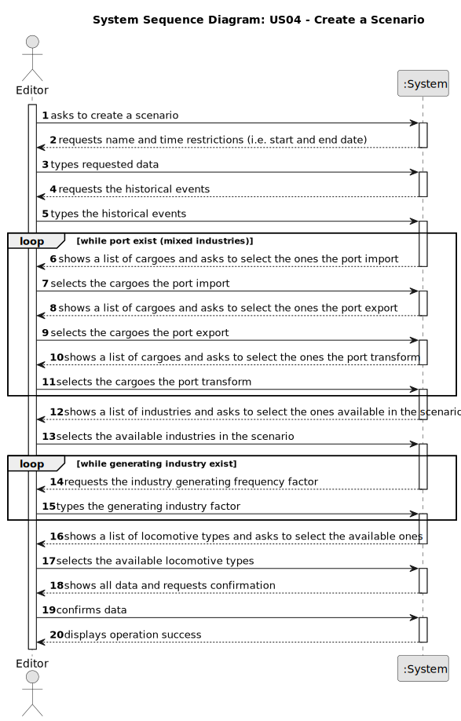

# US04 - Create a Scenario

## 1. Requirements Engineering

### 1.1. User Story Description

As an Editor, I want to create a scenario for a selected map.

### 1.2. Customer Specifications and Clarifications 

**From the specifications document:**

>The Scenario Editor must allow the user to define the restrictions and conditions for using a given map, namely:
>
> - Time Restrictions - the period in which the simulation will take place;
> - Technological Restrictions - for example, which locomotives or industries are available in the scenario;
> - Historical Restrictions - historical events that make sense in the scenario and change the operating conditions of the simulator. For instance, a war increases the steel demand, and a vaccination campaign or a schooling program encourages mail and/or passenger traffic. In this context, the goods that the Ports import and export are also defined.

> Mixed industries - Ports potentially have the capacity, depending on
what is defined in the scenario, to import/export and transform any
cargo.

> Editor - a person who can create maps and scenarios that can be provided in a bundle with the game or sold separately.
>
> Player - a person who wants to play a game; in advanced versions, a scenario can be played by multiple players simultaneously.

**From the client clarifications:**

- n/a

### 1.3. Acceptance Criteria

**Explicit:**
* **AC1:** Definition of the behaviour of ports, which cargoes they import/export and/or transform.
* **AC2:** Definition of the available locomotion types (steam, diesel, and/or electric).
* **AC3:** (Re)Definition of the factors that alter the generation (frequency) of generating industries

**Implicit:**
* A map must exist to be selected for which the scenario will be created.

### 1.4. Found out Dependencies

* There is a dependency on "US01 - Create a map" as there must be at least one map created for which the scenario will be created.

### 1.5 Input and Output Data

**Input Data:**

* Typed data:
    * a name
    * the start date
    * the end date
    * the historical events
    * the industry generation factors (for each generating industry)

* Selected data:
    * a map
    * the available locomotion types
    * the imported cargoes (for each port)
    * the exported cargoes (for each port)
    * the transformed cargoes (for each port)
    * the available industries

**Output Data:**

* List of available maps
* List of available locomotion types
* List of cargoes
* List of industries
* (In)Success of the operation

### 1.6. System Sequence Diagram (SSD)

### 1.7 Other Relevant Remarks

**(i) special requirements:**
- n/a

**(ii) data and/or technology variations:**
- Scenarios restrictions (time period, technological restrictions, historical restrictions) will affect the game simulation.

**(iii) how often this US is held:**
- Multiple scenarios can be created for the same map, but only one scenario can be played at a time.
