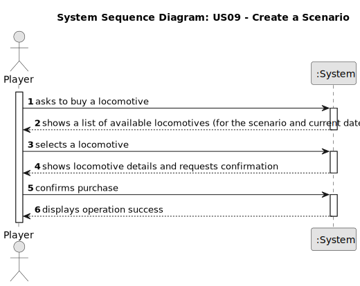

# US09 - Buy a Locomotive

## 1. Requirements Engineering

### 1.1. User Story Description

As a Player, I want to buy a locomotive.

### 1.2. Customer Specifications and Clarifications 

**From the specifications document:**

> The Scenario Editor must allow the user to define the restrictions and conditions for using a given map, namely:
Technological Restrictions - for example, which locomotives or industries are available in the scenario.

> The locomotives provide traction to the composition (train) and can be of different types, namely, run by steam, diesel, and electricity

> The locomotives are characterized by several technical aspects, such as power, acceleration, top speed, start year of operation, fuel cost and maintenance per year, and acquisition price.

> In the simulator, the player/user acquires trains within the available budget and can put the train into service on a specific route.

**From the client clarifications:**

> **Question:** How is the availability of locomotives determined?
>
> **Answer:** Each locomotive model has a one-year entry into service period, after which it becomes available for purchase.

> **Question:** Monetary data is expressed in any particular currency?
>
> **Answer:** An abstract one.

> **Question:** What happens if the player does not have enough budget to buy a locomotive?
>
> **Answer:** He can't buy! Bonds and loans will not be considered right now.

> **Question:** Is there a limit to the number of locomotives a player can buy?
>
> **Answer:** No limit.

> **Question:** Can a player buy the same train multiple times?
>
> **Answer:** The same type of locomotive, yes; but these locomotives will have unique identification (like a plate or a serial number).

### 1.3. Acceptance Criteria

* **AC1:** The player should choose the locomotive from a list of available locomotives for the scenario as well as a current date.
* The player must have sufficient budget to purchase the locomotive.

### 1.4. Found out Dependencies

* There is a dependency on "US04 - Create a scenario" as the scenario must be created before the player can buy a locomotive, as it defines which locomotives are available.

### 1.5 Input and Output Data

**Input Data:**

* Typed data:
    * the current date

* Selected data:
    * a locomotive

**Output Data:**

* List of available locomotives
* (In)Success of the operation

### 1.6. System Sequence Diagram (SSD)

### 1.7 Other Relevant Remarks

**(i) special requirements:**
- n/a

**(ii) data and/or technology variations:**
- Technological Restrictions and date will set the available locomotives in the scenario.

**(iii) how often this US is held:**
- The purchase of locomotives can be done multiple times.
- Usage increases as the railroad network expands.