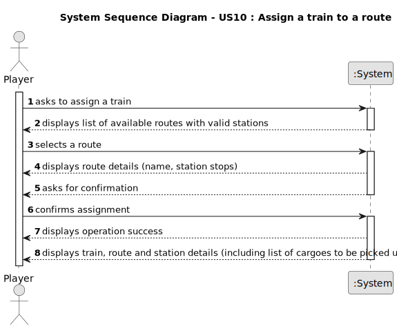

# US010 - Assign a selected train to a route

## 1. Requirements Engineering

### 1.1. User Story Description

As a Player, I want to assign a selected train to a route with valid stations and the respective list of cargoes to be picked up in each station.

### 1.2. Customer Specifications and Clarifications 

**From the specifications document:**

> The simulator will enable the player to create a railway network composed of stations that serve cities and industries, lines connecting those stations, and trains that transport cargo between stations, according to a route defined by the manager. It is crucial to highlight that cities and industries only generate or transform cargo if they have a station; when the cargo is generated, it is then available to be collected at the station.

> In the simulator, the player/user acquires trains within the available budget and can put the train into service on a specific route. A route is a list of stations where the train passes, along which it loads (carriages) cargo at each station.

**From the clients clarifications:**

> **Question:** Can multiple cargo types be assigned to the same train?
>> **Answer:** Yes.

> **Question:** Does a route have a limit of stations that can be assigned?
>> **Answer:** No.

> **Question:** A route is a list of stations where the train passes. If there is many stations but no railway lines, are we able to create a route?
>> **Answer:** If there is no path between any pair of consective points of the route, the player should be warned, then the player can opt between cancel/proceed.

### 1.3. Acceptance Criteria

No acceptance criteria mentioned.

### 1.4. Found out Dependencies

* There is a dependency on "US05 - Build a station", since a train can only be assigned to a route that includes at least one valid station.
* There is a dependency on "US07 - List all the stations", as the player needs to select stations that have demand/supply cargoes to define a valid route.
* There is a dependency on "US08 - Build a railway line", given the train must be able to travel between stations connected by railway lines.
* There is a dependency on "US09 - Buy a locomotive", as the player must first acquire a train before assigning it to a route.

### 1.5 Input and Output Data

* Selected data:
    * a train
    * cargoes
    * a route

**Output Data:**
* Success or insuccess of the operation
* Information about the train, the route and the cargoes assigned to the train

### 1.6. System Sequence Diagram (SSD)

### 1.7 Other Relevant Remarks

N/A