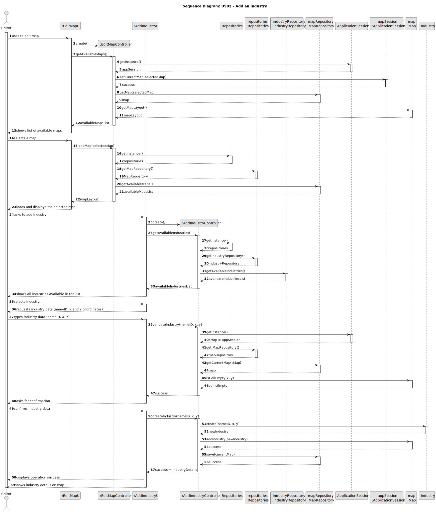
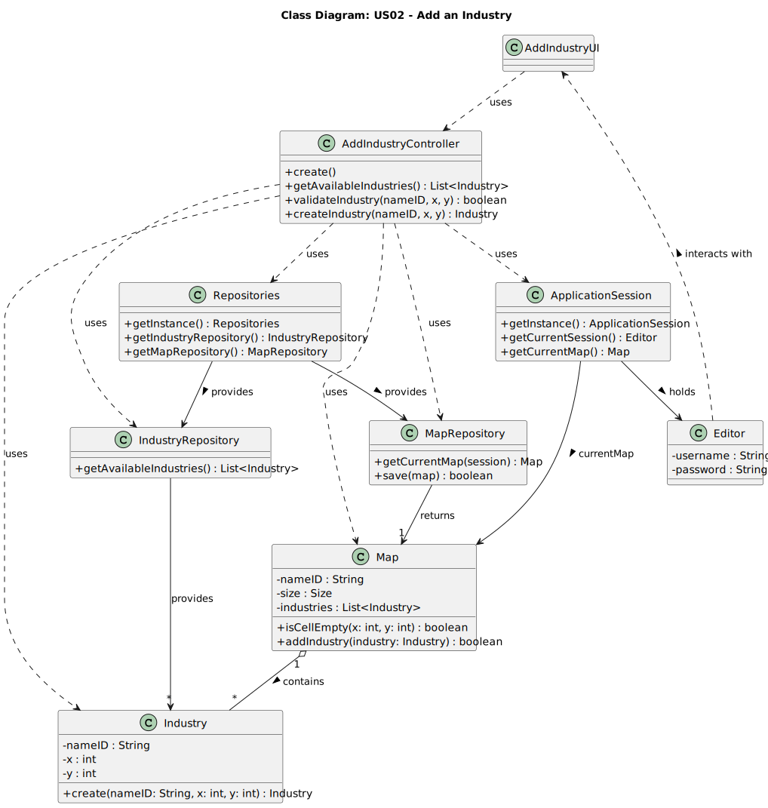

# US02 - Add an Industry

## 3. Design

### 3.1. Rationale

**The rationale grounds on the SSD interactions and the identified input/output data.**

| Interaction ID | Question: Which class is responsible for... | Answer              | Justification (with patterns)                                                                                 |
|:-------------  |:--------------------------------------------|:--------------------|:--------------------------------------------------------------------------------------------------------------|
| Step 1  		 | 	interacting with the actor?                | AddIndustryUI       | Pure Fabrication: there is no reason to assign this responsibility to any existing class in the Domain Model. |
|  | ... coordinating the US?                    | AddIndustryController | Controller: controls the execution of the operation                                                   |
|  | ... knowing the user using the system?      | UserSession         | IE: cf. A&A component documentation. |
|  |                                             | Editor              |IE: knows its own data|
|  |                                             | Map                 |IE: knows its own data|
| Step 2  		 | ... obtaining the list of available industries? | IndustryRepository   | IE: knows all Industry objects                                                                              |              
| Step 3  		 | ... getting the selected industry type?       | AddIndustryUI        | Pure Fabrication: responsible for UI interactions                                                           |
| Step 4  		 | ... validating the positions (X,Y)?          | Map                  | IE: knows its own cells and whether they are occupied                                                      |
| Step 5  		 | ... creating/instantiating a new Industry?   | Industry             | Creator: creates its own instances                                                                         |
| Step 6  		 | ... saving the Industry on the Map?          | Map                  | IE: records all its components and manages its Industry objects                                            |
| Step 7  		 | ... informing operation success?             | AddIndustryUI        | Pure Fabrication: responsible for showing the operation result to the user                                 |

### Systematization ##

According to the taken rationale, the conceptual classes promoted to software classes are:

* Editor
* Map
* Industry

Other software classes (i.e. Pure Fabrication) identified:

* AddIndustryUI  
* AddIndustryController
* IndustryRepository
* MapRepository
* Repositories
* CurrentSession

## 3.2. Sequence Diagram (SD)

_In this section, it is suggested to present an UML dynamic view representing the sequence of interactions between software objects that allows to fulfill the requirements._

## 3.3. Class Diagram (CD)

_In this section, it is suggested to present an UML static view representing the main related software classes that are involved in fulfilling the requirements as well as their relations, attributes and methods._

