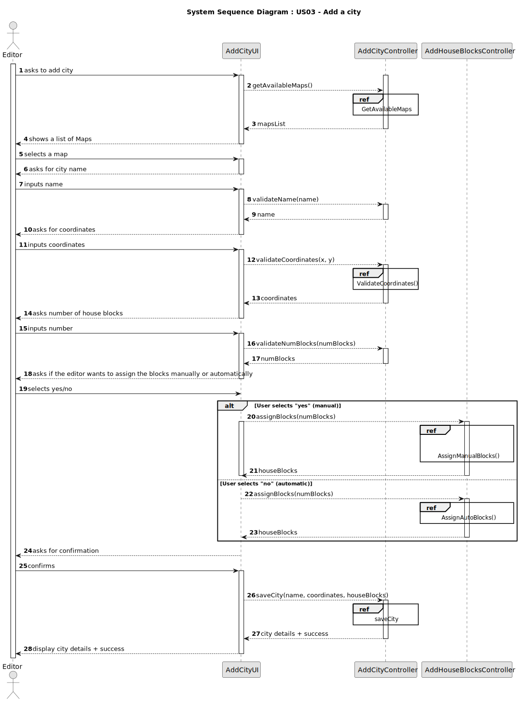
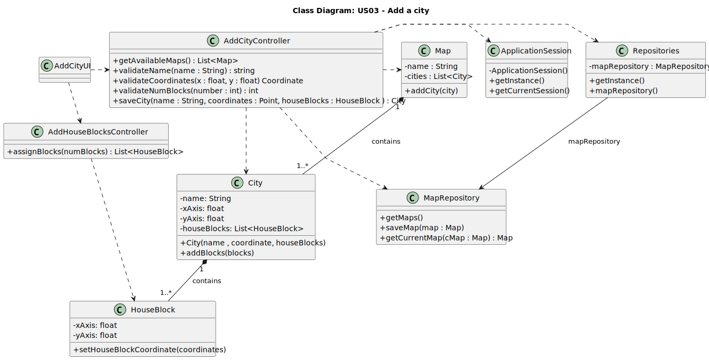

# US03 - Add a City

## 3. Design

### 3.1. Rationale

| Interaction ID | Question: Which class is responsible for...                             | Answer                     | Justification (with patterns)                                                                                                                                                                  |
|----------------|-------------------------------------------------------------------------|----------------------------|------------------------------------------------------------------------------------------------------------------------------------------------------------------------------------------------|
| Step 1         | ... interacting with the actor?                                         | `AddCityUI`                | **Pure Fabrication**: There is no reason to assign this responsibility to any existing class in the Domain Model.                                                                              |
|                | ... coordinating the US?                                                | `AddCityController`        | **Controller**: Coordinates the flow of the use case between UI, domain entities, and repositories.                                                                                            |
|                | ... knowing the user using the system?                                  | `UserSession`              | **IE**: cf. A&A component documentation; represents the current user in session.                                                                                                               |
| Step 2         | ... validating that the city name has no special characters or digits?  | `AddCityController`        | **Controller**: Applies validation rules on inputs.                                                                                                                                            |
| Step 3         | ... validating that the coordinates are acceptable?                     | `AddCityController`        | **Controller**: Ensures coordinates are within the map's bounds.                                                                                                                               |
| Step 4         | ... knowing the map the user is working on?                             | `Map`                      | **IE**: The Map knows its own boundaries and associated cities.                                                                                                                                |
| Step 5         | ... creating the city and adding it to the map?                         | `Map`                      | **IE**: Owns its list of cities and is responsible for their management.                                                                                                                       |
| Step 6         | ... holding the city’s name, coordinates, and number of house blocks?   | `City`                     | **IE**: Knows its own data.                                                                                                                                                                    |
| Step 7         | ... validating if the number of house blocks is a positive number?      | `AddCityController`        | HC + SRP: The controller validates basic business rules related to the city before delegating block creation.                                                                                  |
|                | ... assigning house blocks automatically or manually?                   | `AddHouseBlocksController` | Controller: Responsible for coordinating either manual or automatic assignment of house blocks based on the user's choice.                                                                     |
|                | ... performing the logic of random (automatic) house block placement?   | `AddHouseBlocksController` | SRP + HC: Encapsulates the complexity of block placement (e.g., random generation, collision checking, distribution logic).                                                                    |
| Step 8         | ... validating user-defined block positions (manual assignment)?        | `AddHouseBlocksController` | SRP + HC: Handles validations for manually specified positions, ensuring they are within the map bounds and not overlapping.                                                                   |
| Step 9         | ... confirming the successful creation and displaying city information? | `AddCityUI`                | **IE**: Is responsible for user interactions and feedback.                                                                                                                                     |

### Systematization

According to the taken rationale, the conceptual classes promoted to software classes are:

* `City`
* `Map`

Other software classes (i.e. Pure Fabrication or Controller) identified:

* `AddCityUI`
* `AddCityController`
* `AddHouseBlocksController`
* `ApplicationSession`
* `UserSession`
* `MapRepository`

## 3.2. Sequence Diagram (SD)

_In this section, it is suggested to present an UML dynamic view representing the sequence of interactions between software objects that allows to fulfill the requirements._

## 3.3. Class Diagram (CD)

_In this section, it is suggested to present an UML static view representing the main related software classes that are involved in fulfilling the requirements as well as their relations, attributes and methods._

