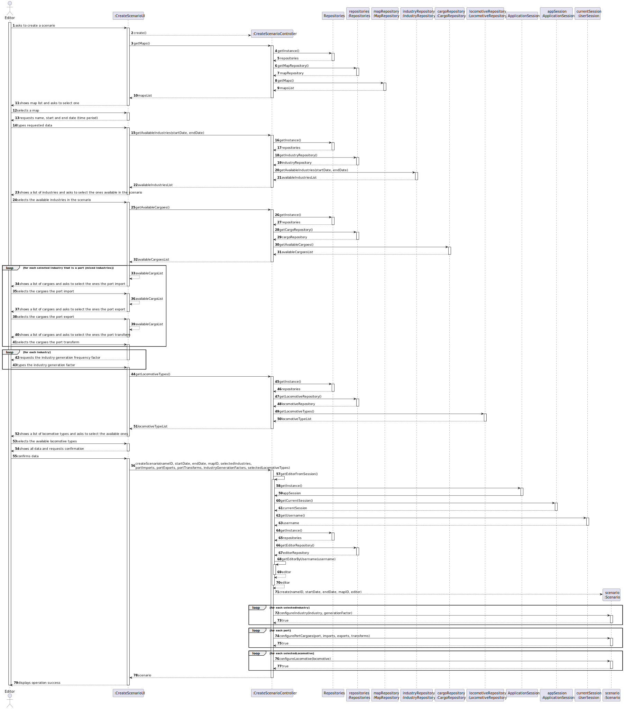
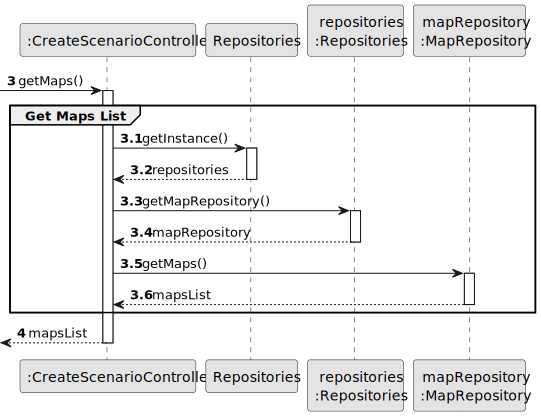
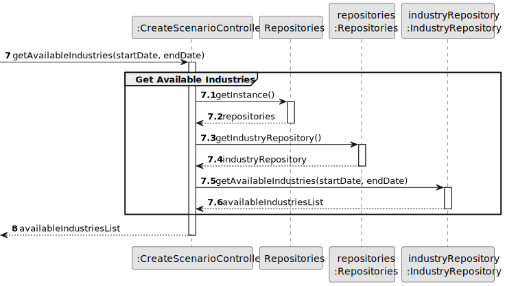
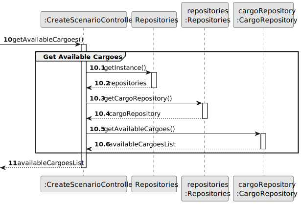
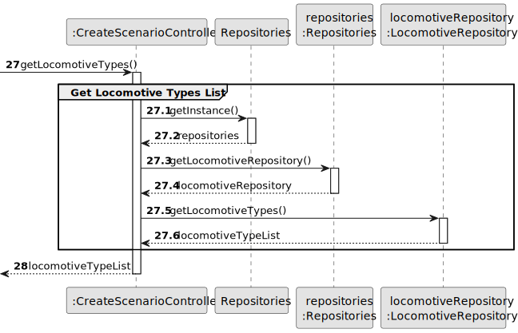
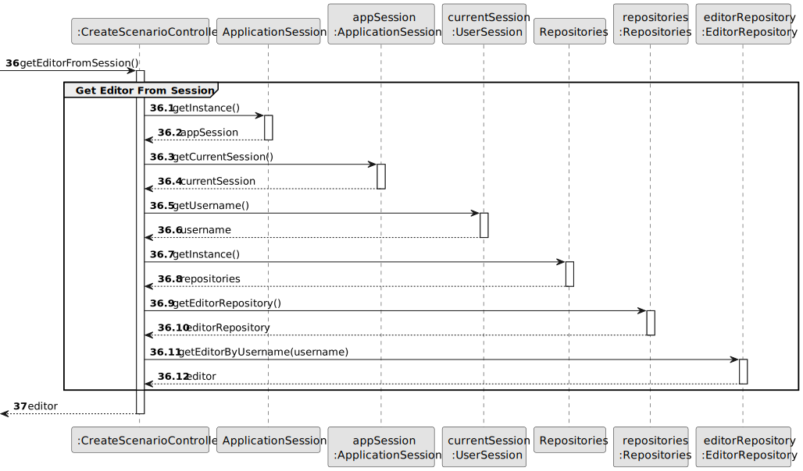
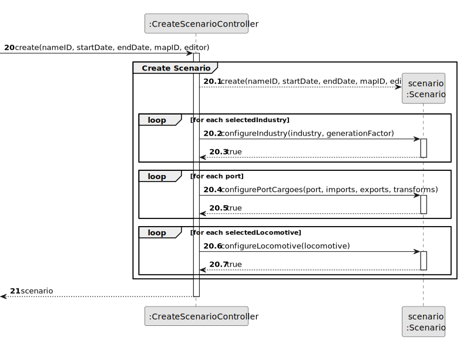
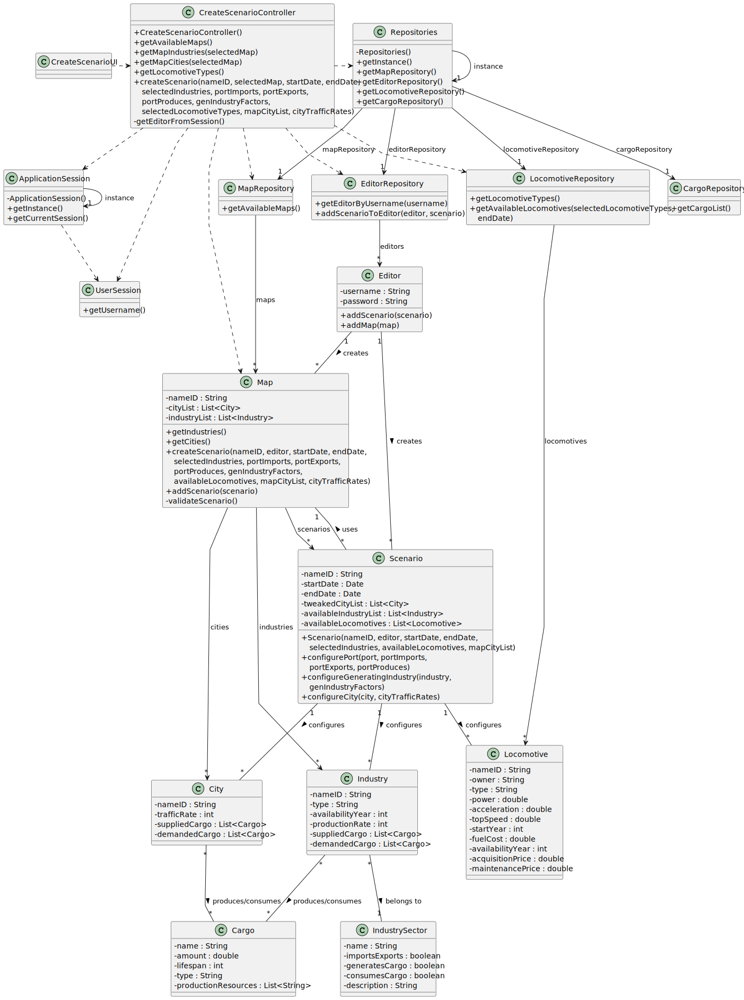

# US04 - Create a Scenario

## 3. Design

### 3.1. Rationale

| Interaction ID | Question: Which class is responsible for...         | Answer                   | Justification (with patterns) |
|:---------------|:----------------------------------------------------|:-------------------------|:------------------------------|
| Step 1  	      | ... interacting with the actor?	                    | CreateScenarioUI         | Pure Fabrication: there is no reason to assign this responsibility to any existing class in the Domain Model. |
|                | ... coordinating the US?                            | CreateScenarioController | Controller                    |
| Step 2  	      | ... requesting name, start and end date?            | CreateScenarioUI         | IE: is responsible for user interactions. |
| Step 3  	      | ... saving the inputted data? 		                    | CreateScenarioUI         | IE: is responsible for keeping the inputted data. |
|                | ... validating time period data? (local validation) | CreateScenarioController | Controller: validates the data before proceeding. |
| Step 4  	      | ... knowing all existing industries to show?				 | Repositories             | IE: Repositories maintains Industries. |
|                |                                                     | IndustryRepository       | By applying High Cohesion (HC) + Low Coupling (LC) on class Repositories, it delegates the responsibility. |
| Step 5  	      | ... saving the selected industries? 							         | CreateScenarioUI         | IE: is responsible for keeping the selected industries. |
| Step 6  	      | ... knowing all available cargoes to show?					 | Repositories             | IE: Repositories maintains Cargoes. |
|                |                                                     | CargoRepository          | By applying HC + LC on class Repositories, it delegates the responsibility. |
| Step 7  	      | ... saving the selected import cargoes for port?    | CreateScenarioUI         | IE: is responsible for keeping the port import operations. |
| Step 8  	      | ... showing export cargo options for port?          | CreateScenarioUI         | IE: is responsible for user interactions. |
| Step 9  	      | ... saving the selected export cargoes for port?    | CreateScenarioUI         | IE: is responsible for keeping the port export operations. |
| Step 10        | ... showing transform cargo options for port?       | CreateScenarioUI         | IE: is responsible for user interactions. |
| Step 11        | ... saving the selected transform cargoes for port? | CreateScenarioUI         | IE: is responsible for keeping the port transform operations. |
| Step 12        | ... requesting industry generation factors?         | CreateScenarioUI         | IE: is responsible for user interactions. |
| Step 13        | ... validating generation factors? (local validation)| CreateScenarioController | Controller: validates the historical constraints. |
| Step 14        | ... saving the inputted generation factors?         | CreateScenarioUI         | IE: is responsible for keeping the generation factors. |
| Step 15        | ... knowing all locomotive types to show?           | Repositories             | IE: Repositories maintains Locomotive types. |
|                |                                                     | LocomotiveRepository     | By applying HC + LC on class Repositories, it delegates the responsibility. |
| Step 16        | ... saving the selected locomotive types?           | CreateScenarioUI         | IE: is responsible for keeping the selected locomotive types. |
| Step 17        | ... showing all data and requesting confirmation?   | CreateScenarioUI         | IE: is responsible for user interactions. |
| Step 18        | ... instantiating a new Scenario?                   | CreateScenarioController | Creator: the controller coordinates the creation of the scenario. |
|                | ... validating all data (local validation)?         | Scenario                 | IE: owns its data. |
|                | ... configuring the scenario components?            | Scenario                 | IE: responsible for its configuration. |
|                | ... saving the created scenario?                    | Editor                   | IE: owns/manages scenarios. |
|                | ... informing operation success?                    | CreateScenarioUI         | IE: is responsible for user interactions. |

### Systematization ##

According to the taken rationale, the conceptual classes promoted to software classes are:

* Scenario
* Map
* Industry
* Cargo
* LocomotiveType
* Editor

Other software classes (i.e. Pure Fabrication) identified:

* CreateScenarioUI  
* CreateScenarioController
* Repositories
* MapRepository
* IndustryRepository
* CargoRepository
* LocomotiveRepository
* ApplicationSession
* UserSession

## 3.2. Sequence Diagram (SD)

### Full Diagram

This diagram shows the full sequence of interactions between the classes involved in the realization of this user story.

### Split Diagrams

The following diagram shows the same sequence of interactions between the classes involved in the realization of this user story, but it is split in partial diagrams to better illustrate the interactions between the classes.

It uses Interaction Occurrence (a.k.a. Interaction Use).

**Get Maps List**

**Get Available Industries**

**Get Available Cargoes**

**Get Locomotive Types**

**Get Editor From Session**

**Create Scenario**

## 3.3. Class Diagram (CD)

