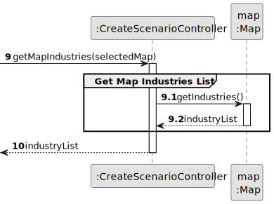
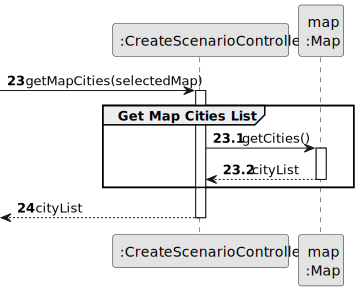
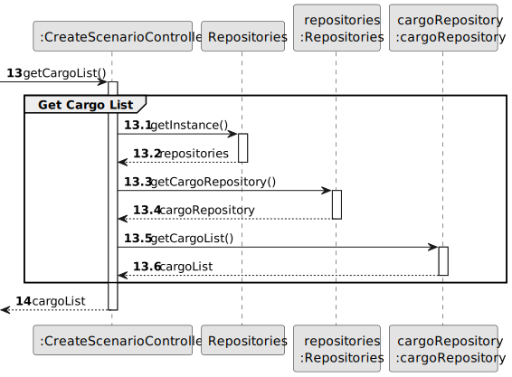
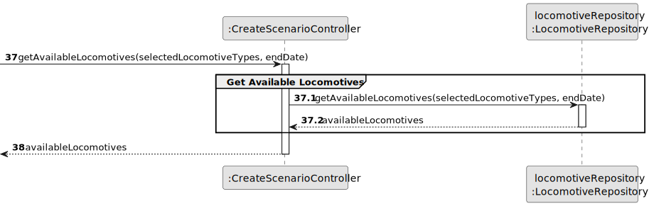
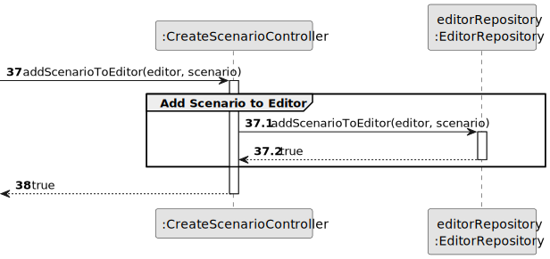

# US04 - Create a Scenario

## 3. Design

### 3.1. Rationale

| Interaction ID | Question: Which class is responsible for...        | Answer                 | Justification (with patterns)                                                                                                       |
|:---------------|:---------------------------------------------------|:-----------------------|:------------------------------------------------------------------------------------------------------------------------------------|
| Step 1         | ... interacting with the actor?                    | CreateScenarioUI       | Pure Fabrication: there is no reason to assign this responsibility to any existing class in the Domain Model.                       |
|                | ... coordinating the US?                           | CreateScenarioController| Controller                                                                                                                          |
|                | ... knowing the user using the system?             | ApplicationSession     | IE: cf. A&A component documentation.                                                                                                |
|                |                                                    | UserSession            | IE: knows the current user's session data                                                                                           |
| Step 2         | ... knowing all available maps to show?            | Repositories           | IE: Repositories maintains Maps.                                                                                                    |
|                |                                                    | MapRepository          | By applying High Cohesion (HC) + Low Coupling (LC) on class Repositories, it delegates the responsibility to MapRepository.         |
| Step 3         | ... saving the selected map?                       | CreateScenarioUI       | IE: is responsible for keeping the selected map.                                                                                    |
| Step 4         | ... requesting name and time period data?          | CreateScenarioUI       | IE: is responsible for user interactions.                                                                                           |
| Step 5         | ... saving the inputted time period data?          | CreateScenarioUI       | IE: is responsible for keeping the inputted data.                                                                                   |
| Step 6         | ... getting map industries?                        | Map                    | IE: knows its own industries.                                                                                                       |
| Step 7         | ... showing list of industries?                    | CreateScenarioUI       | IE: is responsible for user interactions.                                                                                           |
| Step 8         | ... saving the selected industries?                | CreateScenarioUI       | IE: is responsible for keeping the selected industries.                                                                             |
| Step 9         | ... knowing all available cargoes?                 | Repositories           | IE: Repositories maintains Cargoes.                                                                                                 |
|                |                                                    | CargoRepository        | By applying High Cohesion (HC) + Low Coupling (LC) on class Repositories, it delegates the responsibility to CargoRepository.       |
| Step 10        | ... showing available cargoes for import?          | CreateScenarioUI       | IE: is responsible for user interactions.                                                                                           |
| Step 11        | ... saving selected import cargoes?                | CreateScenarioUI       | IE: is responsible for keeping the selected cargoes.                                                                                |
| Step 12        | ... showing available cargoes for export?          | CreateScenarioUI       | IE: is responsible for user interactions.                                                                                           |
| Step 13        | ... saving selected export cargoes?                | CreateScenarioUI       | IE: is responsible for keeping the selected cargoes.                                                                                |
| Step 14        | ... showing available cargoes for production?      | CreateScenarioUI       | IE: is responsible for user interactions.                                                                                           |
| Step 15        | ... saving selected production cargoes?            | CreateScenarioUI       | IE: is responsible for keeping the selected cargoes.                                                                                |
| Step 16        | ... requesting generation frequency factor?         | CreateScenarioUI       | IE: is responsible for user interactions.                                                                                           |
| Step 17        | ... saving generation frequency factor?            | CreateScenarioUI       | IE: is responsible for keeping the inputted data.                                                                                   |
| Step 18        | ... getting map cities?                           | Map                    | IE: knows its own cities.                                                                                                          |
| Step 19        | ... requesting traffic rates?                      | CreateScenarioUI       | IE: is responsible for user interactions.                                                                                           |
| Step 20        | ... saving traffic rates?                          | CreateScenarioUI       | IE: is responsible for keeping the inputted data.                                                                                   |
| Step 21        | ... getting and showing locomotive types?          | Repositories           | IE: Repositories maintains Locomotives.                                                                                             |
|                |                                                    | LocomotiveRepository   | By applying High Cohesion (HC) + Low Coupling (LC) on class Repositories, it delegates the responsibility to LocomotiveRepository.  |
| Step 22        | ... saving selected locomotive types?              | CreateScenarioUI       | IE: is responsible for keeping the selected locomotive types.                                                                       |
| Step 23        | ... showing all data and requesting confirmation?  | CreateScenarioUI       | IE: is responsible for user interactions.                                                                                           |
| Step 24        | ... getting editor from session?                   | ApplicationSession     | IE: knows the current session.                                                                                                      |
|                |                                                    | EditorRepository       | IE: knows all editors.                                                                                                              |
| Step 25        | ... instantiating a new Scenario?                  | Map                    | Creator (Rule 1): in the DM Map has Scenarios.                                                                                      |
|                | ... validating all data (local validation)?        | Scenario               | IE: owns its data.                                                                                                                  |
|                | ... validating all data (global validation)?       | Map                    | IE: knows all its scenarios.                                                                                                        |
|                | ... saving the created scenario?                   | Map                    | IE: owns all its scenarios.                                                                                                         |
|                | ... informing operation success?                   | CreateScenarioUI       | IE: is responsible for user interactions.                                                                                           |

### Systematization ##

According to the taken rationale, the conceptual classes promoted to software classes are:

* Map
* Scenario
* Industry
* City
* Locomotive
* Editor
* Cargo
* IndustrySector

Other software classes (i.e. Pure Fabrication) identified:

* CreateScenarioUI
* CreateScenarioController
* Repositories
* MapRepository
* EditorRepository
* LocomotiveRepository
* CargoRepository
* ApplicationSession
* UserSession

## 3.2. Sequence Diagram (SD)

### Full Diagram

This diagram shows the full sequence of interactions between the classes involved in the realization of this user story.

### Split Diagrams

The following diagram shows the same sequence of interactions between the classes involved in the realization of this user story, but it is split in partial diagrams to better illustrate the interactions between the classes.

It uses Interaction Occurrence (a.k.a. Interaction Use).

**Get Available Maps List Partial SD**

**Get Map Industries List**

**Get Map Cities List**

**Get Cargo List**

**Get Locomotive Types List**

**Get Editor From Session**

**Get Available Locomotives**

**Create Scenario**

**Add Scenario to Editor**

## 3.3. Class Diagram (CD)

