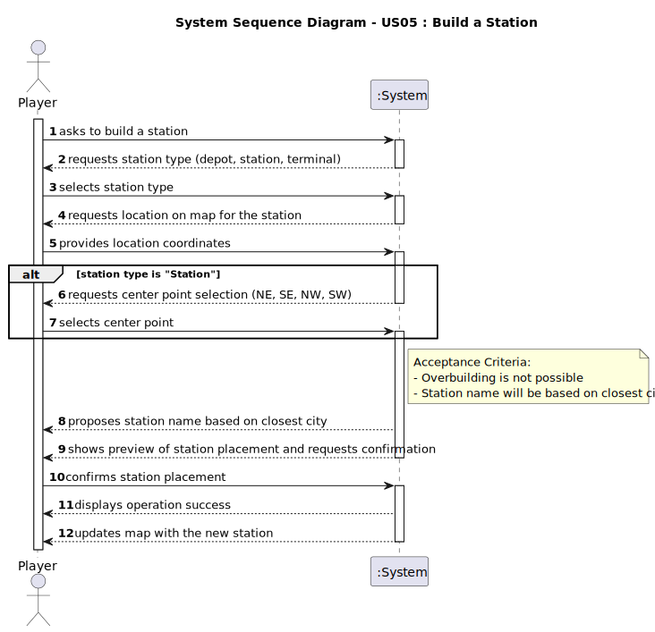

# US05 - Build a Station

## 1. Requirements Engineering

### 1.1. User Story Description

- As a Player, I want to build a station (can be a depot, a station or a terminal) with a location in the current map, so that I can expand my railway network.

### 1.2. Customer Specifications and Clarifications

**From the specifications document:**

> There are three types of stations: Depots (50k, 3x3 radius), Stations (100k, 4x4 radius), and Terminals (200k, 5x5 radius)

> For Depots and Terminals, the center is the geometric one

> For Stations, the center should be defined by the Player (NE, SE, NW, SW)

> The station name should be based on the closest city and station type (e.g., "Porto Terminal", "Ovar Station", "Silvalde Depot")

**From the client clarifications:**

> **Question:** If overbuilding occurs, the program stops running and the game ends or simply gives an error message and asks again for the station construction place? 
> > **Answer:** Overbuilding in the Editor is possible, the existing building is replaced for the new one. Overbuilding in the Simulator is NOT possible, the player gets a warning and games continues

> **Question:** Should the system provide a user interface for specifying station attributes (station name, type)?
> > **Answer:** No, a player can build depots, stations and terminal as far he have available budget and there no overbuilding.

### 1.3. Acceptance Criteria

* **AC1:** Overbuilding is not possible (cannot build a station where one already exists)
* **AC2:** Station name should be automatically generated based on closest city and station type
* **AC3:** For Station type, player must select a center point (NE, SE, NW, SW)

### 1.4. Found out Dependencies

* There is a dependency on **"US01 - As an Editor, I want to create a map with a size and a name"** since map must exist before building stations
* There is a dependency on **"US03 - As an Editor, I want to add a city in a position XY of the selected map"** because at least one city must exist for station naming
* There is a dependency on **"US07 - As a Player, I want to list all the stations to select one to see its details"** since it is needed to verify that no overbuilding occurs

### 1.5 Input and Output Data

**Input Data:**
* Selected data:
  - Station type (DEPOT, STATION, TERMINAL)
  - For **STATION** type: Center point (NE, SE, NW, SW)

* Typed data:
  - Location coordinates (x, y) on map

**Output Data:**
- Proposed station name
- Station cost and economic radius
- Preview of station placement
- (In)Success of the operation
- Updated map with new station

### 1.6. System Sequence Diagram (SSD)

**_Other alternatives might exist._**

### 1.7 Other Relevant Remarks

* Station placement affects cargo generation/consumption in its radius
* The system should validate that the station placement doesn't overlap with existing stations or go beyond map boundaries
* The player must, indirectly, have enough budget to acquire a station