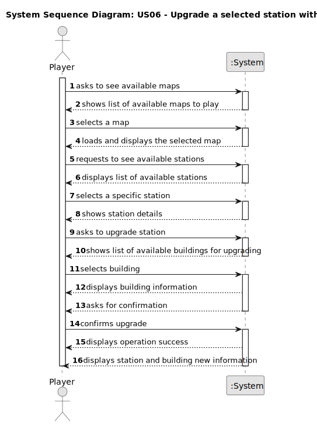

# US006 - Upgrade a selected station with a building

## 1. Requirements Engineering

### 1.1. User Story Description

- As a Player, I want to upgrade a selected station with a building. Each type of station improvement has a date from which it is available. Some equipments are mutually exclusive (e.g., small and grand hotel) and some equipments/buildings replace others (the telegraph was initially used to facilitate the operation of trains at stations, and was later replaced by the telephone, so after the advent of telephone, telegraph is no more available).

### 1.2. Customer Specifications and Clarifications 

**From the specifications document:**

> When built, a station consists of just one building, which can be upgraded with other buildings that can increase the station’s performance, improve train operation, facilitate train manoeuvrers, and increase the lifespan of cargo stored at the station. Some of the buildings that can be used to upgrade
stations are: telegraph (later telephone), café (small or large), customs, post office, hotel (small or large), silo, liquid storage. 

> When viewing a station, in addition to the buildings present, the cargo that is ready for collection and the cargo that needs to be delivered should also be displayed.

**From the client clarifications:**

> **Question:** Is there a limit on the number of buildings a station can be upgraded with?
>> **Answer:** No.

> **Question:** Does the upgrade from telegraph to telephone occur automatically once a certain year is reached?
>> **Answer:** There are no automatic updates; When a new building is available, the player can buy it and then the previous building is replaced.

> **Question:** In the document, it is given the example of the small and large hotel as mutually exclusive equipments. Does that mean that all upgrades of the same kind are mutually exclusive? Or, per example, is it possible to have more than one unit of liquid storage in the same station?
>> **Answer:** There are mutually exclusive buildings such as small and big restaurant. There are buildings that when they exist, it is no longer possible to build the former one, like the telegraph has been replaced with the telephone. The stations that had the telegraph stay with the telegraph working until it is built a telephone that replaces the telegraph. From the moment that the telephone exists, it is no longer possible to build the telegraph.

> **Question:** In case it is allowed, is there a limit for the quantity of buildings in each stations?
>> **Answer:** There can't be multiple equal buildings (per example, I can't have 3 cereal silos).

> **Question:** Are all combinations allowed? Per example, does the Player have freedom of choosing, in the same station, the upgrades: customs + silo + telegraph?
>> **Answer:** The combinations, as long as they are respecting the previously mentioned restrictions, are all possible.

### 1.3. Acceptance Criteria

* No Acceptance criteria mentioned.

### 1.4. Found out Dependencies

* There is a dependency on "US005 - Build a station" as there must be at least one created station in order to upgrade it.
* There is a dependency on "US007 - List all the Stations" as the station containing the building to use as an upgraded will be chosen from a list of stations.

### 1.5 Input and Output Data

**Input Data:**

* Selected data:
    * a station
    * a building type

**Output Data:**

* (In)Success of the operation
* Details of the station and the building

### 1.6. System Sequence Diagram (SSD)

### 1.7 Other Relevant Remarks

N/A