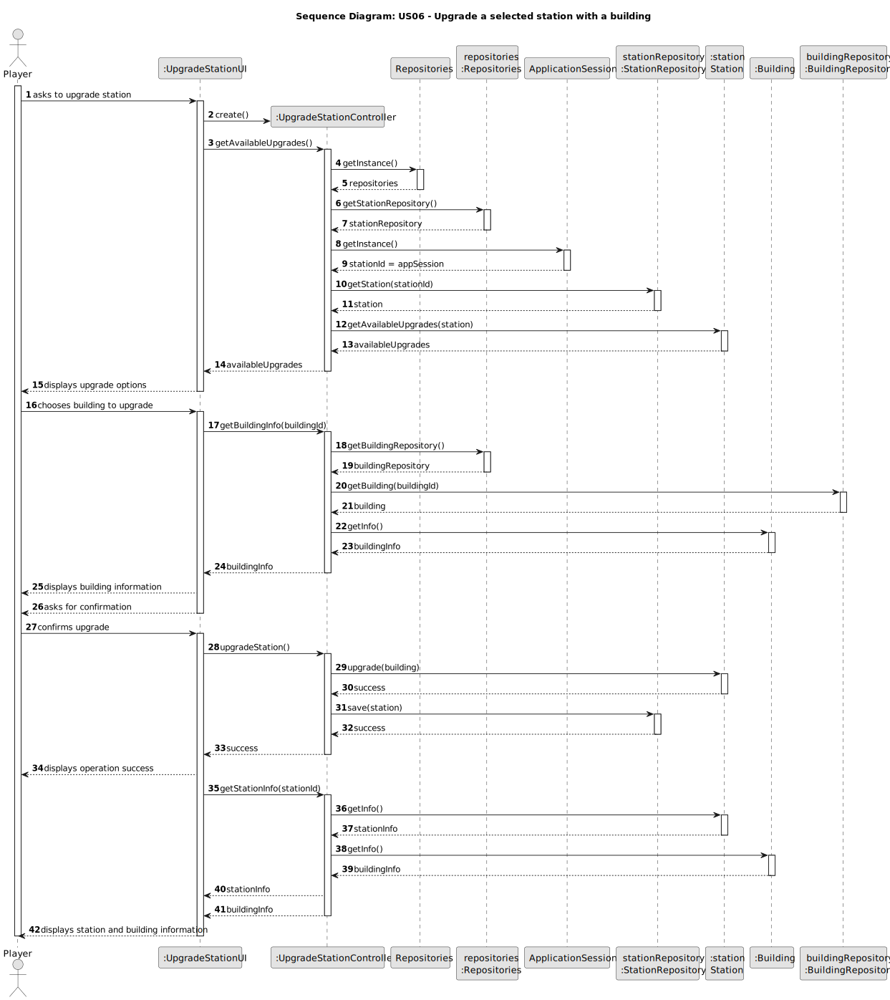

# US06 - Upgrade a selected station with a building

## 3. Design

### 3.1. Rationale

| Interaction ID | Question: Which class is responsible for...       | Answer           | Justification (with patterns)  |
|:---------------|:--------------------------------------------------|:-----------------|:---------------------------- |
| Step 1  		     | ... interacting with the actor? | UpgradeStationUI | Pure Fabrication: there is no reason to assign this responsibility to any existing class in the Domain Model. |
|                | ... coordinating the US? | UpgradeStationController | Controller: pattern that assigns the responsibility of controlling the use case sequence to this class. |
| Step 2  		     | ... knowing which station to upgrade? | ApplicationSession | IE: maintains information about the current session, including the selected station. |
|                |  ... getting available upgrades? | Station | Information Expert: has information about stations. |
| Step 3  		     | ... providing building information? | BuildingRepository | IE: maintains information about available buildings. |
|                | ... knowing building details? | Building | IE: knows its own data. |
| Step 4  		     | ... confirming the upgrade? | UpgradeStationUI | IE: responsible for user interaction. |
| Step 5  		     | ... applying the upgrade to the station? | Station | IE: knows its own state and how to change it. |
| Step 6  		     | ... persisting the upgraded station? | StationRepository | IE: responsible for maintaining all stations. |
| Step 7  		     | ... informing operation success? | UpgradeStationUI | IE: responsible for user interaction. |
| Step 8  		     | ... providing updated station information? | Station | IE: knows its own data. |
| Step 9  		     | ... providing building information after upgrade? | Building | IE: knows its own data. |
| Step 10 		     | ... displaying final information to the user? | UpgradeStationUI | IE: responsible for user interaction. |

### 3.1. Systematization ##

According to the taken rationale, the conceptual classes promoted to software classes are:

* `Station`
* `Building`

Other software classes (i.e. Pure Fabrication) identified:

* `UpgradeStationUI`
* `UpgradeStationController`
* `Repositories`
* `StationRepository`
* `BuildingRepository`
* `ApplicationSession`

## 3.2. Sequence Diagram (SD)

### Full Diagram

### Partial Diagrams

**Request Available Upgrades**

**Get Building Information**

**Upgrade Station**

## 3.3. Class Diagram (CD)

