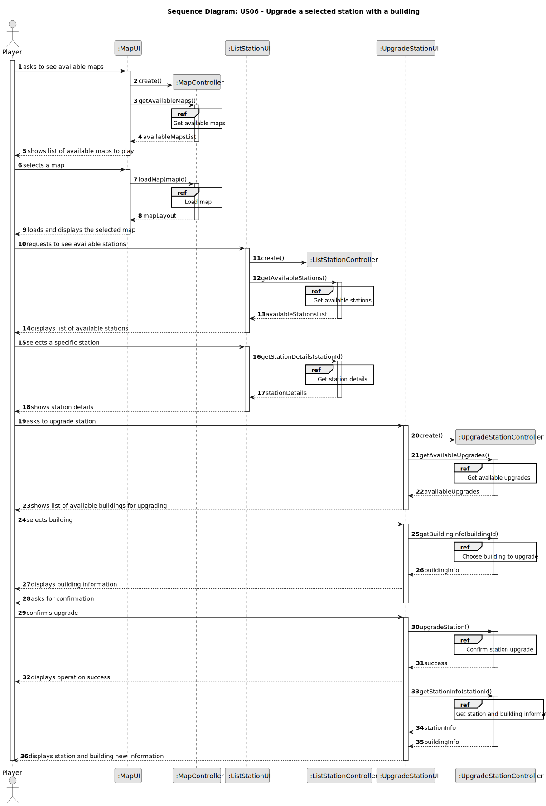
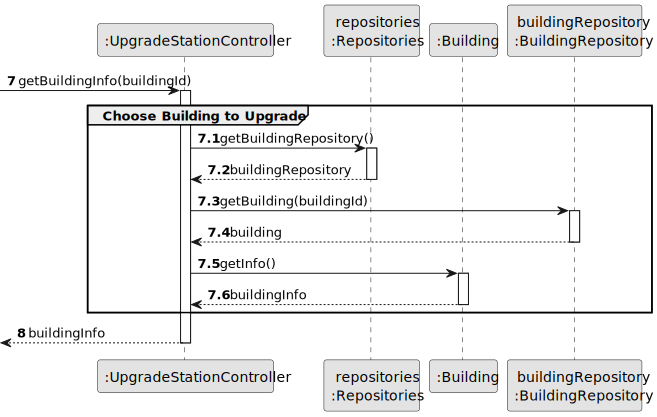
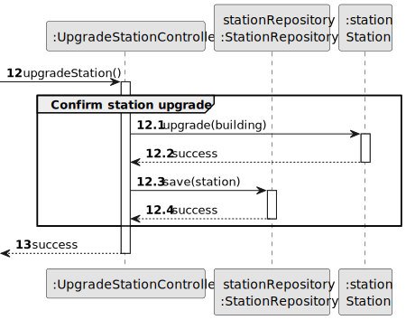

# US06 - Upgrade a selected station with a building

## 3. Design

### 3.1. Rationale

**The rationale grounds on the SSD interactions and the identified input/output data.**

| Interaction ID | Question: Which class is responsible for...       | Answer           | Justification (with patterns)  |
|:---------------|:--------------------------------------------------|:-----------------|:---------------------------- |
| Step 1  		     | ... interacting with the actor? | UpgradeStationUI | Pure Fabrication: there is no reason to assign this responsibility to any existing class in the Domain Model. |
|                | ... coordinating the US? | UpgradeStationController | Controller: pattern that assigns the responsibility of controlling the use case sequence to this class. |
| Step 2  		     | ... knowing which station to upgrade? | ApplicationSession | IE: maintains information about the current session, including the selected station. |
|                |  ... getting available upgrades? | Station | Information Expert: has information about stations. |
| Step 3  		     | ... providing building information? | BuildingRepository | IE: maintains information about available buildings. |
|                | ... knowing building details? | Building | IE: knows its own data. |
| Step 4  		     | ... confirming the upgrade? | UpgradeStationUI | IE: responsible for user interaction. |
| Step 5  		     | ... applying the upgrade to the station? | Station | IE: knows its own state and how to change it. |
| Step 6  		     | ... persisting the upgraded station? | StationRepository | IE: responsible for maintaining all stations. |
| Step 7  		     | ... informing operation success? | UpgradeStationUI | IE: responsible for user interaction. |
| Step 8  		     | ... providing updated station information? | Station | IE: knows its own data. |
| Step 9  		     | ... providing building information after upgrade? | Building | IE: knows its own data. |
| Step 10 		     | ... displaying final information to the user? | UpgradeStationUI | IE: responsible for user interaction. |

### Systematization ##

According to the taken rationale, the conceptual classes promoted to software classes are:

* `Station`
* `Building`

Other software classes (i.e. Pure Fabrication) identified:

* `UpgradeStationUI`
* `UpgradeStationController`
* `Repositories`
* `StationRepository`
* `BuildingRepository`
* `ApplicationSession`

## 3.2. Sequence Diagram (SD)

_In this section, it is suggested to present an UML dynamic view representing the sequence of interactions between software objects that allows to fulfill the requirements._

### 3.2.1. Main Sequence Diagram

### 3.2.2. Partial Sequence Diagrams

#### 3.2.2.1. Get Available Upgrades

#### 3.2.2.2. Choose Building to Upgrade

#### 3.2.2.3. Confirm Station Upgrade

#### 3.2.2.4. Get Station and Building Information

## 3.3. Class Diagram (CD)

_In this section, it is suggested to present an UML static view representing the main related software classes that are involved in fulfilling the requirements as well as their relations, attributes and methods._

