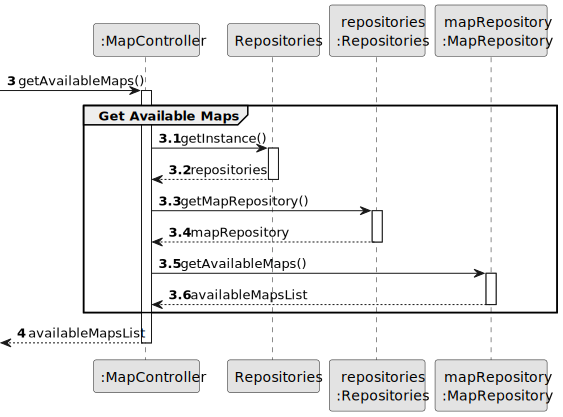
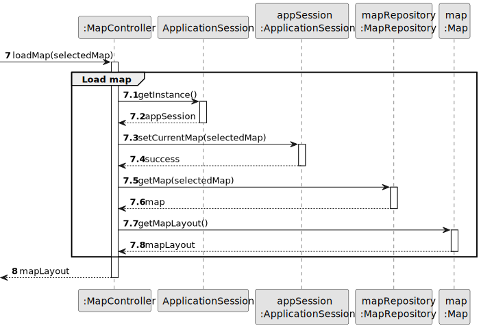
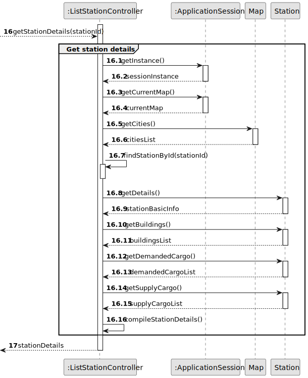

# US06 - Upgrade a selected station with a building

## 3. Design

### 3.1. Rationale

**The rationale grounds on the SSD interactions and the identified input/output data.**

| Interaction ID | Question: Which class is responsible for...       | Answer           | Justification (with patterns)  |
|:---------------|:--------------------------------------------------|:-----------------|:---------------------------- |
| Step 1  		     | ... interacting with the actor? | MapUI | Pure Fabrication: there is no reason to assign this responsibility to any existing class in the Domain Model. |
|                | ... coordinating the US? | MapController | Controller: pattern that assigns the responsibility of controlling the use case sequence to this class. |
| Step 2  		     | ... interacting with the actor? | ListStationUI | Pure Fabrication: there is no reason to assign this responsibility to any existing class in the Domain Model. |
|                | ... coordinating the US? | ListStationController | Controller: pattern that assigns the responsibility of controlling the use case sequence to this class. |
| Step 3  		     | ... interacting with the actor? | UpgradeStationUI | Pure Fabrication: there is no reason to assign this responsibility to any existing class in the Domain Model. |
|                | ... coordinating the US? | UpgradeStationController | Controller: pattern that assigns the responsibility of controlling the use case sequence to this class. |
| Step 4  		     | ... knowing which station to upgrade? | ApplicationSession | IE: maintains information about the current session, including the selected station. |
|                |  ... getting available upgrades? | Station | Information Expert: has information about stations. |
| Step 5  		     | ... providing building information? | BuildingRepository | IE: maintains information about available buildings. |
|                | ... knowing building details? | Building | IE: knows its own data. |
| Step 6  		     | ... confirming the upgrade? | UpgradeStationUI | IE: responsible for user interaction. |
| Step 7  		     | ... applying the upgrade to the station? | Station | IE: knows its own state and how to change it. |
| Step 8  		     | ... persisting the upgraded station? | StationRepository | IE: responsible for maintaining all stations. |
| Step 9  		     | ... informing operation success? | UpgradeStationUI | IE: responsible for user interaction. |
| Step 10 		     | ... providing updated station information? | Station | IE: knows its own data. |
| Step 11 		     | ... providing building information after upgrade? | Building | IE: knows its own data. |
| Step 12 		     | ... displaying final information to the user? | UpgradeStationUI | IE: responsible for user interaction. |

### Systematization ##

According to the taken rationale, the conceptual classes promoted to software classes are:

* `Station`
* `Building`

Other software classes (i.e. Pure Fabrication) identified:

* `MapUI`
* `MapController`
* `ListStationUI`
* `ListStationController`
* `UpgradeStationUI`
* `UpgradeStationController`
* `Repositories`
* `StationRepository`
* `BuildingRepository`
* `ApplicationSession`

## 3.2. Sequence Diagram (SD)

_In this section, it is suggested to present an UML dynamic view representing the sequence of interactions between software objects that allows to fulfill the requirements._

### 3.2.1. Main Sequence Diagram

### 3.2.2. Partial Sequence Diagrams

#### 3.2.2.1. Get Available Maps
This diagram shows the sequence of interactions needed to retrieve available maps. The controller coordinates with the repositories to get the list of maps that can be played.

#### 3.2.2.2. Load Map
This diagram illustrates the process of loading a selected map. The controller retrieves the map layout and coordinates its display.

#### 3.2.2.3. Get Available Stations
This diagram represents the sequence of actions needed to retrieve available stations. The controller coordinates with the repositories to get the list of stations that can be upgraded.

#### 3.2.2.4. Get Station Details
This diagram shows how the system retrieves and displays detailed information about a specific station. The controller coordinates with the repositories to get the station's details.

#### 3.2.2.5. Get Available Upgrades
This diagram shows the sequence of interactions needed to get available upgrades for a station. The controller initiates the process by obtaining necessary repository and application session instances, then queries the selected station for its available upgrades.

#### 3.2.2.6. Choose Building to Upgrade
This diagram illustrates the process of selecting a building for upgrade. The controller obtains the building repository, retrieves the selected building, and gets its detailed information.

#### 3.2.2.7. Confirm Station Upgrade
This diagram represents the sequence of actions needed to confirm and apply the station upgrade. The controller coordinates the station upgrade with the new building and persists the changes in the repository.

#### 3.2.2.8. Get Station and Building Information
This diagram shows how the system retrieves and displays the updated station and building information after the upgrade is completed. The controller coordinates obtaining information from both the station and building.

## 3.3. Class Diagram (CD)

_In this section, it is suggested to present an UML static view representing the main related software classes that are involved in fulfilling the requirements as well as their relations, attributes and methods._

