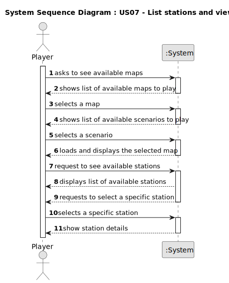

# US007 - As a Player, I want to list all the stations

## 1. Requirements Engineering

As a Player, I want to list all the stations to select one to see its details.

### 1.1. User Story Description

The Player wants the ability to access a list of all available stations and view specific detailed information about each one (including buildings and cargo demand/supply), as an additional function to his role as a system user.

### 1.2. Customer Specifications and Clarifications 

**From the specifications document:**

> When viewing a station, in addition to the buildings present, the cargo that is ready for collection and the cargo that needs to be delivered (as in the example) should also be displayed

**From the client clarifications:**

> **Question:** Should the list be sorted in any particular way? (e.g., by name, by cargo volume, etc.)?
> > **Answer:** To Be Drawn

> **Question:** Will the player be able to apply filters to the list? If so, which ones would be useful? (e.g., only active ones, by type, by region…)?
> > **Answer:** To Be Drawn

> **Question:** What information should be visible directly in the list? Just the station name, or also other details like type, location, and operational status (active/inactive), etc.?
> > **Answer:** Name and a summary of available cargos to be collected and the ones that are demanded

> **Question:** Besides the existing buildings and demand/supply cargo, are there any other details that should be shown when viewing a station's information? For example, location, capacity, or operational status?
> > **Answer:** Available cargos to be collected and the ones that are demanded

> **Question:** When the user selects an existing station, does it automatically show all the associated info to that station or the user selects the station then has to select the required option ? eg: 'show details'
> > **Answer:** That's a matter of UX/UI, each team can decide what works best.

### 1.3. Acceptance Criteria

n/a

### 1.4. Found out Dependencies

* There is a dependency on "US005 - Build a Station" as there must be at least one station to select to view its details.

### 1.5 Input and Output Data

**Input Data:**
* Typed data:
    * n/a
* Selected data:
    * A specific station from the list
    * Confirmation to view the details of the selected station

**Output Data:**

* List of all existing stations
* Details of the selected station, including: Existing buildings and the demand/supply cargoes.

### 1.6. System Sequence Diagram (SSD)

### 1.7 Other Relevant Remarks

&nbsp; &nbsp; **(iii) Frequency of Use**:

Players will likely use this feature frequently, especially in transport management gameplay.

The station list should update dynamically to reflect changes (new stations, operational status, cargo updates).

The frequency of updates depends on gameplay mechanics—real-time updates may be needed if stations and cargo demands fluctuate often.