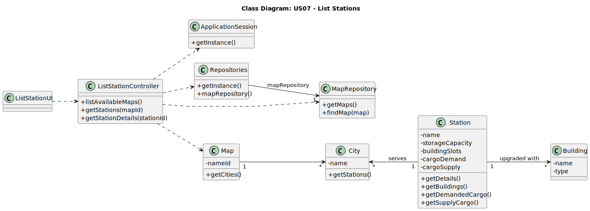

# US007 - List stations and view their details

## 3. Design

### 3.1. Rationale

**The rationale grounds on the SSD interactions and the identified input/output data.**

| Interaction ID | Question: Which class is responsible for...                   | Answer                  | Justification (with patterns)                                                                                     |
|:--------------:|:--------------------------------------------------------------|:------------------------|:------------------------------------------------------------------------------------------------------------------|
|     Step 1     | ... interacting with the actor?                               | `ListStationUI`         | **Pure Fabrication**: There is no reason to assign this responsibility to any existing class in the Domain Model. |
|                | ... coordinating the US?                                      | `ListStationController` | **Controller**: Coordinates the flow of the use case between UI, domain entities, and repositories.               |
|                | ... knowing the user using the system?                        | `ApplicationSession`    | **IE**: Represents the current user in session.                                                                   |
|                | ... getting the list of available maps?                       | `MapRepository`         | **IE**: Knows all maps in the system.                                                                             |
|     Step 2     | ... displaying list of available maps?                        | `ListStationUI`         | **IE**: Responsible for user interaction and displaying information.                                              |
|     Step 3     | ... processing the map selection?                             | `ListStationController` | **Controller**: Processes user input and coordinates the action.                                                  |
|     Step 4     | ... loading and displaying the selected map?                  | `ListStationUI`         | **IE**: Responsible for user interaction and displaying information.                                              |
|     Step 5     | ... requesting to see available stations?                     | `ListStationUI`         | **IE**: Responsible for user interaction.                                                                         |
|     Step 6     | ... retrieving stations from the map?                         | `Map`                   | **IE**: The Map knows its cities which contain stations.                                                          |
|                | ... getting stations from cities?                             | `City`                  | **IE**: Knows its own stations.                                                                                   |
|     Step 7     | ... displaying list of available stations?                    | `ListStationUI`         | **IE**: Responsible for user interaction and displaying information.                                              |
|     Step 8     | ... processing station selection?                             | `ListStationController` | **Controller**: Processes user input and coordinates the action.                                                  |
|     Step 9     | ... retrieving a station's details?                           | `Station`               | **IE**: Information Expert over its own attributes.                                                               |
|                | ... retrieving the list of buildings in a station?            | `Station`               | **IE**: Aggregates buildings.                                                                                     |
|                | ... retrieving the demanded and supplied cargo for a station? | `Station`               | **IE**: Knows its cargo needs and supplies.                                                                       |
|    Step 10     | ... presenting data back to the player?                       | `ListStationUI`         | **IE**: Responsible for user interaction and displaying information.                                              |

### Systematization

According to the taken rationale, the conceptual classes promoted to software classes are:

* `Map`
* `City`
* `Station`
* `StationType`
* `Building`
* `Cargo`
* `Position`
* `Size`

Other software classes (i.e. Pure Fabrication) identified:

* `ListStationUI`
* `ListStationController`
* `MapRepository`
* `ApplicationSession`
* `Repositories`

## 3.2. Sequence Diagram (SD)

_In this section, it is suggested to present an UML dynamic view representing the sequence of interactions between software objects that allows to fulfill the requirements._

## 3.3. Class Diagram (CD)

_In this section, it is suggested to present an UML static view representing the main related software classes that are involved in fulfilling the requirements as well as their relations, attributes and methods._

