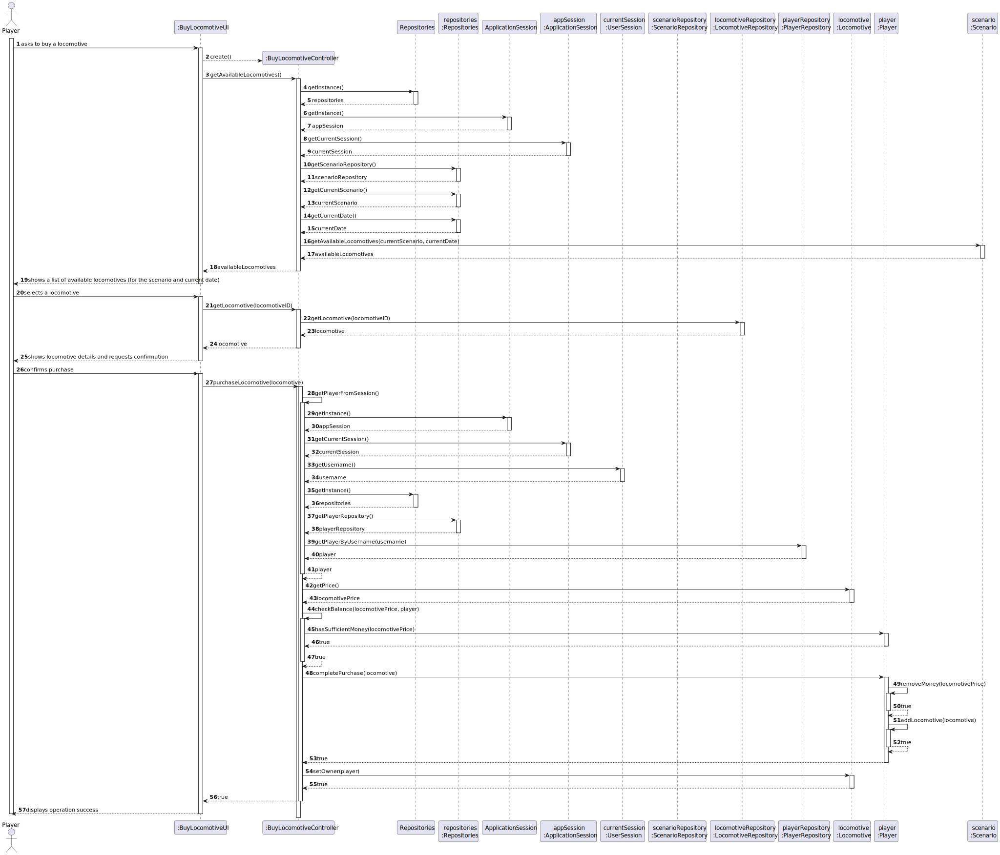
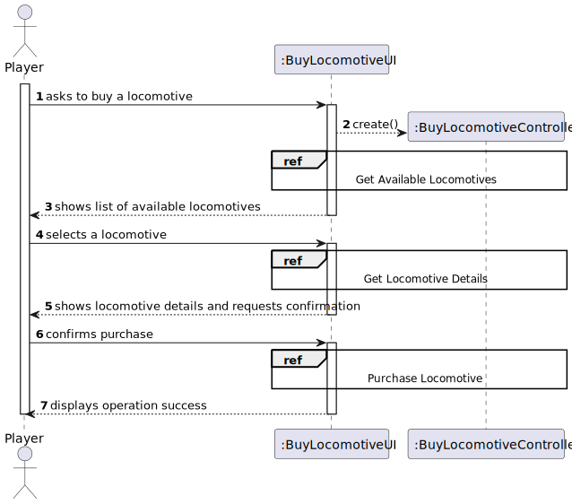
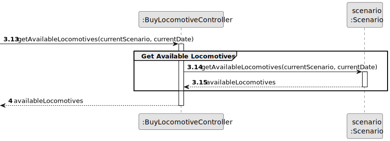
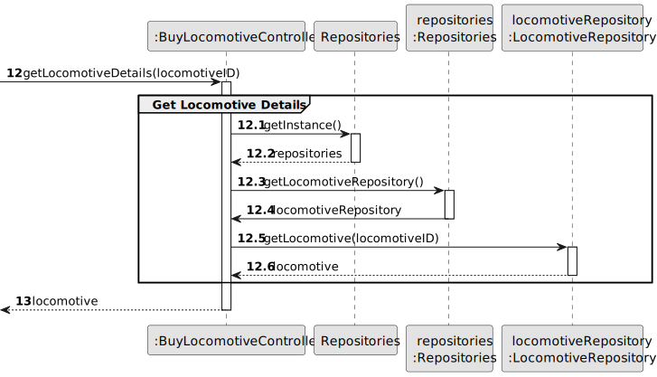
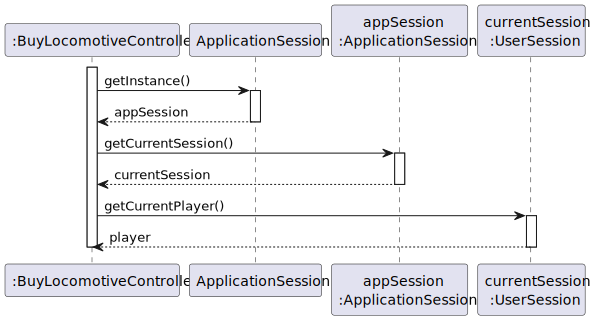
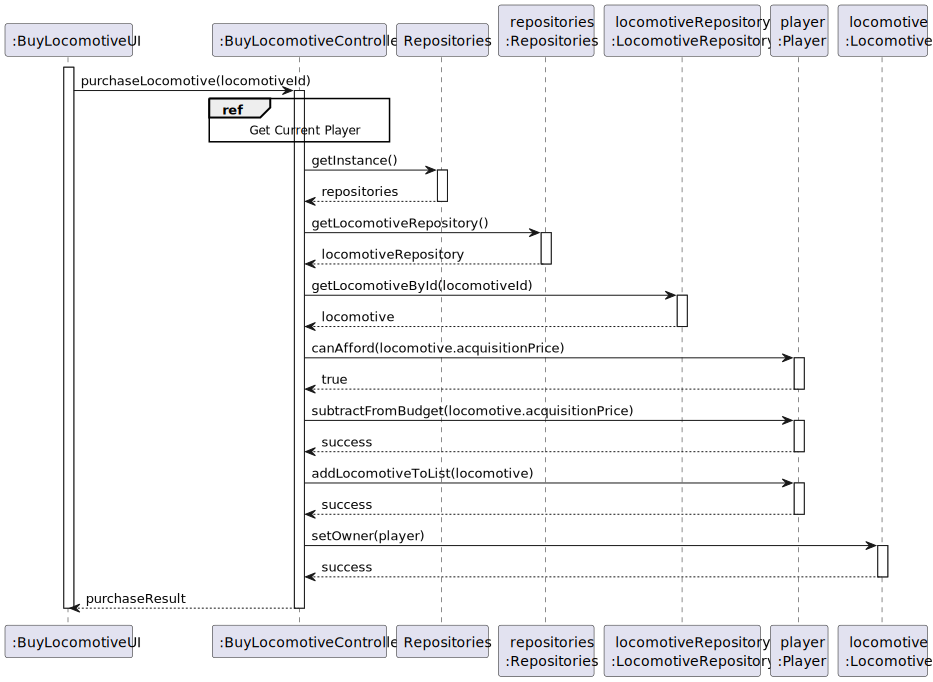
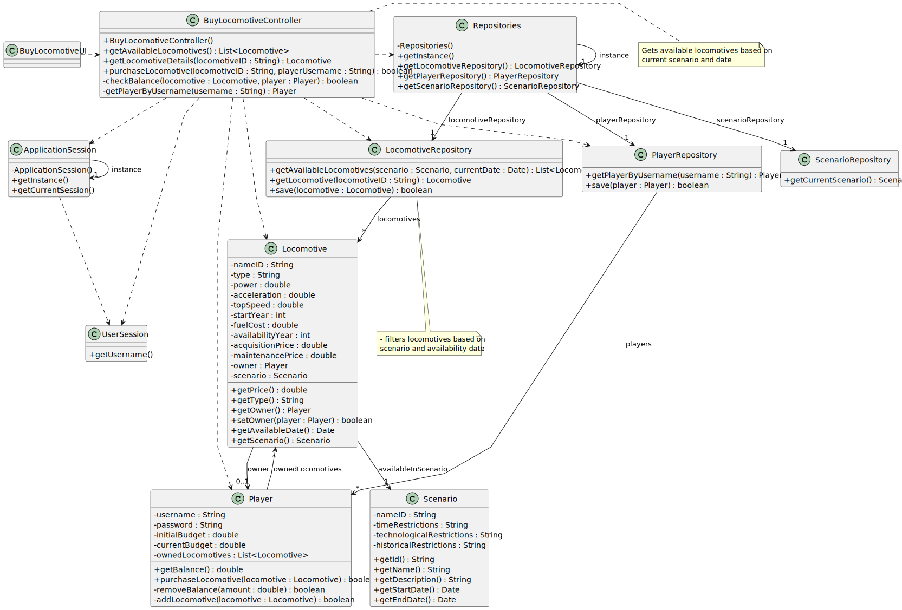

# US09 - Buy a Locomotive

## 3. Design

### 3.1. Rationale

| Interaction ID | Question: Which class is responsible for...                         | Answer                  | Justification (with patterns)                                                                                                                                                                                                  |
|:---------------|:--------------------------------------------------------------------|:------------------------|:-------------------------------------------------------------------------------------------------------------------------------------------------------------------------------------------------------------------------------|
| Step 1  		     | ... interacting with the actor? 	                                   | BuyLocomotiveUI         | Pure Fabrication: there is no reason to assign this responsibility to any existing class in the Domain Model.                                                                                                                  |
|                | ... coordinating the US?                                            | BuyLocomotiveController | Controller                                                                                                                                                                                                                     |
|                | ... knowing the user using the system?                              | UserSession             | IE: cf. A&A component documentation.                                                                                                                                                                                           |
|                |                                                                     | Player                  | IE: knows its own data                                                                                                                                                                                                         |
|                |                                                                     | Locomotive              | IE: knows its own data                                                                                                                                                                                                         |
| Step 2     	   | ... knowing all existing available locomotives to show? 							     | Repositories            | IE: Repositories maintains Locomotives.                                                                                                                                                                                        |
|                |                                                                     | LocomotiveRepository    | By applying High Cohesion (HC) + Low Coupling (LC) on class Repositories, it delegates the responsibility on LocomotiveRepository. IE: has the responsibility to filter locomotives based on the scenario and current date. |
| Step 3  		     | ... saving the selected locomotive? 							                         | BuyLocomotiveUI         | IE: is responsible for keeping the selected locomotive.                                                                                                                                                                        |
| Step 4  		     | ... showing locomotive details and requesting confirmation? 							 | BuyLocomotiveUI         | IE: is responsible for user interactions.                                                                                                                                                                                      |
| Step 5  		     | ... validating if player can afford the locomotive?							          | Player                  | IE: knows its own current budget.                                                                                                                                                                                              |
|                | ... adding the locomotive to player's locomotives list?             | Player                  | IE: owns all its locomotives.                                                                                                                                                                                                  |
|                | ... changing ownership of the locomotive?                           | Locomotive              | IE: knows its own owner.                                                                                                                                                                                                       |
|                | ... subtracting locomotive price from player's balance?             | Player                  | IE: owns its own current budget                                                                                                                                                                                                |
| Step 6  		     | ... informing operation success? 							                            | BuyLocomotiveUI         | IE: is responsible for user interactions.                                                                                                                                                                                      |              

### Systematization ##

According to the taken rationale, the conceptual classes promoted to software classes are:

* Player
* Locomotive
* Scenario

Other software classes (i.e. Pure Fabrication) identified:

* BuyLocomotiveUI
* BuyLocomotiveController
* Repositories
* LocomotiveRepository
* PlayerRepository
* ScenarioRepository
* ApplicationSession
* UserSession

## 3.2. Sequence Diagram (SD)

### Full Diagram

This diagram shows the full sequence of interactions between the classes involved in the realization of this user story.

### Split Diagrams

The following diagram shows the same sequence of interactions between the classes involved in the realization of this user story, but it is split in partial diagrams to better illustrate the interactions between the classes.

It uses Interaction Occurrence (a.k.a. Interaction Use).

**Get Available Locomotives**

**Get Locomotive Details**

**Get Current Player**

**Purchase Locomotive**

## 3.3. Class Diagram (CD)

