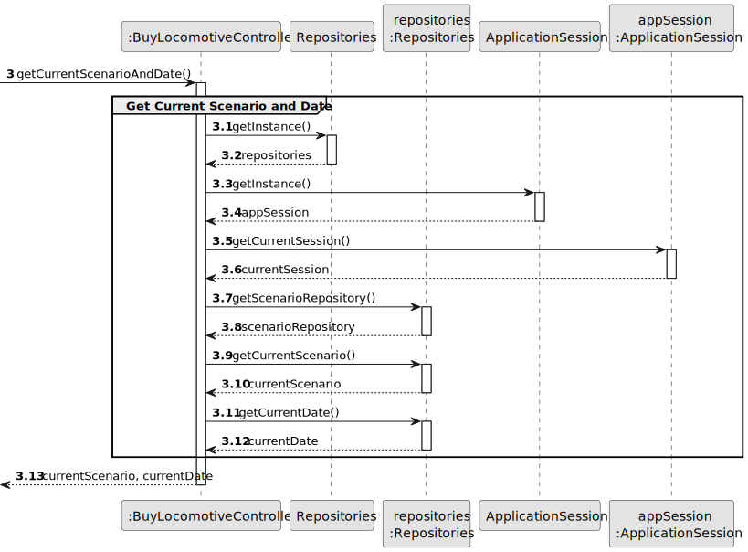
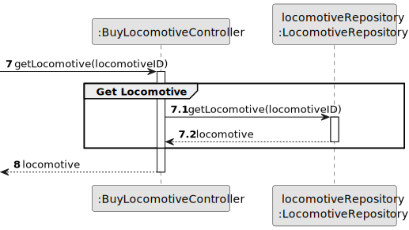
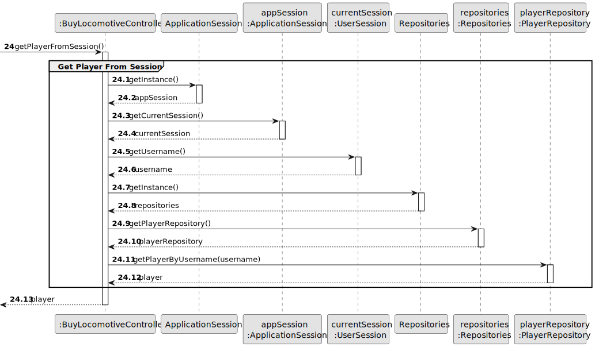

# US09 - Buy a Locomotive

## 3. Design

### 3.1. Rationale

| Interaction ID | Question: Which class is responsible for...        | Answer                  | Justification (with patterns)                                                                                                     |
|:---------------|:--------------------------------------------------|:-----------------------|:--------------------------------------------------------------------------------------------------------------------------------|
| Step 1         | ... interacting with the actor?                    | BuyLocomotiveUI        | Pure Fabrication: there is no reason to assign this responsibility to any existing class in the Domain Model.                     |
|                | ... coordinating the US?                           | BuyLocomotiveController| Controller                                                                                                                        |
|                | ... knowing the user using the system?             | UserSession            | IE: cf. A&A component documentation.                                                                                              |
|                | ... getting current scenario and date?             | ApplicationSession     | IE: knows the current game state including scenario and date.                                                                     |
|                | ... getting available locomotives?                  | Scenario               | IE: knows its available locomotives for a given date.                                                                             |
| Step 2         | ... showing available locomotives?                  | BuyLocomotiveUI        | IE: is responsible for user interactions.                                                                                         |
| Step 3         | ... saving the selected locomotive?                | BuyLocomotiveUI        | IE: is responsible for keeping the selected locomotive.                                                                           |
|                | ... getting locomotive details?                    | LocomotiveRepository   | IE: knows/has access to all locomotives.                                                                                          |
| Step 4         | ... showing locomotive details?                    | BuyLocomotiveUI        | IE: is responsible for user interactions.                                                                                         |
| Step 5         | ... getting player information?                    | PlayerRepository       | IE: knows/has access to all players.                                                                                              |
|                | ... validating purchase possibility?               | Player                 | IE: knows its own budget and can validate if purchase is possible.                                                                |
|                | ... processing the purchase?                       | Player                 | Creator (Rule 1): in the DM Player owns Locomotives.                                                                              |
|                | ... updating locomotive ownership?                 | Locomotive             | IE: knows its own data including owner.                                                                                           |
| Step 6         | ... informing operation success?                   | BuyLocomotiveUI        | IE: is responsible for user interactions.                                                                                         |

### Systematization ##

According to the taken rationale, the conceptual classes promoted to software classes are: 

* Player
* Locomotive
* Scenario

Other software classes (i.e. Pure Fabrication) identified: 

* BuyLocomotiveUI  
* BuyLocomotiveController
* Repositories
* LocomotiveRepository
* PlayerRepository
* ScenarioRepository
* ApplicationSession
* UserSession

## 3.2. Sequence Diagram (SD)

### Full Diagram

This diagram shows the full sequence of interactions between the classes involved in the realization of this user story.

### Split Diagrams

The following diagram shows the same sequence of interactions between the classes involved in the realization of this user story, but it is split in partial diagrams to better illustrate the interactions between the classes.

It uses Interaction Occurrence (a.k.a. Interaction Use).

**Get Current Scenario and Date**

**Get Available Locomotives**

**Get Locomotive**

**Get Player From Session**

**Purchase Locomotive**

## 3.3. Class Diagram (CD)

