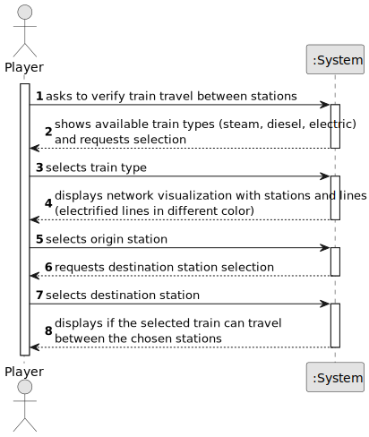

# US13 - Verify Train Travel Between Stations

## 1. Requirements Engineering

### 1.1. User Story Description

As a Player, given a railway with stations and lines connecting pairs of stations, I want to verify if a specific train (steam, diesel, or electric powered) can travel between two stations belonging to the rail network (or from any type of station to another of the same type).

### 1.2. Customer Specifications and Clarifications 

**From the specifications document:**

> The player should be able to verify if a specific type of train can travel between two stations in the railway network, considering the type of power (steam, diesel, or electric) and the station types (depot, station, or terminal).

> The system should provide a visual representation of the railway network, clearly distinguishing between electrified and non-electrified lines.

**From the client clarifications:**

> The implementation must focus on using primitive operations and avoid using existing Java library functions for the path-finding algorithms.

### 1.3. Acceptance Criteria

* **AC01:** The player should be able to choose the type of train (steam, diesel or electric) and station type (depot, station or terminal) in real time.
* **AC02:** A visualization of the stations, and the lines connecting stations of this scenario (using, for example, Graphviz or GraphStream packages) should be displayed to the player, where electrified railway lines are drawn with a different color from the others.
* **AC03:** All implemented procedures (except the used for graphic visualization) must use primitive operations only, and not existing functions in JAVA libraries.
* **AC04:** The algorithm(s) implemented to solve this problem should be documented/detailed in the repository documentation (using markdown format).

### 1.4. Found out Dependencies

* There is a dependency on US requirements related to building the railway network infrastructure:
  * Building stations
  * Creating railway lines
  * Defining line electrification status
  * Station type definitions

### 1.5 Input and Output Data

**Input Data:**
* Selected data:
    * Train type (steam, diesel, or electric)
    * Origin station
    * Destination station

**Output Data:**
* Network visualization showing:
    * Stations
    * Railway lines (with different colors for electrified lines)
* Verification result:
    * Whether the selected train can travel between the chosen stations
    * Path information (if available)

### 1.6. System Sequence Diagram (SSD)

### 1.7 Other Relevant Remarks

**(i) special requirements:**
- The implementation must use primitive operations for path-finding algorithms
- The visualization should clearly distinguish electrified lines from non-electrified ones

**(ii) data and/or technology variations:**
- Different train types (steam, diesel, electric)
- Different station types (depot, station, terminal)
- Electrified vs non-electrified lines

**(iii) frequency of occurrence:**
- This functionality will be used frequently during gameplay to verify possible train routes
- Critical for strategic planning of train routes and network expansion