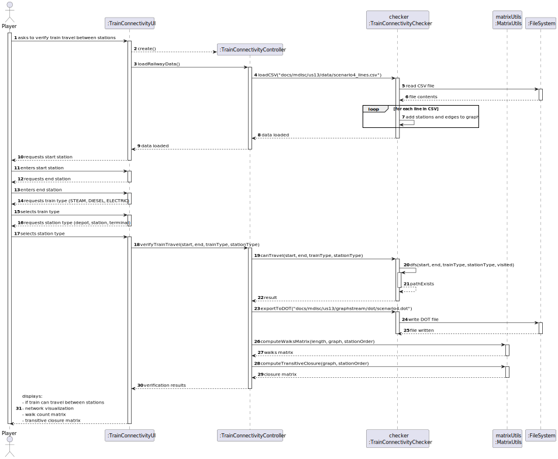
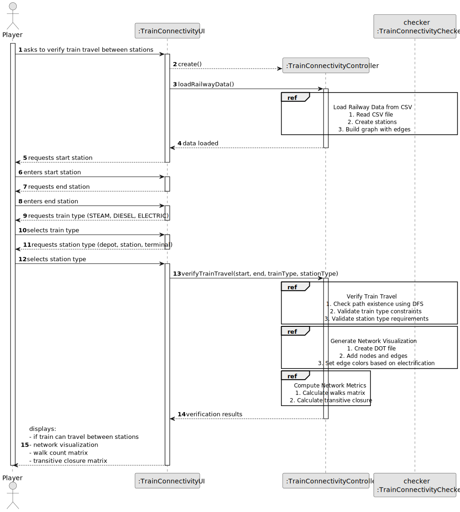
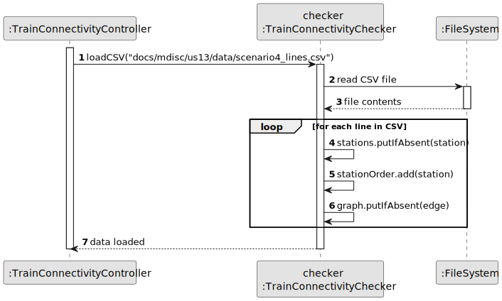
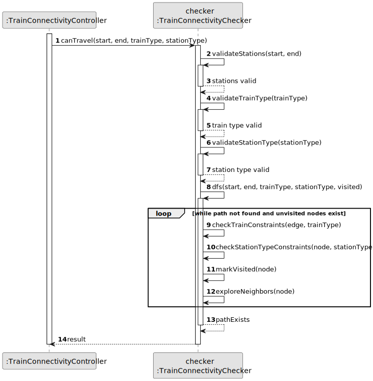

# US13 - Verify Train Travel Between Stations

## 3. Design

### 3.1. Rationale

| Interaction ID | Question: Which class is responsible for...        | Answer                    | Justification (with patterns)                                                                                                 |
|:---------------|:--------------------------------------------------|:--------------------------|:-----------------------------------------------------------------------------------------------------------------------------|
| Step 1         | ... interacting with the actor?                    | TrainConnectivityUI      | Pure Fabrication: there is no reason to assign this responsibility to any existing class in the Domain Model.                 |
|                | ... coordinating the US?                           | TrainConnectivityController| Controller: coordinates the interaction between UI and domain objects.                                                        |
| Step 2         | ... loading railway data from CSV?                 | TrainConnectivityChecker | Information Expert: manages the railway network data and graph structure.                                                     |
|                | ... storing station and edge data?                 | TrainConnectivityChecker | Creator and Information Expert: creates and manages Station and Edge objects.                                                 |
| Step 3         | ... validating station existence?                  | TrainConnectivityChecker | Information Expert: knows all stations in the network.                                                                        |
| Step 4         | ... validating train type?                         | TrainConnectivityChecker | Information Expert: knows valid train types and their constraints.                                                            |
| Step 5         | ... validating station type?                       | TrainConnectivityChecker | Information Expert: knows station types and their requirements.                                                               |
| Step 6         | ... checking path existence?                       | TrainConnectivityChecker | Information Expert: has the graph structure and algorithms for path finding.                                                  |
| Step 7         | ... generating network visualization?              | TrainConnectivityChecker | Information Expert: knows the network structure and edge properties.                                                          |
| Step 8         | ... computing network metrics?                     | MatrixUtils              | Pure Fabrication: separates matrix computation responsibilities for better cohesion.                                          |
| Step 9         | ... displaying results?                            | TrainConnectivityUI      | IE: responsible for user interactions and displaying results.                                                                 |

### Systematization ##

According to the taken rationale, the conceptual classes promoted to software classes are: 

* Station
* Edge
* StationType
* TrainType

Other software classes (i.e. Pure Fabrication) identified: 

* TrainConnectivityUI  
* TrainConnectivityController
* TrainConnectivityChecker
* MatrixUtils

## 3.2. Sequence Diagram (SD)

### Full Diagram

This diagram shows the full sequence of interactions between the classes involved in the realization of this user story.

### Split Diagrams

The following diagram shows the same sequence of interactions between the classes involved in the realization of this user story, but it is split in partial diagrams to better illustrate the interactions between the classes.

It uses Interaction Occurrence (a.k.a. Interaction Use).

**Load Railway Data Partial SD**

This diagram shows the sequence of loading railway data from CSV and building the graph structure.

**Verify Train Travel Partial SD**

This diagram shows the sequence of verifying if a train can travel between two stations.

**Network Analysis Partial SD**

This diagram shows the sequence of generating network visualization and computing metrics.

## 3.3. Class Diagram (CD)

The class diagram shows the static structure of the system, including:
- Core domain classes (Station, Edge)
- Enums for types (StationType, TrainType)
- Control classes (TrainConnectivityController)
- UI class (TrainConnectivityUI)
- Utility class (MatrixUtils)

The relationships and dependencies between these classes are designed to support the verification of train travel between stations while maintaining high cohesion and low coupling.

