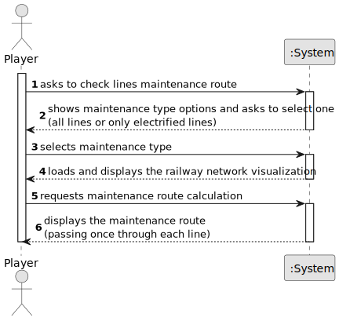

# US14 - Check Railway Lines Maintenance Route

## 1. Requirements Engineering

### 1.1. User Story Description

As a Player, given a railway with stations and railway lines, I want to see a route that passes once, and only once, by each railway line to carry out maintenance on the lines.

### 1.2. Customer Specifications and Clarifications 

**From the specifications document:**

> The system should allow the player to visualize and plan maintenance routes for railway lines, considering both regular and electrified lines. The maintenance route should pass through each line exactly once, optimizing the maintenance process.

**From the client clarifications:**

> The system must provide a clear distinction between electrified and non-electrified railway lines in the visualization, and allow the player to focus on either all lines or just the electrified ones for maintenance planning.

### 1.3. Acceptance Criteria

* **AC01:** The player should be able to choose between the maintenance of all the lines, or only the electrified ones.
* **AC02:** A warning message should be displayed in case it is not possible to get such route. If possible, the station(s) where the route can start, should be displayed so that the player may select it.
* **AC03:** A visualization of the rail network (stations, railway lines) should be displayed to the player (using, for example, Graphviz or GraphStream packages), where electrified railway lines are drawn with a different color from the others.
* **AC04:** All implemented procedures (except the used for graphic visualization) must only use primitive operations, and not existing functions in JAVA libraries.
* **AC05:** The algorithm(s) implemented to solve this problem should be documented/detailed in the repository documentation, using markdown format.

### 1.4. Found out Dependencies

* There is a dependency on having a railway network with defined stations and railway lines
* There is a dependency on having information about which railway lines are electrified

### 1.5 Input and Output Data

**Input Data:**

* Selected data:
    * Maintenance type (all lines or only electrified lines)
    * Starting station (when multiple options are available)

**Output Data:**

* Railway network visualization
* Maintenance route (if possible)
* Warning messages (if route is not possible)
* List of possible starting stations (when applicable)

### 1.6. System Sequence Diagram (SSD)

### 1.7 Other Relevant Remarks

**(i) special requirements:**
- The implementation must use primitive operations only (except for visualization)
- The solution must be properly documented in markdown format

**(ii) data and/or technology variations:**
- Different visualization options may be used (Graphviz, GraphStream)
- The system must handle both electrified and non-electrified railway lines

**(iii) frequency of occurrence:**
- This functionality will be used whenever maintenance planning is required for the railway network