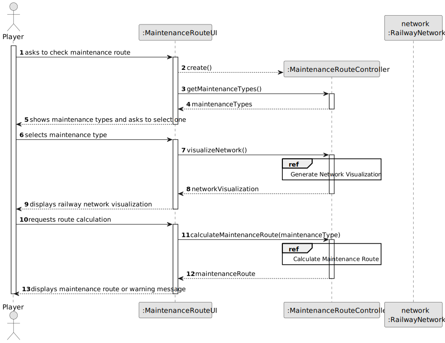
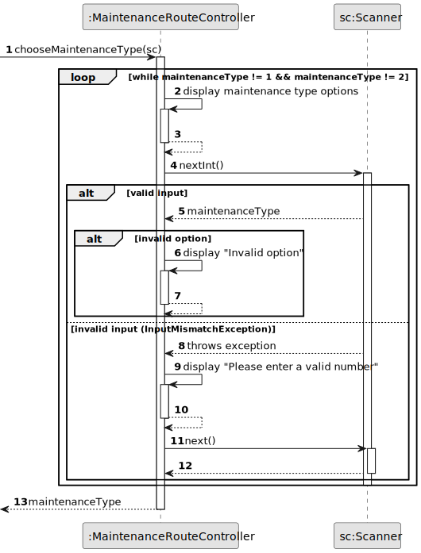
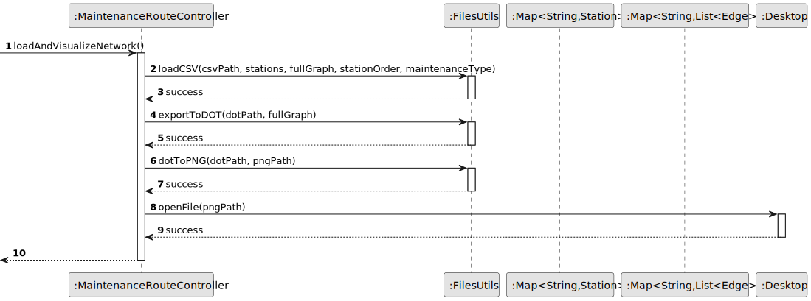
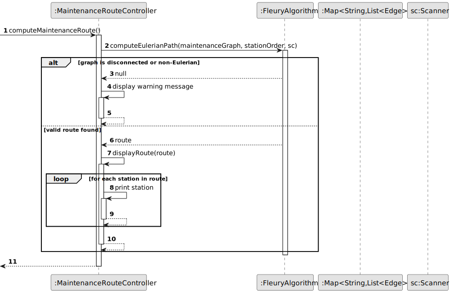
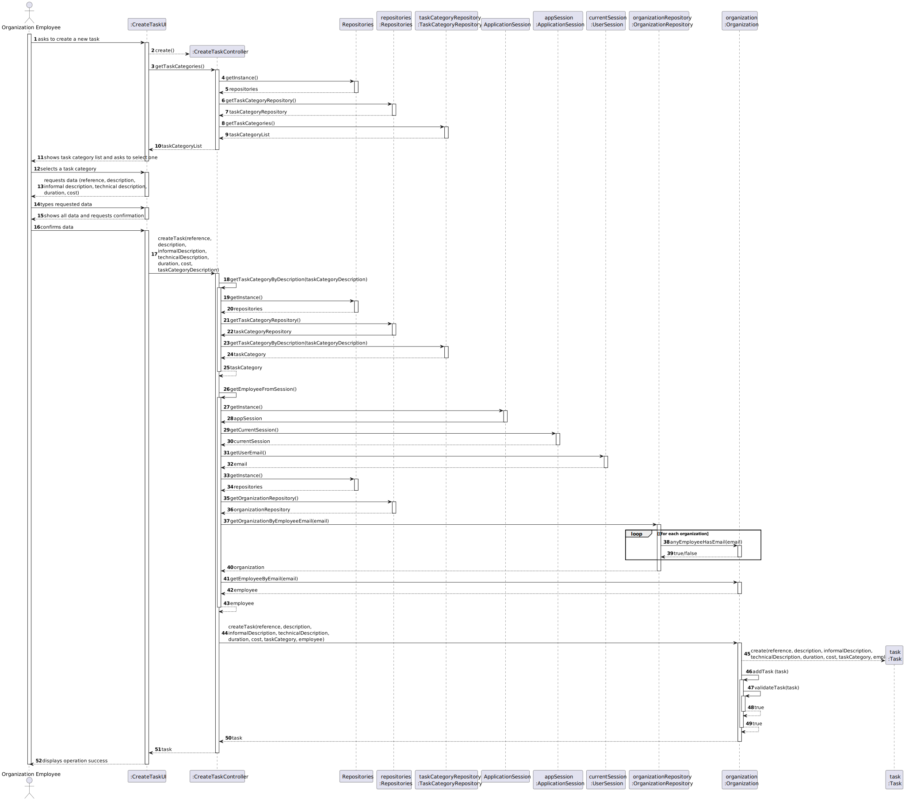
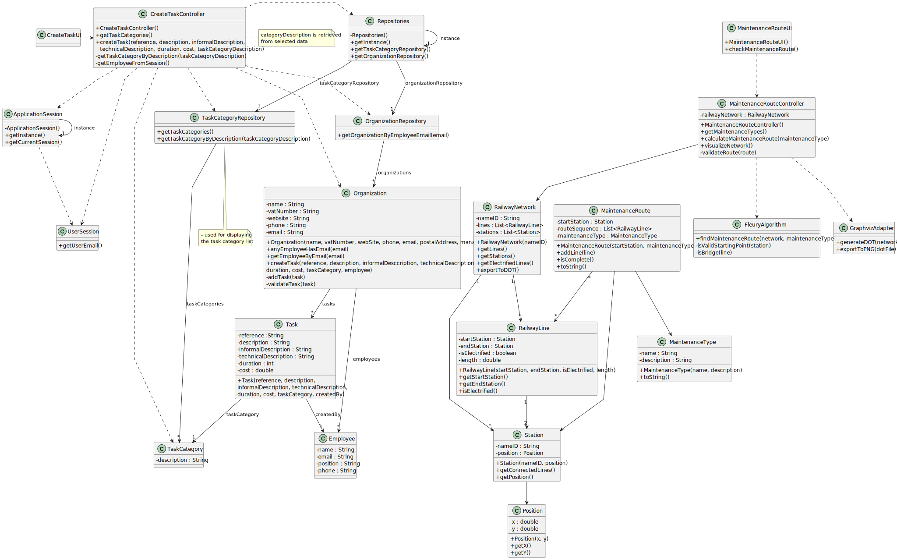

# US14 - Check Railway Lines Maintenance Route

_XXX stands for User Story number and YYY for User Story description (e.g. US006 - Create a Task)_

## 3. Design

### 3.1. Rationale

**The rationale grounds on the SSD interactions and the identified input/output data.**

| Interaction ID | Question: Which class is responsible for... | Answer  | Justification (with patterns)  |
|:-------------  |:--------------------- |:------------|:---------------------------- |
| Step 1  		 | ...interacting with the user? | MaintenanceRouteUI | Pure Fabrication: UI layer responsibility |
| Step 2  		 | ...coordinating the maintenance route functionality? | MaintenanceRouteController | Controller Pattern: coordinates operations |
| Step 3  		 | ...managing maintenance type selection? | MaintenanceRouteController | Controller Pattern: handles user input validation |
| Step 4  		 | ...loading the railway network data? | FilesUtils | Pure Fabrication: handles file operations |
| Step 5  		 | ...storing network structure? | RailwayNetwork | Information Expert: contains network data |
| Step 6  		 | ...visualizing the network? | GraphvizAdapter | Adapter Pattern: converts network to visual format |
| Step 7  		 | ...computing the maintenance route? | FleuryAlgorithm | Pure Fabrication: implements route algorithm |
| Step 8  		 | ...representing the maintenance route? | MaintenanceRoute | Information Expert: contains route data |
| Step 9  		 | ...validating the route? | MaintenanceRouteController | Controller Pattern: validates business rules |
| Step 10  		 | ...displaying results to user? | MaintenanceRouteUI | Pure Fabrication: UI layer responsibility |

### Systematization ##

According to the taken rationale, the conceptual classes promoted to software classes are:

* RailwayNetwork
* RailwayLine
* Station
* MaintenanceRoute
* MaintenanceType

Other software classes (i.e. Pure Fabrication) identified:

* MaintenanceRouteUI  
* MaintenanceRouteController
* FleuryAlgorithm
* GraphvizAdapter
* FilesUtils

## 3.2. Sequence Diagram (SD)

The sequence diagrams are split into three main parts for better understanding:

### 3.2.1 Main Sequence Diagram
This diagram shows the high-level interaction between the Player and the system.

### 3.2.2 Get Maintenance Type
This diagram details the process of selecting the maintenance type.

### 3.2.3 Load and Visualize Network
This diagram shows how the railway network is loaded and visualized.

### 3.2.4 Compute Maintenance Route
This diagram details the route computation using Fleury's Algorithm.

### 3.2.5 Complete Sequence Diagram
For a complete view of all interactions, refer to:

## 3.3. Class Diagram (CD)

The class diagram shows the static structure of the system, including:
- UI and Controller classes for user interaction
- Domain classes for railway network representation
- Utility classes for route computation and visualization
- Relationships and dependencies between classes

### Design Patterns Used

1. **MVC Pattern**
   - Model: RailwayNetwork, RailwayLine, Station
   - View: MaintenanceRouteUI
   - Controller: MaintenanceRouteController

2. **Adapter Pattern**
   - GraphvizAdapter: Adapts network structure for visualization

3. **Pure Fabrication**
   - FleuryAlgorithm: Encapsulates route computation
   - FilesUtils: Handles file operations

4. **Information Expert**
   - RailwayNetwork: Manages network structure
   - MaintenanceRoute: Manages route information