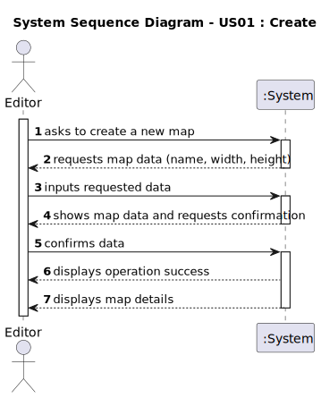

# US01 - Create a Map

## 1. Requirements Engineering

### 1.1. User Story Description

As an Editor, I want to create a map with a size and a name.

### 1.2. Customer Specifications and Clarifications

**From the specifications document:**

> The Map Editor allows you to create rectangular maps and place static elements on the map.

**From the client clarifications:**

> **Question:** What are the minimum and maximum dimensions allowed for a map (e.g., width and height in units or pixels)?
> >**Answer:** Should be positive integer;

> **Question:** Is there a predefined list of sizes, or should users be able to input custom dimensions?
> >**Answer:** Custom dimensions but suggesting predefined sizes could be a good idea.

> **Question:** Are there any requirements or restrictions for the map's name (e.g., character limit, allowed/disallowed characters)?
> >**Answer:** File name like restrictions.

> **Question:** Should map names be unique within the system?
> >**Answer:** yes.

> **Question:** O tamanho do mapa pode ser um número real ou precisa de ser um número inteiro?
> >**Answer:** The map is a set of cells, similar to a spreadsheet. The coordinates are integers (row and column, or alternatively X and Y)
### 1.3. Acceptance Criteria

* **AC1:** The maps dimensions are positive integers.
* **AC2:** Map name should be a valid file name.

### 1.4. Found out Dependencies

* No dependencies were identified for this user story as creating a map is a primary action needed before adding elements such as cities or industries.

### 1.5 Input and Output Data

**Input Data:**

* Typed data:
  * map name
  * width (x-axis size)
  * height (y-axis size) 
  * scale

**Output Data:**

* (In)Success of the operation
* Map details
 

### 1.6. System Sequence Diagram (SSD)

**_Other alternatives might exist._**

### 1.7 Other Relevant Remarks

* The map serves as the foundation for the entire simulation system, where cities, industries, and railway networks will be built.
* The map needs to be created before any scenario can be associated with it.
