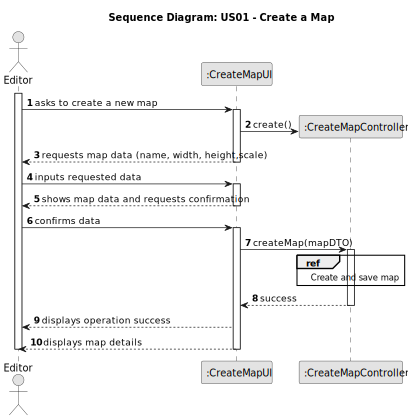
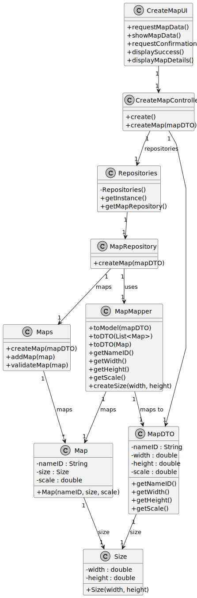

# US01 - Create a Map

## 3. Design

### 3.1. Rationale

**The rationale grounds on the SSD interactions and the identified input/output data.**

| Interaction ID | Question: Which class is responsible for... | Answer              | Justification (with patterns)                                                        |
|:---------------|:--------------------------------------------|:--------------------|:-------------------------------------------------------------------------------------|
| Step 1  		     | ...interacting with the user?               | CreateMapUI         | Pure Fabrication: there is no reason to assign this responsibility to a domain class |
| Step 2  		     | ...coordinating the US?                     | CreateMapController | Controller: coordinates the use case                                                 |
| Step 3  		     | ...receiving the map data?                  | CreateMapUI         | Pure Fabrication: UI classes are responsible for user interactions                   |
| Step 4   		    | ...validating the map name?                 | Map                 | Information Expert: owns its data                                                    |
| 		             | ...validating the map size?                 | Size                | Information Expert: owns its data                                                    |
| Step 5  		     | ...creating the Size?                       | CreateMapController | Creator: Controller creates Size to pass to Editor                                   |
|   		           | ...creating the map?                        | Editor              | Creator: Editor creates Maps according to the domain model                           |
| Step 6  		     | ...saving the map?                          | MapRepository       | Pure Fabrication: responsible for persistence operations                             |
| Step 7  		     | ...informing operation success?             | CreateMapUI         | Pure Fabrication: UI classes handle user feedback                                    |
| Step 8  		     | ...displaying map details?                  | CreateMapUI         | Pure Fabrication: UI classes present information to users                            |

### Systematization ##

According to the taken rationale, the conceptual classes promoted to software classes are:

* Editor
* Map
* Size

Other software classes (i.e. Pure Fabrication) identified:

* CreateMapUI  
* CreateMapController
* MapRepository

## 3.2. Sequence Diagram (SD)

## 3.3. Class Diagram (CD)

