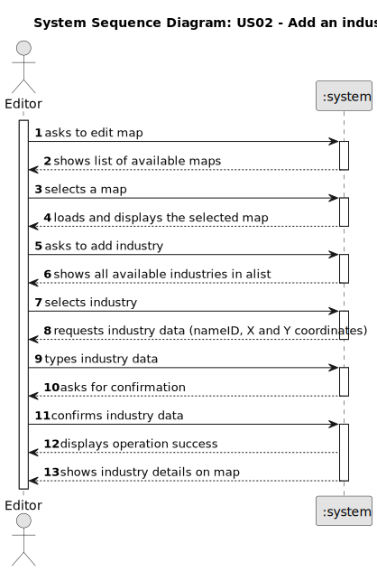

# US002 - Add an Industry

## 1. Requirements Engineering

### 1.1. User Story Description

- As an Editor, I want to add an industry (selected from the available industries) in a position XY of the selected (current) map.

### 1.2. Customer Specifications and Clarifications 

**From the specifications document:**

> The Map Editor allows you to create rectangular maps and place static elements on the map. Elements can be cities or industries. As for industries, there are three different types, primary sector industries, transforming industries and mixed industries.

**From the client clarifications:**

> **Question:** Is it possible to select more than one industry at the same time to place on the map?
> > **Answer:** That question is more UI/UX related than of the said User Story, so the teams have freedom to decide it.

> **Question:** When adding a new industry to a map, is there any other necessary input aside from position and industry type?  
> > **Answer:** No.

> **Question:** As an editor, when adding a new factory, do I need to check for overbuild?
> > **Answer:** Yes.

### 1.3. Acceptance Criteria

* **AC1:**  Each industry must occupy a cell in the map.

### 1.4. Found out Dependencies

* There is a dependency on "US01 - As an Editor, I want to create a map with a size and a name" as there a map must be created before.

### 1.5 Input and Output Data

**Input Data:**
* Typed data:
    * industry nameID
    * a X coordinate
    * a Y coordinate

* Selected data:
    * a map
    * an industry available in the list

**Output Data:**

* Success or insuccess of the operation
* Details of the industry placed in the map

### 1.6. System Sequence Diagram (SSD)

### 1.7 Other Relevant Remarks

n/a