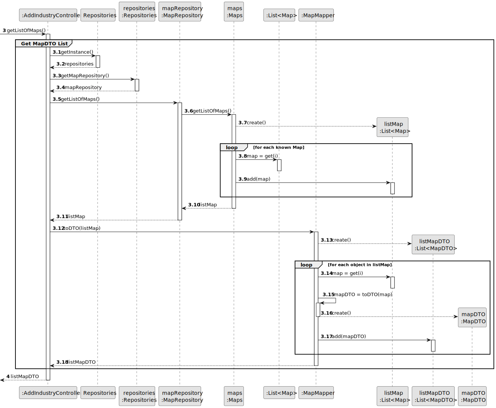
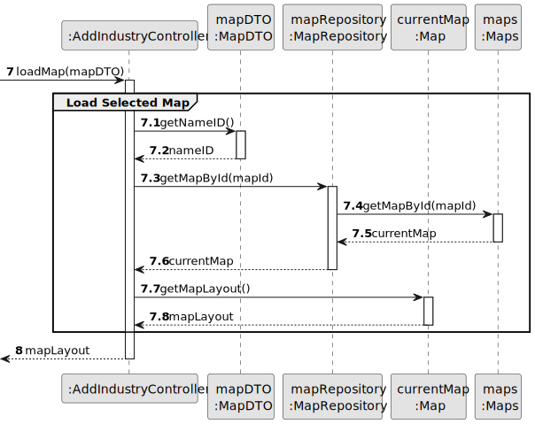
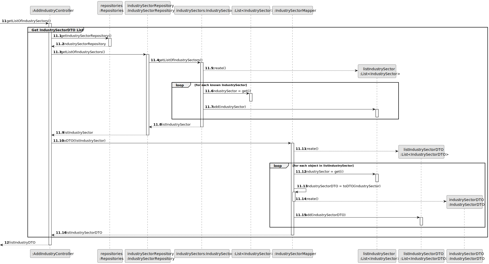
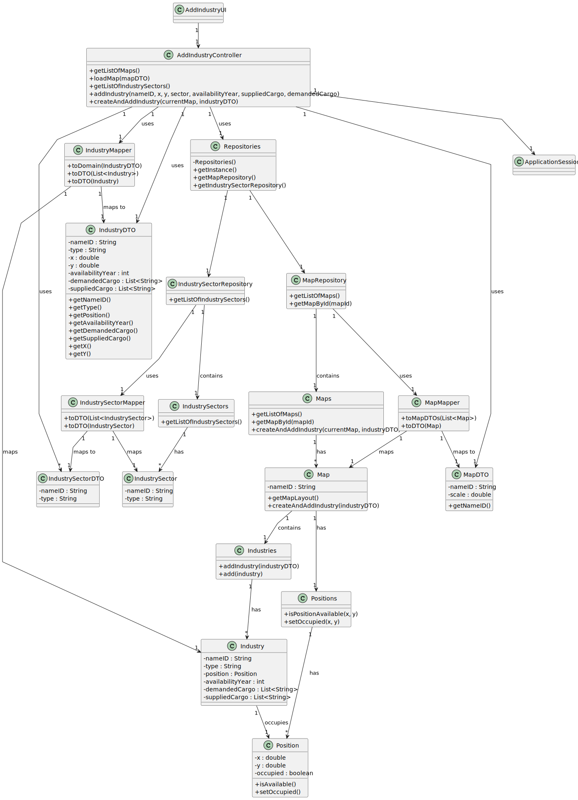

# US02 - Add an Industry

## 3. Design

### 3.1. Rationale

**The rationale grounds on the SSD interactions and the identified input/output data.**

| Interaction ID | Question: Which class is responsible for... | Answer              | Justification (with patterns)                                                                                 |
|:-------------  |:--------------------------------------------|:--------------------|:--------------------------------------------------------------------------------------------------------------|
| Step 1         | ... interacting with the actor?            | AddIndustryUI       | Pure Fabrication: there is no reason to assign this responsibility to any existing class in the Domain Model. |
|                | ... coordinating the US?                   | AddIndustryController | Controller: controls the execution of the operation                                                         |
|                | ... knowing the user using the system?     | ApplicationSession  | IE: cf. A&A component documentation.                                                                        |
|                |                                            | Editor              | IE: knows its own data                                                                                       |
| Step 2         | ... obtaining the list of available maps?  | MapRepository       | IE: knows all Map objects                                                                                    |
|                | ... converting Map objects to MapDTO?      | MapMapper           | Pure Fabrication: responsible for data conversion between layers                                             |
| Step 3         | ... selecting and loading a specific map?  | AddIndustryUI       | Pure Fabrication: responsible for UI interactions                                                           |
|                | ... retrieving map by ID?                  | Maps                | IE: knows all its Map objects and can retrieve by identifier                                                |
|                | ... providing map layout information?      | Map                 | IE: knows its own structure and layout                                                                       |
| Step 4         | ... obtaining the list of industry sectors? | IndustrySectorRepository | IE: knows all IndustrySector objects                                                                    |
|                | ... converting IndustrySector to DTO?      | IndustrySectorMapper | Pure Fabrication: responsible for data conversion between layers                                         |
| Step 5         | ... collecting industry data from user?    | AddIndustryUI       | Pure Fabrication: responsible for UI interactions and data collection                                       |
|                | ... creating IndustryDTO for validation?   | AddIndustryController | Controller: coordinates the creation of DTOs for business operations                                       |
| Step 6         | ... validating the positions (X,Y)?        | Positions           | IE: knows all position states and availability                                                               |
|                | ... checking if position is available?     | Position            | IE: knows its own occupation status                                                                          |
| Step 7         | ... creating/instantiating a new Industry? | IndustryMapper      | Pure Fabrication: responsible for converting DTO to domain object                                           |
|                | ... adding Industry to the collection?     | Industries          | IE: knows all its Industry objects and manages the collection                                                |
| Step 8         | ... marking position as occupied?          | Position            | IE: knows and controls its own state                                                                         |
|                | ... updating position collection?          | Positions           | IE: manages all Position objects                                                                             |
| Step 9         | ... informing operation success?           | AddIndustryUI       | Pure Fabrication: responsible for showing the operation result to the user                                  |

### 3.2. Systematization

According to the taken rationale, the conceptual classes promoted to software classes are:

* Editor
* Map
* Industry
* IndustrySector
* Position

Other software classes (i.e. Pure Fabrication) identified:

* AddIndustryUI
* AddIndustryController
* MapRepository
* IndustrySectorRepository
* Maps
* Industries
* IndustryDTO
* Positions
* MapMapper
* IndustrySectorMapper
* IndustryMapper
* Repositories
* ApplicationSession
* IndustrySectorDTO
* MapDTO
## 3.2. Sequence Diagram (SD)

_In this section, it is suggested to present an UML dynamic view representing the sequence of interactions between software objects that allows to fulfill the requirements._

### 3.2.1. Main Sequence Diagram

### 3.2.2. Partial Sequence Diagrams

#### 3.2.2.1. Get Available Maps DTO

#### 3.2.2.2. Load Map

#### 3.2.2.3. Get Available Industry Sectors

#### 3.2.2.4. Create and Add Industry

## 3.3. Class Diagram (CD)

_In this section, it is suggested to present an UML static view representing the main related software classes that are involved in fulfilling the requirements as well as their relations, attributes and methods._

