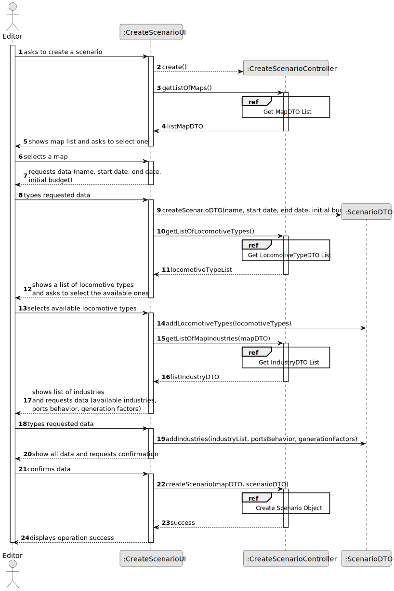
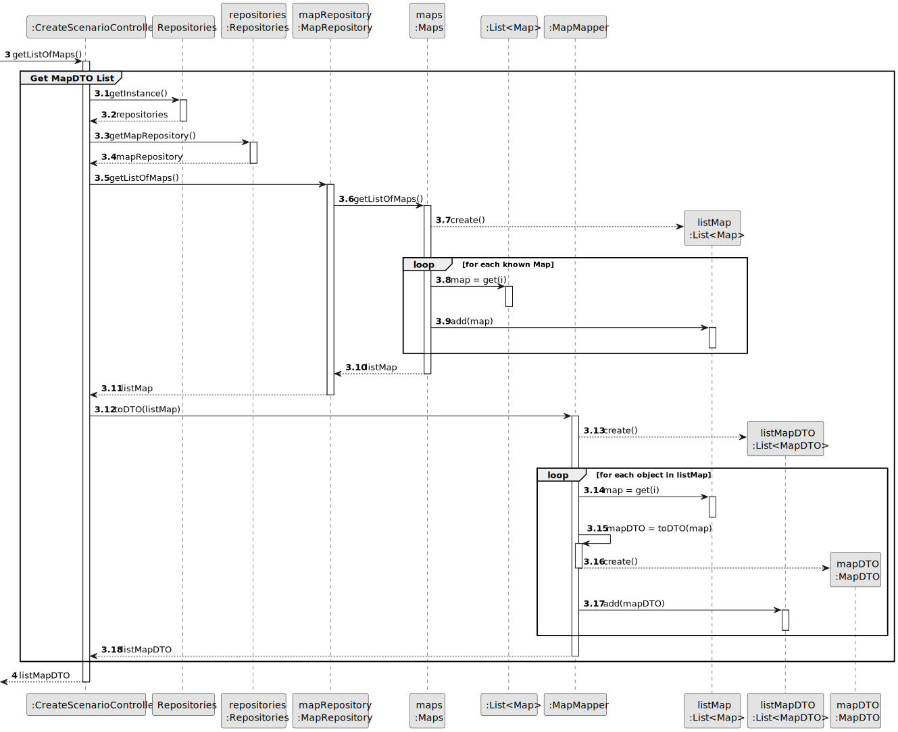
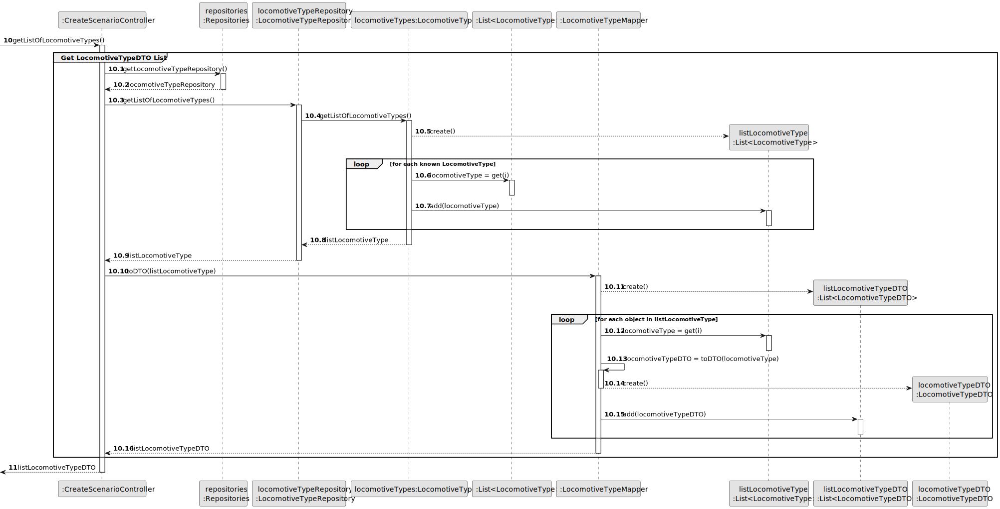
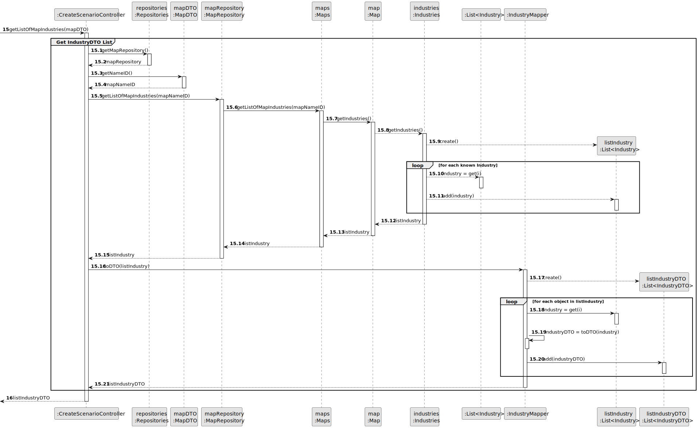
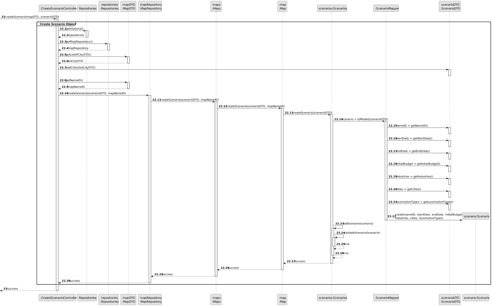
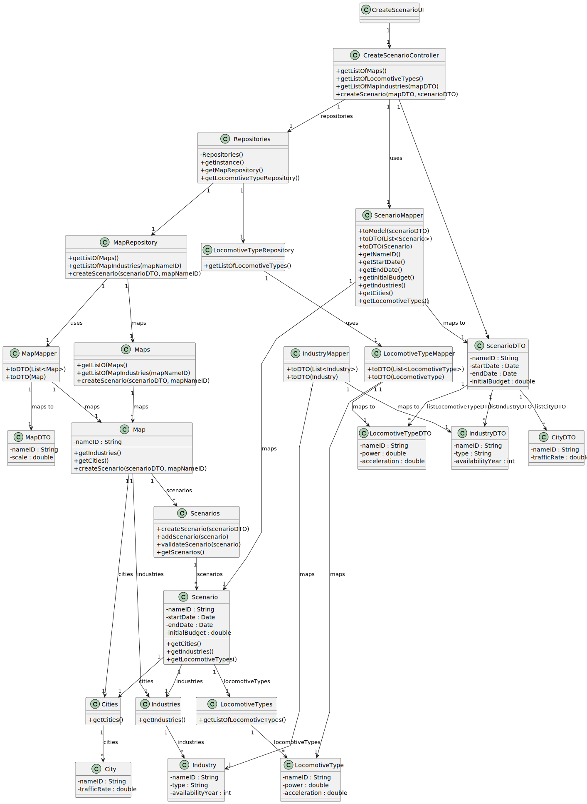

# US04 - Create a Scenario

## 3. Design

### 3.1. Rationale

| Interaction ID | Question: Which class is responsible for...        | Answer                 | Justification (with patterns)                                                                                                       |
|:---------------|:---------------------------------------------------|:-----------------------|:------------------------------------------------------------------------------------------------------------------------------------|
| Step 1         | ... interacting with the actor?                    | CreateScenarioUI       | Pure Fabrication: there is no reason to assign this responsibility to any existing class in the Domain Model.                       |
|                | ... coordinating the US?                           | CreateScenarioController| Controller                                                                                                                          |
| Step 2         | ... knowing all available maps to show?            | Repositories           | IE: Repositories maintains Maps.                                                                                                    |
|                |                                                    | MapRepository          | By applying High Cohesion (HC) + Low Coupling (LC) on class Repositories, it delegates the responsibility to MapRepository.         |
| Step 3         | ... saving the selected map?                       | CreateScenarioUI       | IE: is responsible for keeping the selected map.                                                                                    |
| Step 4         | ... requesting name and time period data?          | CreateScenarioUI       | IE: is responsible for user interactions.                                                                                           |
| Step 5         | ... saving the inputted time period data?          | CreateScenarioUI       | IE: is responsible for keeping the inputted data.                                                                                   |
| Step 6         | ... getting and showing locomotive types?          | Repositories           | IE: Repositories maintains LocomotiveTypes.                                                                                         |
|                |                                                    | LocomotiveTypeRepository| By applying High Cohesion (HC) + Low Coupling (LC) on class Repositories, it delegates the responsibility to LocomotiveTypeRepository.|
| Step 7         | ... saving selected locomotive types?              | CreateScenarioUI       | IE: is responsible for keeping the selected locomotive types.                                                                       |
| Step 8         | ... getting map industries?                        | MapRepository          | IE: knows all maps and can retrieve their industries.                                                                               |
| Step 9         | ... showing list of industries?                    | CreateScenarioUI       | IE: is responsible for user interactions.                                                                                           |
| Step 10        | ... saving the selected industries?                | CreateScenarioUI       | IE: is responsible for keeping the selected industries.                                                                             |
| Step 11        | ... showing all data and requesting confirmation?  | CreateScenarioUI       | IE: is responsible for user interactions.                                                                                           |
| Step 12        | ... instantiating a new Scenario?                  | Map                    | Creator (Rule 1): in the DM Map has Scenarios.                                                                                      |
|                | ... validating all data (local validation)?        | Scenario               | IE: owns its data.                                                                                                                  |
|                | ... validating all data (global validation)?       | Scenarios              | IE: knows all scenarios.                                                                                                            |
|                | ... saving the created scenario?                   | Map                    | IE: owns all its scenarios.                                                                                                         |
|                | ... informing operation success?                   | CreateScenarioUI       | IE: is responsible for user interactions.                                                                                           |

### Systematization ##

According to the taken rationale, the conceptual classes promoted to software classes are:

* Map
* Scenario
* Industry
* City
* LocomotiveType

Other software classes (i.e. Pure Fabrication) identified:

* CreateScenarioUI
* CreateScenarioController
* Repositories
* MapRepository
* LocomotiveTypeRepository
* Maps
* Scenarios
* Cities
* Industries
* LocomotiveTypes
* ScenarioMapper
* MapMapper
* IndustryMapper
* LocomotiveTypeMapper
* ScenarioDTO
* MapDTO
* CityDTO
* IndustryDTO
* LocomotiveTypeDTO

## 3.2. Sequence Diagram (SD)

### Split Diagrams

The following diagram shows the same sequence of interactions between the classes involved in the realization of this user story, but it is split in partial diagrams to better illustrate the interactions between the classes.

It uses Interaction Occurrence (a.k.a. Interaction Use).

**Get MapDTO List Partial SD**

**Get LocomotiveTypeDTO List Partial SD**

**Get IndustryDTO List Partial SD**

**Create Scenario Object Partial SD**

## 3.3. Class Diagram (CD)

