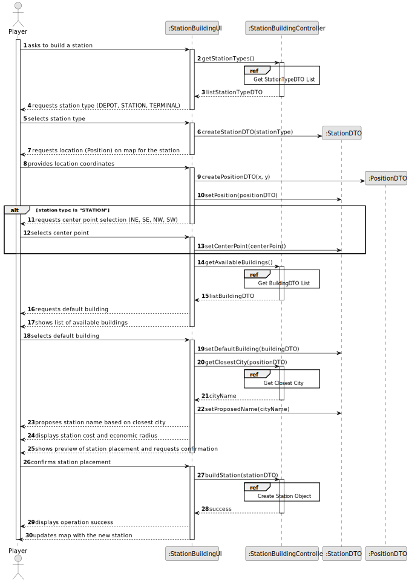
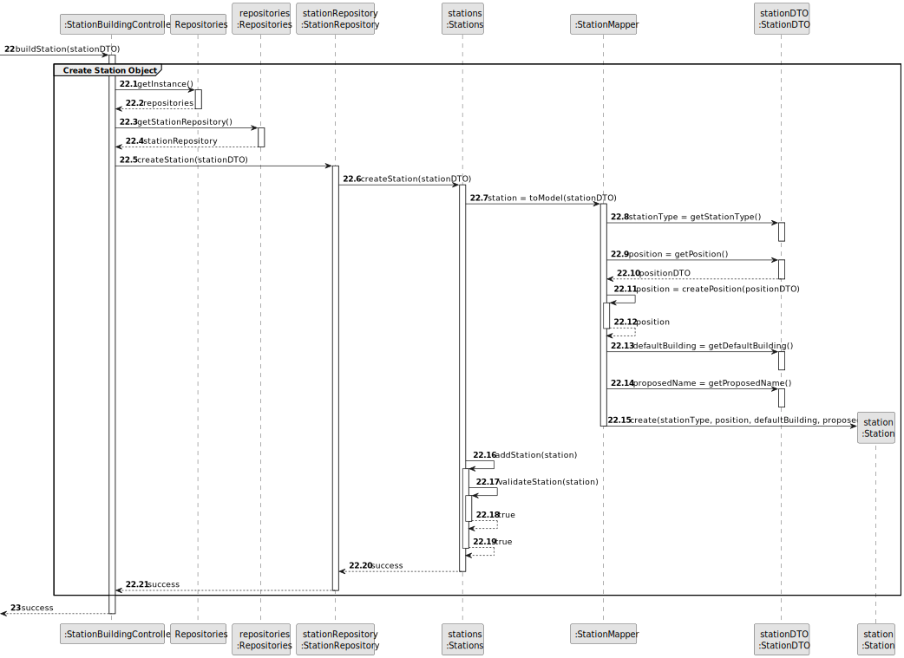
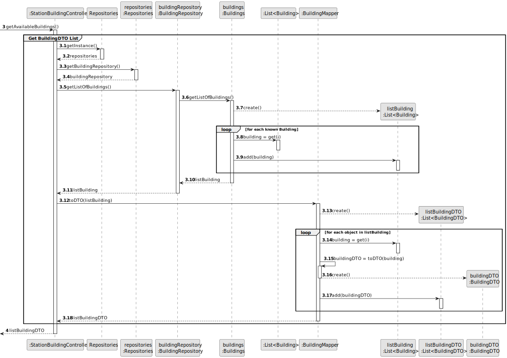
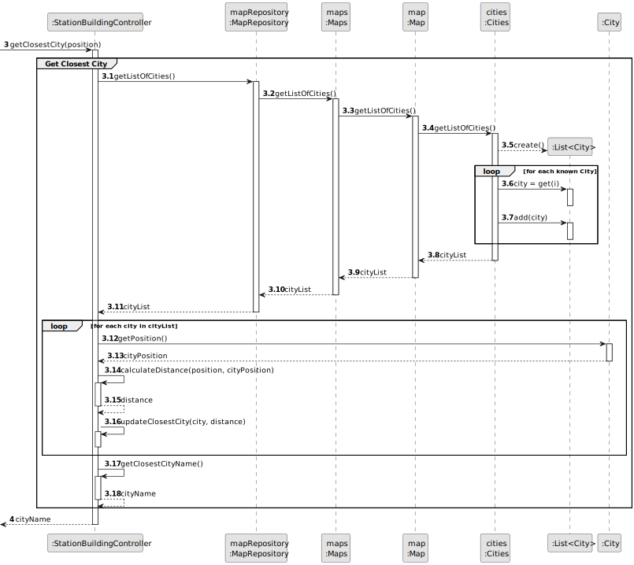
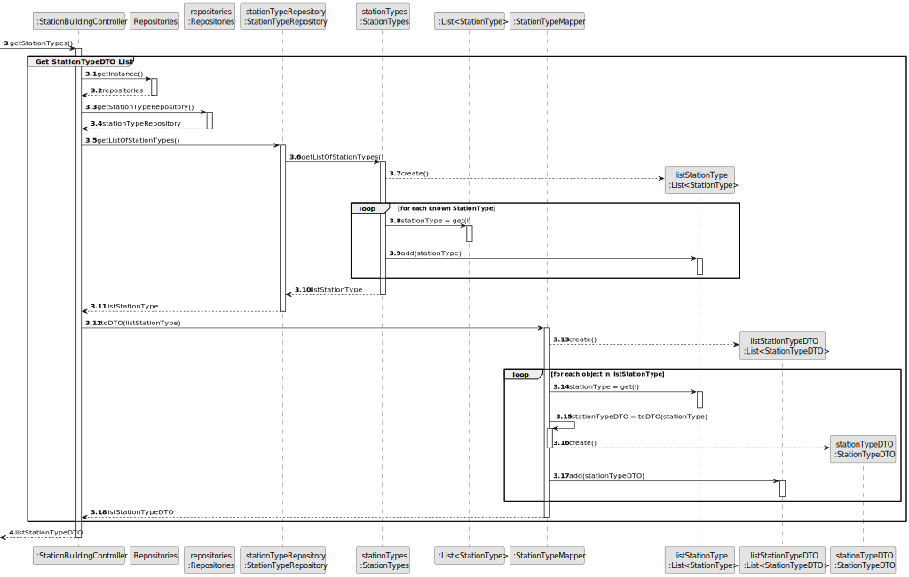
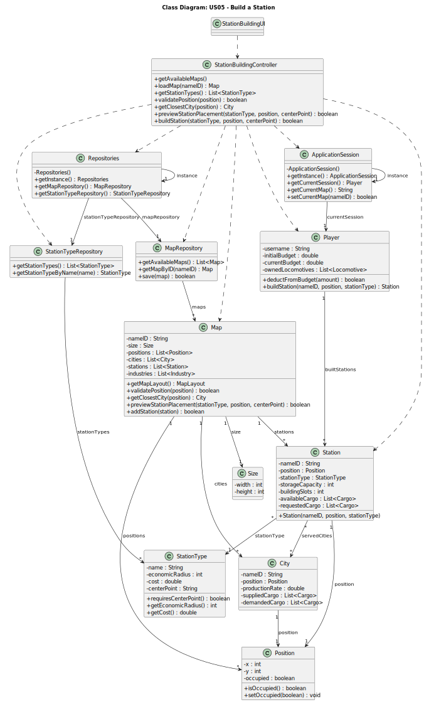

# US05 - Build a Station

## 3. Design

### 3.1. Rationale

**The rationale grounds on the SSD interactions and the identified input/output data.**

| Interaction ID | Question: Which class is responsible for...          | Answer                    | Justification (with patterns)                                                           |
|:---------------|:-----------------------------------------------------|:--------------------------|:----------------------------------------------------------------------------------------|
| Step 1  		     | ... interacting with the actor?                      | StationBuildingUI         | Pure Fabrication: no reason to assign this responsibility to any existing domain class. |
|                | ... coordinating the US?                             | StationBuildingController | Controller pattern: coordinates the use case.                                           |
|                | ... showing available station types?                 | StationTypeRepository     | Information Expert: knows all available station types.                                  |
| Step 2  		     | ... recording the selected station type?             | StationBuildingUI         | IE: UI is responsible for keeping track of user selections.                             |
| Step 3  		     | ... creating station DTO?                           | StationBuildingUI         | Creator: creates DTO to hold station information.                                       |
| Step 4  		     | ... validating if position is valid on map?          | Map                       | IE: knows its own structure and valid positions.                                        |
|                |                                                      | Position                  | IE: knows its own state (occupied or not).                                              |
| Step 5  		     | ... determining if center point selection is needed? | StationType               | IE: knows its own properties and requirements.                                          |
| Step 6  		     | ... recording the selected center point?             | StationBuildingUI         | IE: UI is responsible for keeping track of user selections.                             |
| Step 7  		     | ... getting available buildings?                     | BuildingRepository        | IE: contains all building information.                                                  |
| Step 8  		     | ... determining the closest city?                    | Map                       | IE: knows all cities and their positions.                                               |
|                | ... calculating station cost and economic radius?    | StationType               | IE: contains cost and radius information.                                               |
|                | ... generating a preview of station placement?       | Map                       | IE: can determine impact of station placement.                                          |
| Step 9  		     | ... confirming station placement?                    | StationBuildingController | Controller: coordinates the action.                                                     |
|                | ... creating the station instance?                   | Map                       | Creator: contains stations.                                                             |
|                | ... updating the map with new station?               | Map                       | IE: knows its own structure and manages station placement.                              |

### Systematization ##

According to the taken rationale, the conceptual classes promoted to software classes are:

* Map
* City
* Position
* Station
* StationType
* Building

Other software classes (i.e. Pure Fabrication) identified:

* StationBuildingUI
* StationBuildingController
* MapRepository
* StationTypeRepository
* BuildingRepository
* Repositories
* StationMapper
* StationTypeMapper
* BuildingMapper
* StationDTO
* StationTypeDTO
* BuildingDTO
* Maps
* Scenarios
* Scenario
* Stations
* Cities
* StationTypes
* Buildings

## 3.2. Sequence Diagram (SD)

### 3.2.1. Partial Sequence Diagrams - Create Station Object

#### 3.2.2. Partial Sequence Diagrams - Get BuildingDTO List

#### 3.2.3. Partial Sequence Diagrams - Get Closest City

#### 3.2.4. Partial Sequence Diagrams - Get StationTypeDTO List

## 3.3. Class Diagram (CD)

