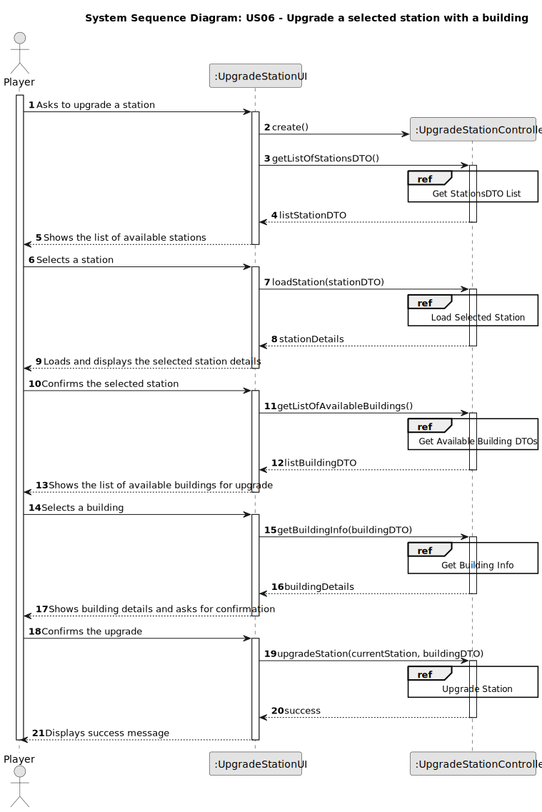
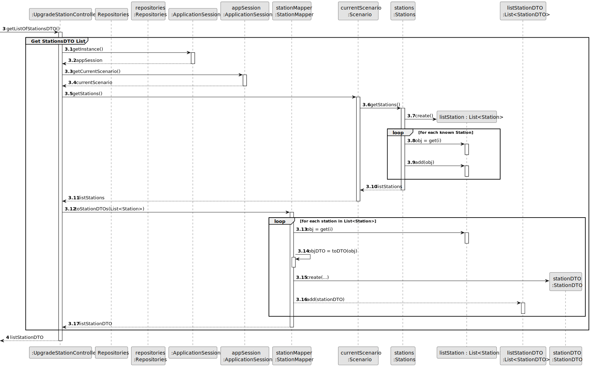
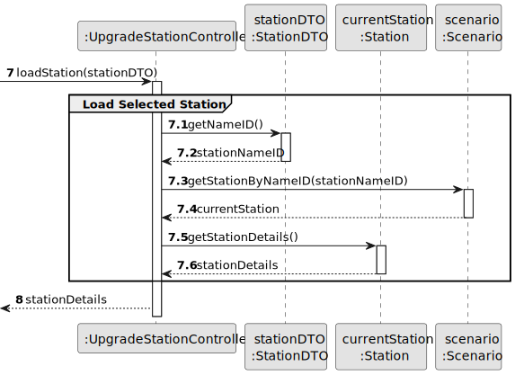
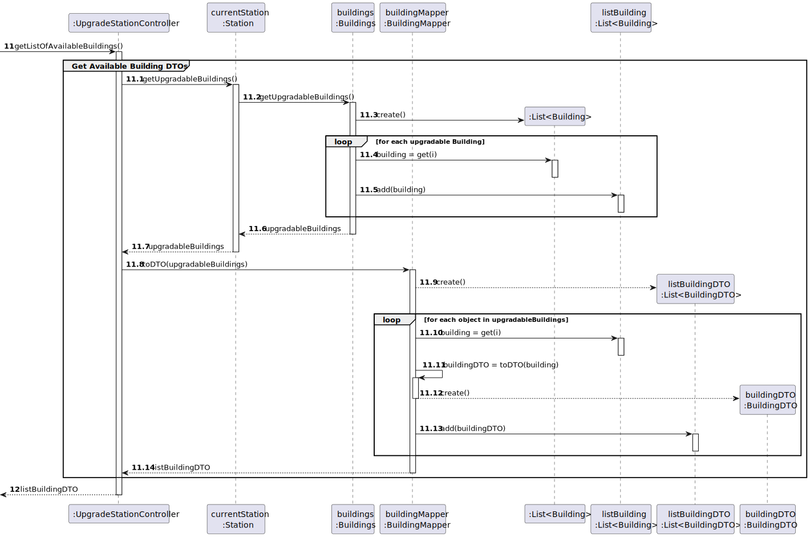
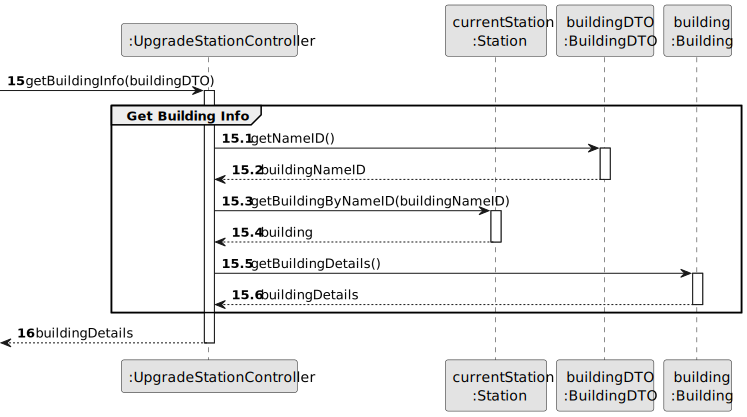
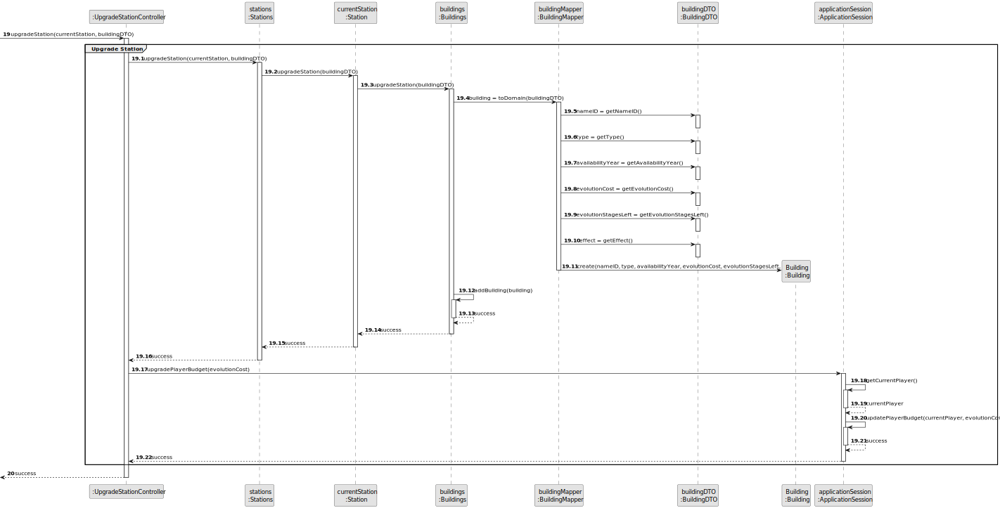
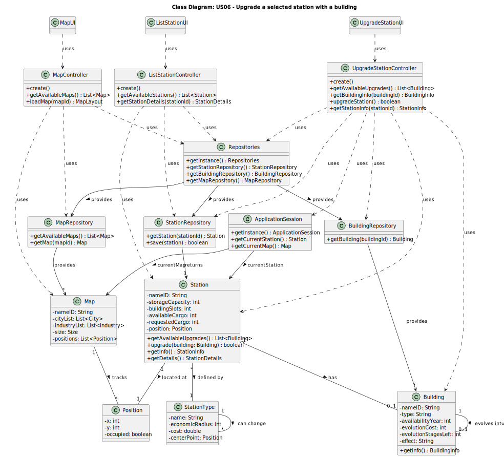

# US06 - Upgrade a selected station with a building

## 3. Design

### 3.1. Rationale

**The rationale grounds on the SSD interactions and the identified input/output data.**

| Interaction ID | Question: Which class is responsible for... | Answer                    | Justification (with patterns)                                                                                   |
|:--------------:|:---------------------------------------------|:---------------------------|:----------------------------------------------------------------------------------------------------------------|
| Step 1         | ... interacting with the actor?              | UpgradeStationUI           | Pure Fabrication: UI class responsible for interaction.                                                        |
|                | ... coordinating the US?                     | UpgradeStationController   | Controller: coordinates the sequence of operations.                                                             |
|                | ... knowing the logged user and station?     | ApplicationSession         | IE: maintains session state (e.g., selected station).                                                           |
| Step 2         | ... retrieving station by ID?                | StationRepository          | IE: knows all Station objects and allows retrieval.                                                             |
|                | ... returning StationDTO to UI?              | StationMapper              | Pure Fabrication: converts domain object to DTO.                                                                |
| Step 3         | ... obtaining available buildings?           | BuildingRepository         | IE: maintains all Building objects.                                                                            |
|                | ... converting buildings to DTOs?            | BuildingMapper             | Pure Fabrication: responsible for data conversion.                                                              |
| Step 4         | ... collecting upgrade choice from user?     | UpgradeStationUI           | Pure Fabrication: responsible for UI interaction.                                                               |
| Step 5         | ... retrieving building by ID?               | BuildingRepository         | IE: manages and allows access to Building objects.                                                              |
|                | ... validating if station can be upgraded?   | Station                    | IE: knows its own state and rules for being upgraded.                                                           |
| Step 6         | ... performing the upgrade?                  | Station                    | IE: changes its own state by applying the building.                                                             |
| Step 7         | ... saving the upgraded station?             | StationRepository          | IE: persists changes in the system.                                                                             |
| Step 8         | ... converting updated station to DTO?       | StationMapper              | Pure Fabrication: maps domain object to DTO.                                                                    |
| Step 9         | ... providing building info after upgrade?   | Building                   | IE: knows its own data.                                                                                         |
| Step 10        | ... presenting final information to user?    | UpgradeStationUI           | Pure Fabrication: responsible for UI output.                                                                    |

---

### 3.2. Systematization

**According to the taken rationale, the conceptual classes promoted to software classes are:**

* `Station`
* `Building`

**Other software classes (i.e. Pure Fabrication) identified:**

* `UpgradeStationUI`
* `UpgradeStationController`
* `StationRepository`
* `BuildingRepository`
* `StationMapper`
* `BuildingMapper`
* `ApplicationSession`

**DTOs used:**

* `StationDTO`
* `BuildingDTO`

## 3.2. Sequence Diagram (SD)

_In this section, it is suggested to present an UML dynamic view representing the sequence of interactions between software objects that allows to fulfill the requirements._

### 3.2.1. Main Sequence Diagram

### 3.2.2. Partial Sequence Diagrams

#### 3.2.2.1. Get Stations DTO List

#### 3.2.2.2. Load Station

#### 3.2.2.3. Get Available Buildings DTO List

#### 3.2.2.4. Get Building Details

#### 3.2.2.5. Upgrade Station with Building

## 3.3. Class Diagram (CD)

