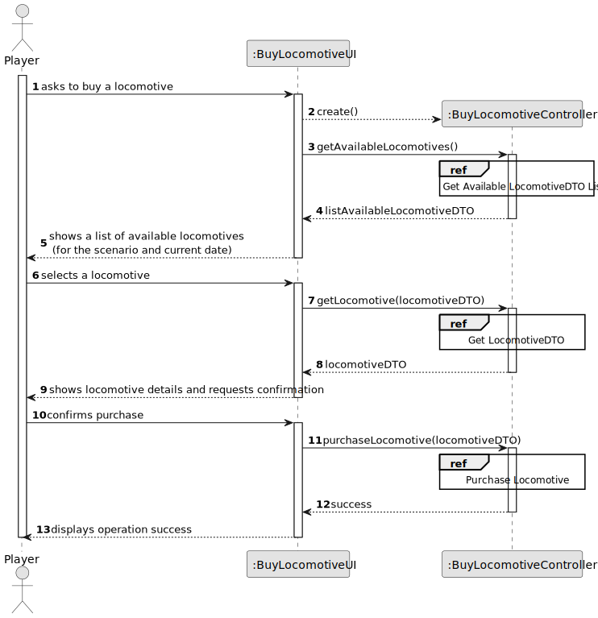
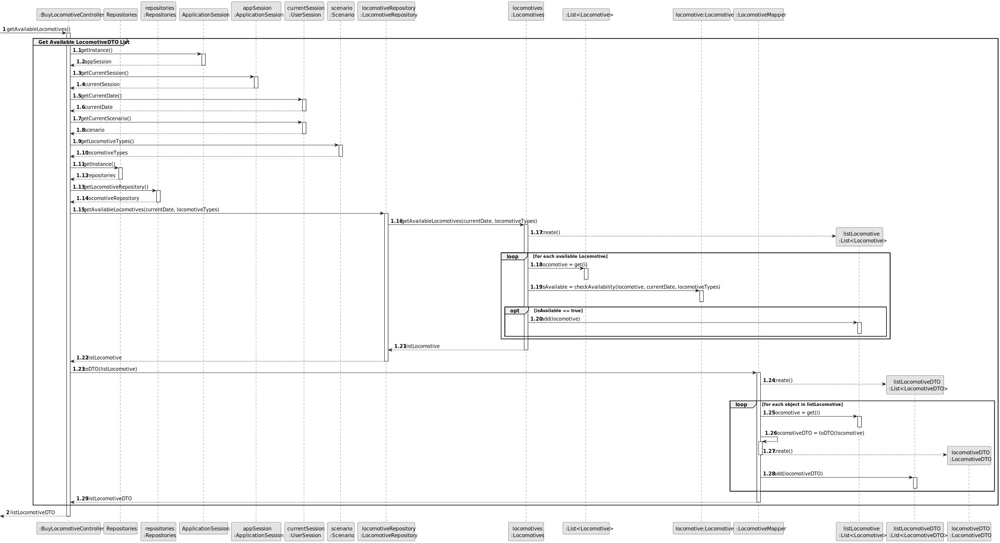
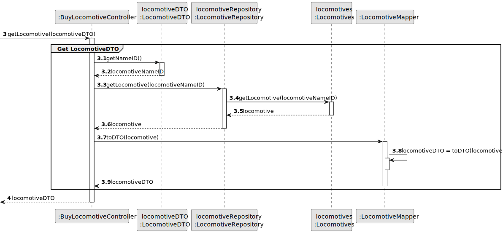
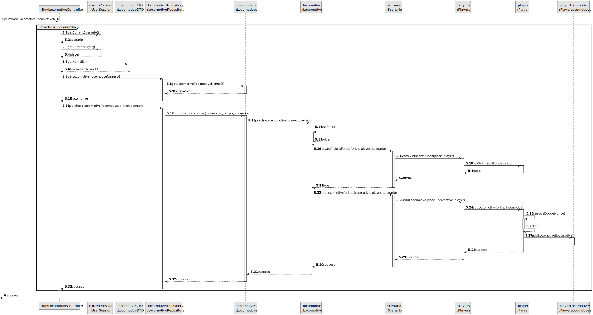
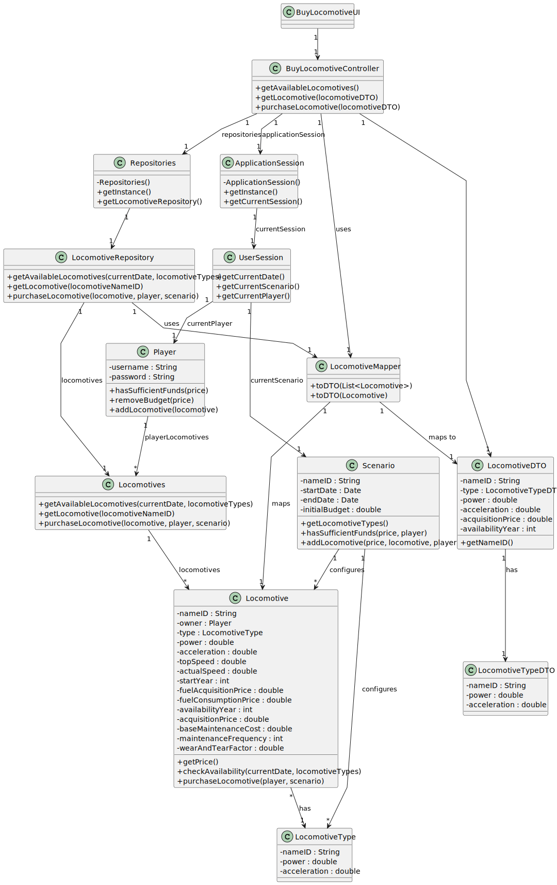

# US09 - Buy a Locomotive

## 3. Design

### 3.1. Rationale

| Interaction ID | Question: Which class is responsible for...        | Answer                  | Justification (with patterns)                                                                                                     |
|:---------------|:--------------------------------------------------|:-----------------------|:--------------------------------------------------------------------------------------------------------------------------------|
| Step 1         | ... interacting with the actor?                    | BuyLocomotiveUI        | Pure Fabrication: there is no reason to assign this responsibility to any existing class in the Domain Model.                     |
|                | ... coordinating the US?                           | BuyLocomotiveController| Controller                                                                                                                        |
|                | ... knowing the user using the system?             | UserSession            | IE: cf. A&A component documentation.                                                                                              |
|                | ... getting current scenario and date?             | ApplicationSession     | IE: knows the current game state including scenario and date.                                                                     |
| Step 2         | ... showing available locomotives?                  | BuyLocomotiveUI        | IE: is responsible for user interactions.                                                                                         |
|                | ... getting available locomotives?                 | LocomotiveRepository   | IE: knows/has access to all locomotives.                                                                                          |
|                | ... getting locomotive types?                      | Scenario               | IE: knows its available locomotive types.                                                                                         |
|                | ... mapping to DTOs?                              | LocomotiveMapper       | Pure Fabrication: handles data transfer objects.                                                                                  |
| Step 3         | ... handling locomotive selection?                 | BuyLocomotiveUI        | IE: is responsible for user interactions.                                                                                         |
|                | ... getting locomotive details?                    | LocomotiveRepository   | IE: knows/has access to all locomotives.                                                                                          |
|                | ... mapping to DTO?                               | LocomotiveMapper       | Pure Fabrication: handles data transfer objects.                                                                                  |
| Step 4         | ... showing locomotive details?                    | BuyLocomotiveUI        | IE: is responsible for user interactions.                                                                                         |
|                | ... getting current player?                        | UserSession            | IE: knows the current player in the session.                                                                                      |
|                | ... getting current scenario?                      | UserSession            | IE: knows the current scenario in the session.                                                                                    |
| Step 5         | ... processing the purchase?                       | BuyLocomotiveController| Controller                                                                                                                        |
|                | ... validating purchase possibility?               | Scenario               | IE: knows scenario constraints and can validate purchase.                                                                         |
|                | ... checking player funds?                         | Player                 | IE: manages its own funds and can validate purchase possibility.                                                                  |
|                | ... updating locomotive ownership?                 | Locomotive             | IE: knows its own data and can process purchase.                                                                                  |
|                | ... updating player's locomotives?                 | Player                 | IE: owns the locomotives and manages its collection.                                                                              |
|                | ... updating player's budget?                      | Player                 | IE: manages its own budget.                                                                                                       |
| Step 6         | ... informing operation success?                   | BuyLocomotiveUI        | IE: is responsible for user interactions.                                                                                         |

### Systematization ##

According to the taken rationale, the conceptual classes promoted to software classes are: 

* Player
* Locomotive
* LocomotiveType
* Scenario

Other software classes (i.e. Pure Fabrication) identified: 

* BuyLocomotiveUI  
* BuyLocomotiveController
* Repositories
* LocomotiveRepository
* ApplicationSession
* UserSession
* Locomotives
* LocomotiveMapper
* LocomotiveDTO
* LocomotiveTypeDTO

## 3.2. Sequence Diagram (SD)

### Split Diagrams

The following diagram shows the same sequence of interactions between the classes involved in the realization of this user story, but it is split in partial diagrams to better illustrate the interactions between the classes.

It uses Interaction Occurrence (a.k.a. Interaction Use).

**Get Available Locomotives**

**Get Locomotive**

**Purchase Locomotive**

## 3.3. Class Diagram (CD)

