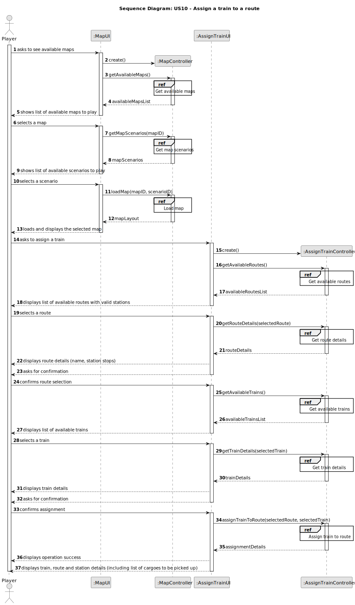
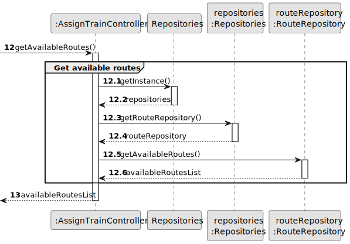
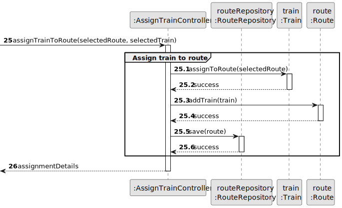
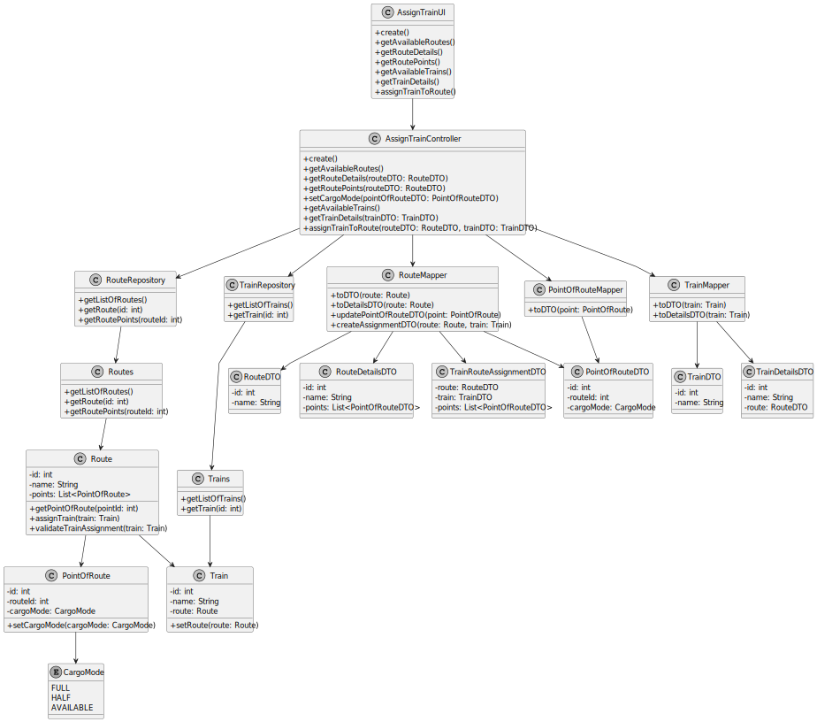

# US10 - Assign a train to a route

## 3. Design

### 3.1. Rationale

**The rationale grounds on the SSD interactions and the identified input/output data.**

| Interaction ID | Question: Which class is responsible for...       | Answer           | Justification (with patterns)  |
|:---------------|:--------------------------------------------------|:-----------------|:---------------------------- |
| Step 1  		     | ... interacting with the actor? | EditMapUI | Pure Fabrication: there is no reason to assign this responsibility to any existing class in the Domain Model. |
|                | ... coordinating the US? | EditMapController | Controller: pattern that assigns the responsibility of controlling the use case sequence to this class. |
| Step 2  		     | ... knowing which map is selected? | ApplicationSession | IE: maintains information about the current session, including the selected map. |
|                | ... getting available maps? | MapRepository | IE: maintains information about available maps. |
| Step 3  		     | ... interacting with the actor for train assignment? | AssignTrainUI | Pure Fabrication: responsible for UI interactions. |
|                | ... coordinating the train assignment? | AssignTrainController | Controller: controls the execution of the operation. |
| Step 4  		     | ... providing route information? | RouteRepository | IE: maintains information about available routes. |
|                | ... knowing route details? | Route | IE: knows its own data. |
| Step 5  		     | ... providing train information? | TrainRepository | IE: maintains information about available trains. |
|                | ... knowing train details? | Train | IE: knows its own data. |
| Step 6  		     | ... assigning the train to the route? | Train | IE: knows its own state and how to change it. |
| Step 7  		     | ... persisting the route with the assigned train? | RouteRepository | IE: responsible for maintaining all routes. |
| Step 8  		     | ... informing operation success? | AssignTrainUI | IE: responsible for user interaction. |
| Step 9  		     | ... providing updated route information? | Route | IE: knows its own data. |
| Step 10 		     | ... providing updated train information? | Train | IE: knows its own data. |
| Step 11 		     | ... displaying final information to the user? | AssignTrainUI | IE: responsible for user interaction. |

### Systematization ##

According to the taken rationale, the conceptual classes promoted to software classes are:

* `Map`
* `Route`
* `Train`

Other software classes (i.e. Pure Fabrication) identified:

* `EditMapUI`
* `EditMapController`
* `AssignTrainUI`
* `AssignTrainController`
* `Repositories`
* `MapRepository`
* `RouteRepository`
* `TrainRepository`
* `ApplicationSession`

## 3.2. Sequence Diagram (SD)

_In this section, it is suggested to present an UML dynamic view representing the sequence of interactions between software objects that allows to fulfill the requirements._

### 3.2.1. Main Sequence Diagram

### 3.2.2. Partial Sequence Diagrams

#### 3.2.2.1. Get Available Maps

#### 3.2.2.2. Load Map

#### 3.2.2.3. Get Available Routes

#### 3.2.2.4. Get Route Details

#### 3.2.2.5. Get Available Trains

#### 3.2.2.6. Get Train Details

#### 3.2.2.7. Assign Train to Route

## 3.3. Class Diagram (CD)

_In this section, it is suggested to present an UML static view representing the main related software classes that are involved in fulfilling the requirements as well as their relations, attributes and methods._

 