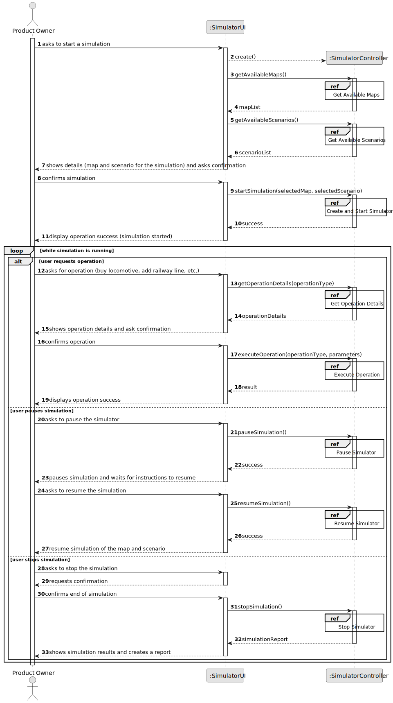
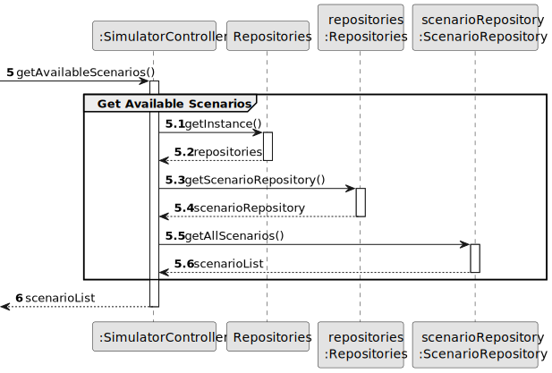
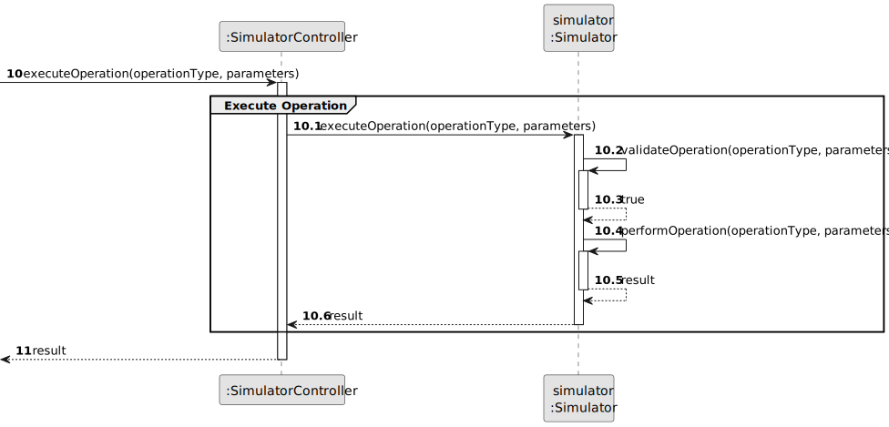
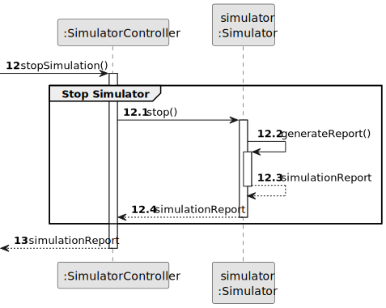

# US12 - Create a Simulator

## 3. Design

### 3.1. Rationale

| Interaction ID | Question: Which class is responsible for...        | Answer               | Justification (with patterns)                                                                                                     |
|:---------------|:--------------------------------------------------|:---------------------|:---------------------------------------------------------------------------------------------------------------------------------|
| Step 1         | ... interacting with the actor?                    | SimulatorUI          | Pure Fabrication: there is no reason to assign this responsibility to any existing class in the Domain Model.                     |
|                | ... coordinating the US?                           | SimulatorController  | Controller                                                                                                                        |
|                | ... getting available maps?                        | MapRepository        | IE: Repositories maintains Maps. By applying High Cohesion (HC) + Low Coupling (LC), it delegates to MapRepository.               |
|                | ... getting available scenarios?                   | ScenarioRepository   | IE: Repositories maintains Scenarios. By applying High Cohesion (HC) + Low Coupling (LC), it delegates to ScenarioRepository.     |
| Step 2         | ... showing simulation details and asking confirmation? | SimulatorUI     | IE: is responsible for user interactions.                                                                                         |
| Step 3         | ... creating the simulator?                        | SimulatorRepository  | Creator (Rule 1): in the DM Repositories manages Simulators.                                                                      |
|                | ... validating simulation data?                    | Simulator            | IE: owns its data.                                                                                                                |
|                | ... starting the simulation?                       | Simulator            | IE: controls its own lifecycle.                                                                                                   |
| Step 4         | ... showing operation success?                     | SimulatorUI          | IE: is responsible for user interactions.                                                                                         |
| Step 5         | ... handling operation requests?                   | SimulatorController  | Controller: coordinates the operation execution.                                                                                   |
|                | ... executing operations?                          | Simulator            | IE: manages its own operations.                                                                                                   |
|                | ... validating operations?                         | Simulator            | IE: knows what operations are valid in its current state.                                                                         |
| Step 6         | ... showing operation details?                     | SimulatorUI          | IE: is responsible for user interactions.                                                                                         |
| Step 7         | ... confirming operation?                          | SimulatorUI          | IE: is responsible for user interactions.                                                                                         |
| Step 8         | ... showing operation success?                     | SimulatorUI          | IE: is responsible for user interactions.                                                                                         |
| Step 9         | ... pausing simulation?                           | Simulator            | IE: controls its own state.                                                                                                       |
| Step 10        | ... showing pause status?                         | SimulatorUI          | IE: is responsible for user interactions.                                                                                         |
| Step 11        | ... resuming simulation?                          | Simulator            | IE: controls its own state.                                                                                                       |
| Step 12        | ... showing resume status?                        | SimulatorUI          | IE: is responsible for user interactions.                                                                                         |
| Step 13        | ... requesting stop confirmation?                 | SimulatorUI          | IE: is responsible for user interactions.                                                                                         |
| Step 14        | ... confirming end of simulation?                 | SimulatorUI          | IE: is responsible for user interactions.                                                                                         |
| Step 15        | ... stopping simulation?                          | Simulator            | IE: controls its own lifecycle.                                                                                                   |
|                | ... generating simulation report?                  | Simulator            | IE: has all the necessary data to generate its report.                                                                            |
| Step 16        | ... showing simulation results and creating report? | SimulatorUI        | IE: is responsible for user interactions and displaying the report.                                                               |

### Systematization ##

According to the taken rationale, the conceptual classes promoted to software classes are: 

* Simulator
* Map
* Scenario
* City
* Industry
* Station
* Position
* StationType
* Cargo

Other software classes (i.e. Pure Fabrication) identified: 

* SimulatorUI  
* SimulatorController
* Repositories
* SimulatorRepository
* MapRepository
* ScenarioRepository

## 3.2. Sequence Diagram (SD)

### Full Diagram

This diagram shows the full sequence of interactions between the classes involved in the realization of this user story.

### Split Diagrams

The following diagram shows the same sequence of interactions between the classes involved in the realization of this user story, but it is split in partial diagrams to better illustrate the interactions between the classes.

It uses Interaction Occurrence (a.k.a. Interaction Use).

**Get Available Maps**

**Get Available Scenarios**

**Create and Start Simulator**

**Execute Operation**

**Stop Simulator**

## 3.3. Class Diagram (CD)

