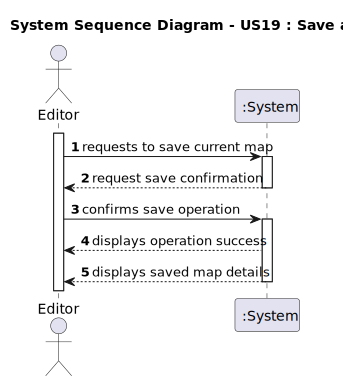

# US19 - Save a Map

## 1. Requirements Engineering

### 1.1. User Story Description

- As an Editor, I want to Save a Map in a file for later use.

### 1.2. Customer Specifications and Clarifications

**From the specifications document:**

> The Map should be saved in a file for later use.
 
**From the client clarifications:**

> **Question:** Nesta US quando se refere a guardar um mapa para ser usado posteriormente, estamos a falar de guardar um mapa 1 a 1 num ficheiro independente ou apenas tornar persistente através de serialização?
> > **Answer:** Pretende-se que a aplicação permita o armazenamento dos mapas para utilização futura usando persistência através de serialização

> **Question:** Nesta US quando se refere a guardar um mapa para ser usado posteriormente, estamos a falar de guardar um mapa 1 a 1 num ficheiro independente ou apenas tornar persistente através de serialização?
> > **Answer:** Pretende-se que a aplicação permita o armazenamento dos mapas para utilização futura usando persistência através de serialização.

 
### 1.3. Acceptance Criteria

* **AC1:** The system must save the current map with all its attributes (nameID, scale, size) and associated entities (cities, industries, positions) to a file using serialization.
* **AC2:** The system must use the map's existing nameID as the filename for saving.

### 1.4. Found out Dependencies

* There is a dependency on **"US01 - Create a Map"** since a map must exist before it can be saved.
* There is a dependency on **"US20 - Load a Map"** since the saved map will need to be loaded later.
 
### 1.5 Input and Output Data

**Input Data:**
* Selected data:
     * Current map to be saved

* Typed data:
    * None (all data comes from the existing map)
 
**Output Data:**

* (In)Success of the operation
* Saved map details 

### 1.6. System Sequence Diagram (SSD)

**_Other alternatives might exist._**

### 1.7 Other Relevant Remarks

* The save operation uses serialization as specified in the client clarifications.
* The map's nameID from the domain model is used as the filename for saving.
* The system provides immediate feedback about the save operation's success.
