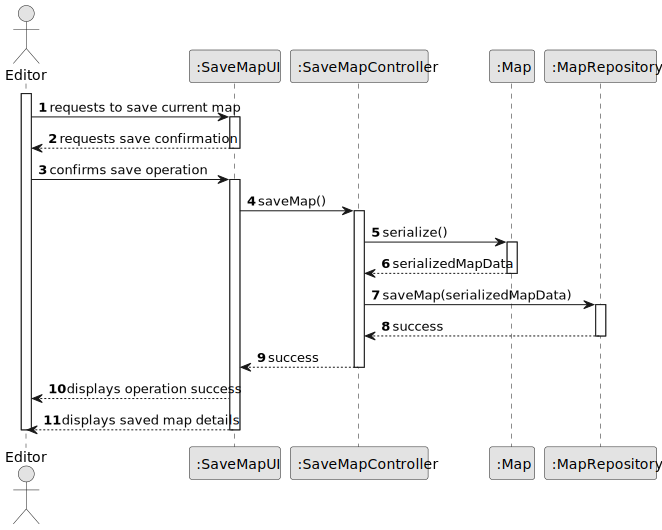
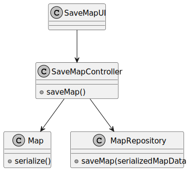

# US19 - Save a Map

## 3. Design

### 3.1. Rationale

**The rationale grounds on the SSD interactions and the identified input/output data.**

| Interaction ID | Question: Which class is responsible for... | Answer  | Justification (with patterns)  |
|:-------------  |:--------------------- |:------------|:---------------------------- |
| Step 1  		 | receiving the save map request? | SaveMapUI | Pure Fabrication: UI class to handle user interactions |
| Step 2  		 | requesting save confirmation? | SaveMapUI | Pure Fabrication: UI class to handle user interactions |
| Step 3  		 | confirming the save operation? | SaveMapUI | Pure Fabrication: UI class to handle user interactions |
| Step 4  		 | performing the save operation? | SaveMapController | Controller: Coordinates the save operation |
| Step 5  		 | serializing the map data? | Map | Information Expert: Map class knows its own data structure |
| Step 6  		 | storing the serialized data? | MapRepository | Pure Fabrication: Repository pattern for data persistence |
| Step 7  		 | displaying operation success? | SaveMapUI | Pure Fabrication: UI class to handle user feedback |
| Step 8  		 | displaying saved map details? | SaveMapUI | Pure Fabrication: UI class to handle user feedback |

### Systematization ##

According to the taken rationale, the conceptual classes promoted to software classes are:

* Map
* Editor

Other software classes (i.e. Pure Fabrication) identified:

* SaveMapUI - Handles user interface for saving maps
* SaveMapController - Coordinates the save operation
* MapRepository - Handles map persistence

## 3.2. Sequence Diagram (SD)

_In this section, it is suggested to present an UML dynamic view representing the sequence of interactions between software objects that allows to fulfill the requirements._

## 3.3. Class Diagram (CD)

_In this section, it is suggested to present an UML static view representing the main related software classes that are involved in fulfilling the requirements as well as their relations, attributes and methods._

