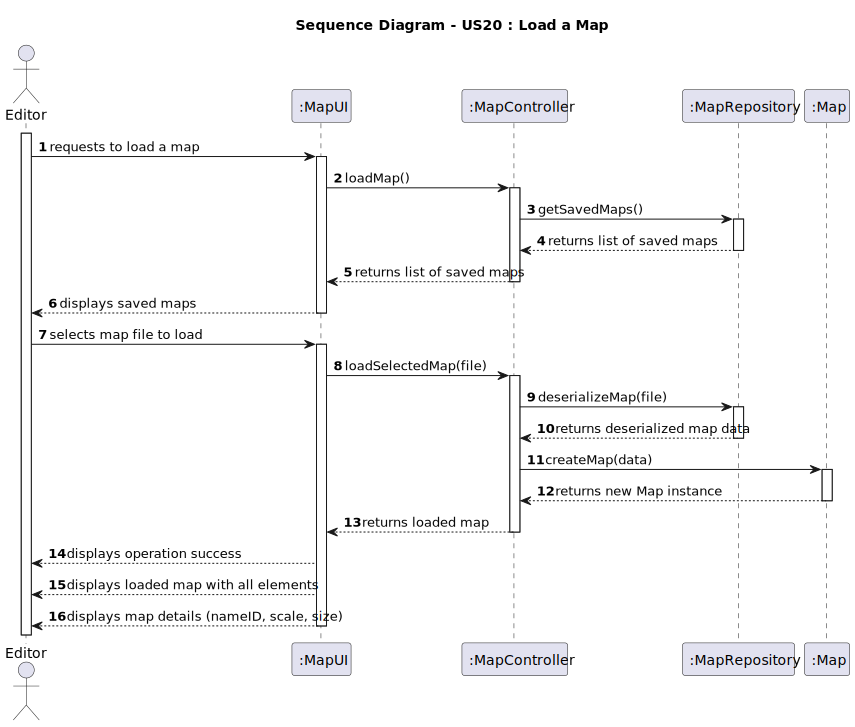
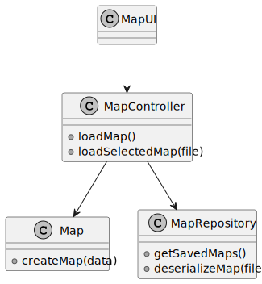

# US20 - Load a Map

## 3. Design

### 3.1. Rationale

**The rationale grounds on the SSD interactions and the identified input/output data.**

| Interaction ID | Question: Which class is responsible for...  | Answer        | Justification (with patterns)                                               |
|:---------------|:---------------------------------------------|:--------------|:----------------------------------------------------------------------------|
| Step 1  		     | Receiving the request to load a map?         | Editor        | The Editor initiates the request to load a map.                             |
| Step 2  		     | Displaying the list of saved maps?           | MapRepository | The MapRepository retrieves and displays the list of saved maps.            |
| Step 3  		     | Selecting the map file to load?              | Editor        | The Editor selects the desired map file from the list.                      |
| Step 4  		     | Loading the selected map?                    | MapRepository | The MapRepository is responsible for deserializing the map file.            |
| Step 5  		     | Displaying the success of the operation?     | MapUI         | The MapUI informs the Editor about the success or failure of the operation. |
| Step 6  		     | Displaying the loaded map details?           | MapUI         | The MapUI provides the loaded map details (nameID, scale, size).            |
| Step 7  		     | Making the loaded map available for editing? | MapController | The MapController ensures the loaded map is ready for further operations.   |

### Systematization

According to the taken rationale, the conceptual classes promoted to software classes are:

* Editor
* Map
* MapRepository

Other software classes (i.e. Pure Fabrication) identified:

* MapUI  
* MapController

## 3.2. Sequence Diagram (SD)

## 3.3. Class Diagram (CD)

