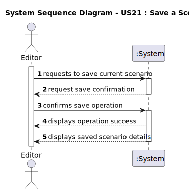

# US21 - Save a Scenario

## 1. Requirements Engineering

### 1.1. User Story Description

- As an Editor, I want to Save a Scenario in a file for later use.

### 1.2. Customer Specifications and Clarifications

**From the specifications document:**

> The Scenario should be saved in a file for later use.

**From the client clarifications:**

> **Question:** N/A
> > **Answer:** N/A

### 1.3. Acceptance Criteria

* **AC1:** The system must save the current scenario with all its attributes (nameID, startDate, endDate, initialBudget, currentBudget) and associated entities (map, locomotives, industries, industrySectors, stations, cities) to a file using serialization.
* **AC2:** The system must use the scenario's existing nameID as the filename for saving.

### 1.4. Found out Dependencies

* There is a dependency on **"US04 - Create a Scenario"** since a scenario must exist before it can be saved.
* There is a dependency on **"US22 - Load a Scenario"** since the saved scenario will need to be loaded later.

### 1.5 Input and Output Data

**Input Data:**
* Selected data:
    * Current scenario to be saved

* Typed data:
    * None (all data comes from the existing scenario)

**Output Data:**

* (In)Success of the operation
* Saved scenario details

### 1.6. System Sequence Diagram (SSD)

**_Other alternatives might exist._**

### 1.7 Other Relevant Remarks

* The save operation uses serialization as specified in the client clarifications.
* The scenario's nameID from the domain model is used as the filename for saving.
* The system provides immediate feedback about the save operation's success.
