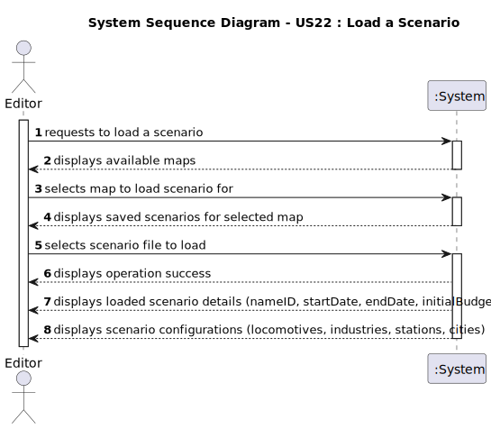

# US22 - Load a Scenario

## 1. Requirements Engineering

### 1.1. User Story Description

- As an Editor, I want to Load a Scenario from a file previously saved.

### 1.2. Customer Specifications and Clarifications

**From the specifications document:**

> The Scenario should be loaded from a previously saved file.

**From the client clarifications:**

> **Question:**  N/A
> > **Answer:**  N/A

### 1.3. Acceptance Criteria

* **AC1:** The system must load a previously saved scenario with all its attributes (nameID, startDate, endDate, initialBudget, currentBudget) and associated entities (locomotives, industries, industrySectors, stations, cities) from a serialized file.
* **AC2:** The system must display the list of available saved scenarios for selection.

### 1.4. Found out Dependencies

* There is a dependency on **"US21 - Save a Scenario"** since a scenario must be saved before it can be loaded.

### 1.5 Input and Output Data

**Input Data:**
* Selected data:
    * Scenario file to be loaded from the list of saved scenario

* Typed data:
    * None (all data comes from the selected map file)

**Output Data:**
* List of available maps
* List of available saved scenarios
* (In)Success of the operation
* Loaded scenario with all its elements (locomotives, industries, industrySectors, stations, cities)
* Scenario details (nameID, startDate, endDate, initialBudget, currentBudget)

### 1.6. System Sequence Diagram (SSD)

**_Other alternatives might exist._**

### 1.7 Other Relevant Remarks

* The load operation uses deserialization as specified in the client clarifications.
* The loaded scenario should be immediately available for editing after successful loading.