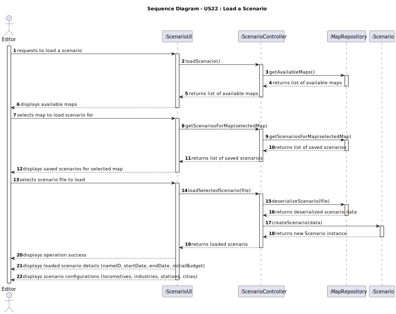
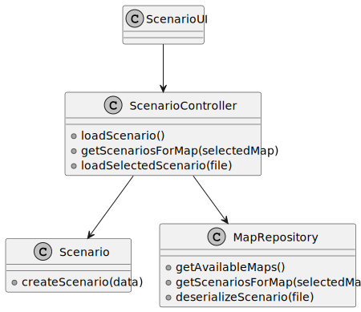

# US22 - Load a Scenario

## 3. Design

### 3.1. Rationale

**The rationale grounds on the SSD interactions and the identified input/output data.**

| Interaction ID | Question: Which class is responsible for...  | Answer             | Justification (with patterns)                                                                    |
|:---------------|:---------------------------------------------|:-------------------|:-------------------------------------------------------------------------------------------------|
| Step 1  		     | Receiving the request to load a scenario?    | Editor             | The Editor initiates the request to load a scenario.                                             |
| Step 2  		     | Displaying the list of available maps?       | MapRepository      | The MapRepository retrieves and provides the list of available maps.                             |
| Step 3  		     | Selecting the map to load scenario for?      | Editor             | The Editor selects the desired map from the list.                                                |
| Step 4  		     | Displaying saved scenarios for selected map? | ScenarioRepository | The ScenarioRepository retrieves and provides the list of saved scenarios for the selected map.  |
| Step 5  		     | Selecting the scenario file to load?         | Editor             | The Editor selects the desired scenario file from the list.                                      |
| Step 6  		     | Loading the selected scenario?               | ScenarioRepository | The ScenarioRepository is responsible for deserializing the scenario file.                       |
| Step 7  		     | Creating the scenario instance?              | Scenario           | The Scenario class creates a new instance with the deserialized data.                            |
| Step 8  		     | Displaying the operation success?            | ScenarioUI         | The ScenarioUI informs the Editor about the success of the operation.                            |
| Step 9  		     | Displaying the loaded scenario details?      | ScenarioUI         | The ScenarioUI provides the loaded scenario details (nameID, startDate, endDate, initialBudget). |
| Step 10  		    | Displaying scenario configurations?          | ScenarioUI         | The ScenarioUI displays all scenario configurations (locomotives, industries, stations, cities). |

### Systematization

According to the taken rationale, the conceptual classes promoted to software classes are:

* Editor
* Scenario
* MapRepository
* ScenarioRepository

Other software classes (i.e. Pure Fabrication) identified:

* ScenarioUI  
* ScenarioController

## 3.2. Sequence Diagram (SD)

_In this section, it is suggested to present an UML dynamic view representing the sequence of interactions between software objects that allows to fulfill the requirements._

## 3.3. Class Diagram (CD)

_In this section, it is suggested to present an UML static view representing the main related software classes that are involved in fulfilling the requirements as well as their relations, attributes and methods._

