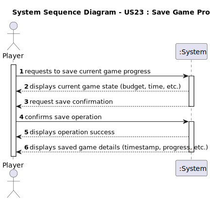

# US23 - Save Game Progress

## 1. Requirements Engineering

### 1.1. User Story Description

- As a Player, I want to Save my current game progress in a file for later use.

### 1.2. Customer Specifications and Clarifications

**From the specifications document:**

> The game progress should be saved in a file for later use.

**From the client clarifications:**

> **Question:** N/A
> > **Answer:** N/A

### 1.3. Acceptance Criteria

* **AC1:** The system must save the current game state with all its attributes (budget, time, etc.) and associated entities (map, locomotives, industries, industrySectors, stations, cities) to a file using serialization.
* **AC2:** The system must use a unique identifier (timestamp) as the filename for saving.
* **AC3:** The system must display the current game state before saving.
 
### 1.4. Found out Dependencies

* There is a dependency on **"US04 - Create a Scenario"** since a game must exist before it can be saved.
* There is a dependency on **"US24 - Load Game Progress"** since the saved game will need to be loaded later.

### 1.5 Input and Output Data

**Input Data:**
* Selected data:
    * Current game state to be saved

* Typed data:
    * None (all data comes from the existing game state)

**Output Data:**
* Current game state details (budget, time, etc.)
* (In)Success of the operation
* Saved game details (timestamp, progress, etc.)

### 1.6. System Sequence Diagram (SSD)

**_Other alternatives might exist._**

### 1.7 Other Relevant Remarks

* The save operation uses serialization as specified in the client clarifications.
* The system provides immediate feedback about the save operation's success.
* The saved game state includes all necessary information to restore the game exactly as it was when saved.
