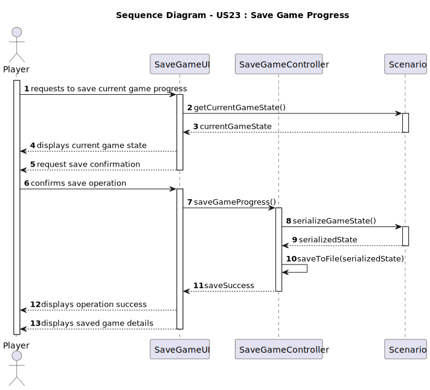
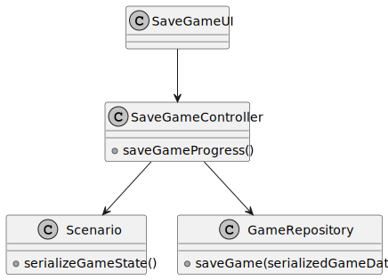

# US23 - Save Game Progress

## 3. Design

### 3.1. Rationale

**The rationale grounds on the SSD interactions and the identified input/output data.**

| Interaction ID | Question: Which class is responsible for... | Answer             | Justification (with patterns)                                  |
|:---------------|:--------------------------------------------|:-------------------|:---------------------------------------------------------------|
| Step 1  		     | receiving the save request?                 | SaveGameUI         | Pure Fabrication - UI class to handle user interactions        |
| Step 2  		     | displaying current game state?              | SaveGameUI         | Pure Fabrication - UI class to display information             |
| Step 3  		     | requesting save confirmation?               | SaveGameUI         | Pure Fabrication - UI class to handle user interactions        |
| Step 4  		     | receiving save confirmation?                | SaveGameUI         | Pure Fabrication - UI class to handle user interactions        |
| Step 5  		     | coordinating the save operation?            | SaveGameController | Pure Fabrication - Controller to coordinate the save operation |
| Step 6  		     | serializing the game state?                 | Scenario           | Information Expert - Has all the game state information        |
| Step 7  		     | saving to file?                             | SaveGameController | Pure Fabrication - Handles file operations                     |
| Step 8  		     | displaying operation success?               | SaveGameUI         | Pure Fabrication - UI class to display information             |
| Step 9  		     | displaying saved game details?              | SaveGameUI         | Pure Fabrication - UI class to display information             |

### Systematization ##

According to the taken rationale, the conceptual classes promoted to software classes are:

* Scenario
* Player
* Map
* Locomotive
* Industry
* Station
* City
* IndustrySector

Other software classes (i.e. Pure Fabrication) identified:

* SaveGameUI  
* SaveGameController

## 3.2. Sequence Diagram (SD)

## 3.3. Class Diagram (CD)

