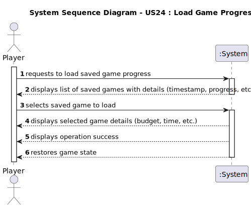

# US24 - Load Game Progress

## 1. Requirements Engineering

### 1.1. User Story Description

- As a Player, I want to Load a previously saved game progress from a file.

### 1.2. Customer Specifications and Clarifications

**From the specifications document:**

> The saved game progress should be loadable from a file.

**From the client clarifications:**

> **Question:** N/A
> > **Answer:** N/A

### 1.3. Acceptance Criteria

* **AC1:** The system must display a list of all available saved games with their details (timestamp, progress, etc.).
* **AC2:** The system must allow the player to select a saved game to load.
* **AC3:** The system must restore the complete game state from the selected save file.
 
### 1.4. Found out Dependencies

* There is a dependency on **"US23 - Save Game Progress"** since a game must be saved before it can be loaded.
* There is a dependency on **"US04 - Create a Scenario"** since the loaded game will need to be initialized in a scenario.

### 1.5 Input and Output Data

**Input Data:**
* Selected data:
    * Saved game to be loaded

* Typed data:
    * None (all data comes from the saved game file)

**Output Data:**
* List of available saved games with details
* Selected game details (budget, time, etc.)
* (In)Success of the operation
* Restored game state

### 1.6. System Sequence Diagram (SSD)

**_Other alternatives might exist._**

### 1.7 Other Relevant Remarks

* The load operation uses deserialization to restore the game state.
* The system provides immediate feedback about the load operation's success.
* The restored game state should be exactly as it was when saved.
