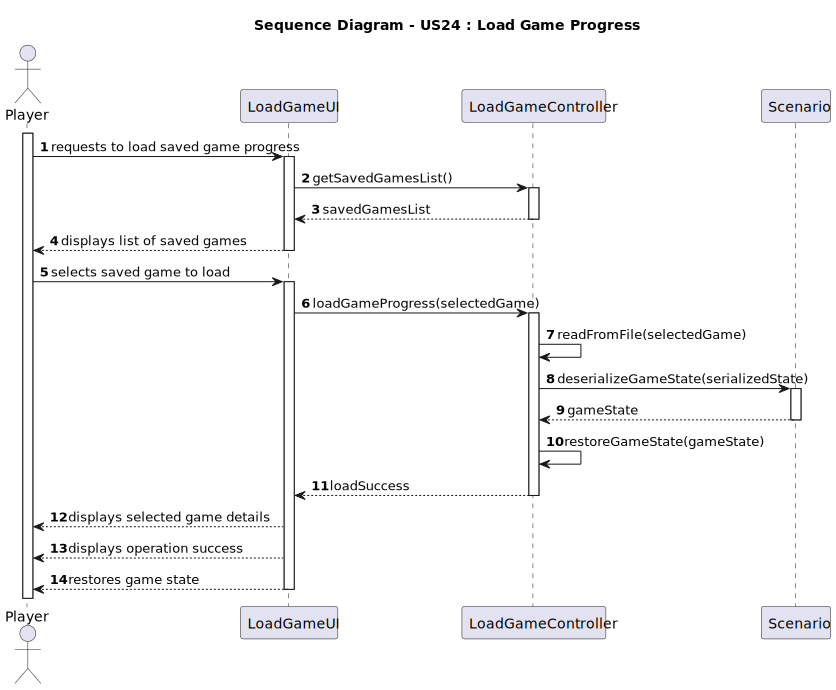
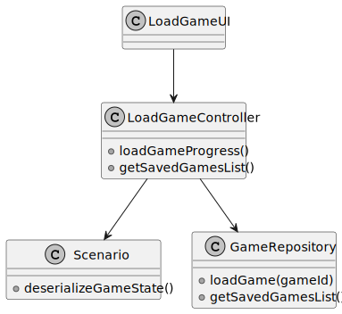

# US24 - Load Game Progress

## 3. Design

### 3.1. Rationale

**The rationale grounds on the SSD interactions and the identified input/output data.**

| Interaction ID | Question: Which class is responsible for... | Answer             | Justification (with patterns)                                  |
|:---------------|:--------------------------------------------|:-------------------|:---------------------------------------------------------------|
| Step 1  		     | receiving the load request?                 | LoadGameUI         | Pure Fabrication - UI class to handle user interactions        |
| Step 2  		     | displaying list of saved games?             | LoadGameUI         | Pure Fabrication - UI class to display information             |
| Step 3  		     | receiving game selection?                   | LoadGameUI         | Pure Fabrication - UI class to handle user interactions        |
| Step 4  		     | coordinating the load operation?            | LoadGameController | Pure Fabrication - Controller to coordinate the load operation |
| Step 5  		     | reading from file?                          | LoadGameController | Pure Fabrication - Handles file operations                     |
| Step 6  		     | deserializing the game state?               | Scenario           | Information Expert - Has all the game state information        |
| Step 7  		     | displaying selected game details?           | LoadGameUI         | Pure Fabrication - UI class to display information             |
| Step 8  		     | displaying operation success?               | LoadGameUI         | Pure Fabrication - UI class to display information             |
| Step 9  		     | restoring game state?                       | LoadGameController | Pure Fabrication - Coordinates state restoration               |

### Systematization ##

According to the taken rationale, the conceptual classes promoted to software classes are:

* Scenario
* Player
* Map
* Locomotive
* Industry
* Station
* City
* IndustrySector

Other software classes (i.e. Pure Fabrication) identified:

* LoadGameUI  
* LoadGameController

## 3.2. Sequence Diagram (SD)

## 3.3. Class Diagram (CD)

