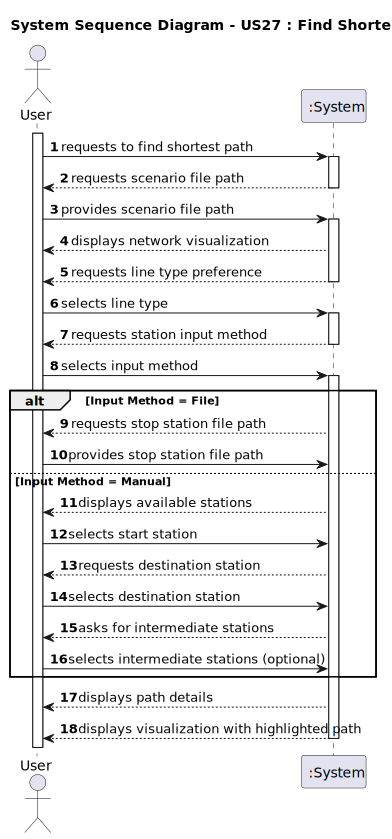

# US27 - Find Shortest Path

## 1. Requirements Engineering

### 1.1. User Story Description

- As a Player, given a scenario with stations and railway lines, I want to get one of the shortest routes between two stations, which goes
through an ordered list of stations I choose
### 1.2. Customer Specifications and Clarifications

**From the specifications document:**

>  

**From the client clarifications:**

> **Question:**
> Boa tarde,
> 
> Podemos inserir a estaçao de partida, de chegada e a lista ordenada de "checkpoints" como inputs? Ou é necessario ser carregado um csv com estes dados?
>
> Muito obrigado pela atencao.
> > **Answer:** Olá,
> >
> > Sim, podem processar previamente os .csv e ter como input dos algoritmos listas, estação (string ou numérica), etc.
> >
> > Bom trabalho!
### 1.3. Acceptance Criteria

* **AC1:**  A visualization of the scenario should be displayed to the player,
where the shortest route is drawn with a different color

* **AC2:** All implemented procedures (except those used for graphic visualization) must only use primitive operations, and not existing functions
in JAVA libraries.

### 1.4. Found out Dependencies

* N/A
* 
### 1.5 Input and Output Data

**Input Data:**
* Selected data:
    - Line type preference (all lines or only electrified lines)
    - Input method (file or manual)
    - For file input:
        - Path to stop station file
    - For manual input:
        - Start station
        - Destination station
        - Intermediate stations (optional)

* Typed data:
    - Path to scenario CSV file

**Output Data:**
- Network visualization (PNG format)
- Path details including:
    - List of stations in the path
    - Distance between each pair of stations
    - Total path distance
- Visualization of the network with the shortest path highlighted in red

### 1.6. System Sequence Diagram (SSD)

**_Other alternatives might exist._**

### 1.7 Other Relevant Remarks

* The system uses Dijkstra's algorithm to find the shortest path
* The visualization uses different colors to distinguish between electrified (blue) and non-electrified (black) lines
* The shortest path is highlighted in red in the visualization
* The system supports both directed and undirected graphs
* The system validates the existence of all input files and stations before processing