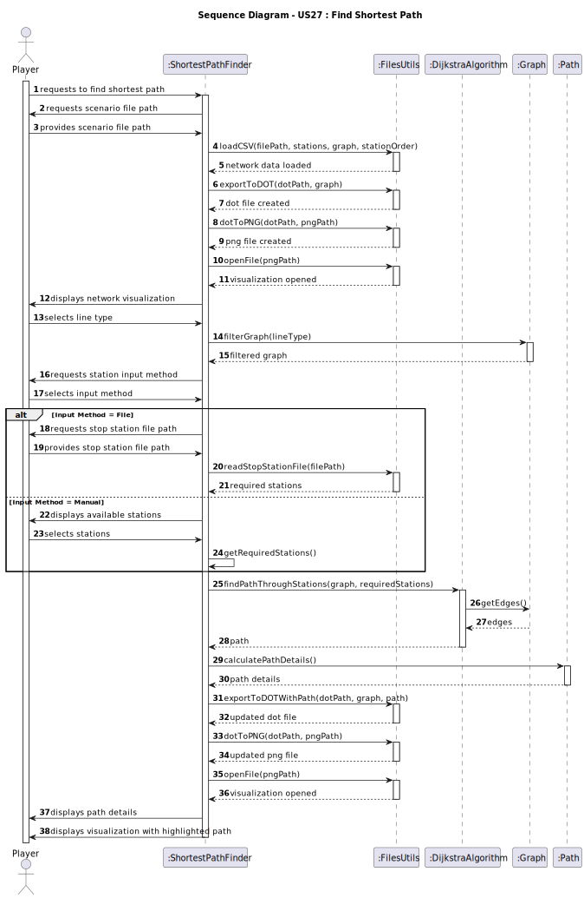
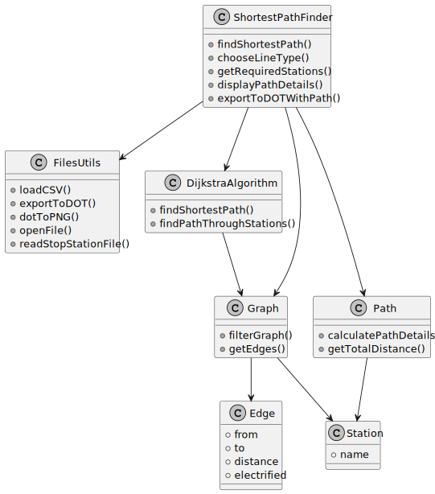

# US27 - Find Shortest Path

_XXX stands for User Story number and YYY for User Story description (e.g. US006 - Create a Task)_

## 3. Design

### 3.1. Rationale

**The rationale grounds on the SSD interactions and the identified input/output data.**

| Interaction ID | Question: Which class is responsible for... | Answer  | Justification (with patterns)  |
|:-------------  |:--------------------- |:------------|:---------------------------- |
| Step 1  		 | initiating the shortest path finding process | ShortestPathFinder | Controller pattern - coordinates the entire process |
| Step 2  		 | loading and parsing the scenario file | FilesUtils | Pure Fabrication - handles file operations |
| Step 3  		 | creating network visualization | FilesUtils | Pure Fabrication - handles visualization operations |
| Step 4  		 | filtering the graph based on line type | Graph | Information Expert - knows about graph structure |
| Step 5  		 | handling station input | ShortestPathFinder | Controller pattern - manages user input |
| Step 6  		 | finding the shortest path | DijkstraAlgorithm | Pure Fabrication - implements the algorithm |
| Step 7  		 | calculating path details | Path | Information Expert - knows about path structure |
| Step 8  		 | creating visualization with highlighted path | FilesUtils | Pure Fabrication - handles visualization operations |
| Step 9  		 | displaying results | ShortestPathFinder | Controller pattern - manages output |

### Systematization ##

According to the taken rationale, the conceptual classes promoted to software classes are:

* Graph
* Path
* Station
* Edge

Other software classes (i.e. Pure Fabrication) identified:

* ShortestPathFinder (Controller)
* FilesUtils (Utility)
* DijkstraAlgorithm (Algorithm)

## 3.2. Sequence Diagram (SD)

_In this section, it is suggested to present an UML dynamic view representing the sequence of interactions between software objects that allows to fulfill the requirements._

## 3.3. Class Diagram (CD)

_In this section, it is suggested to present an UML static view representing the main related software classes that are involved in fulfilling the requirements as well as their relations, attributes and methods._

