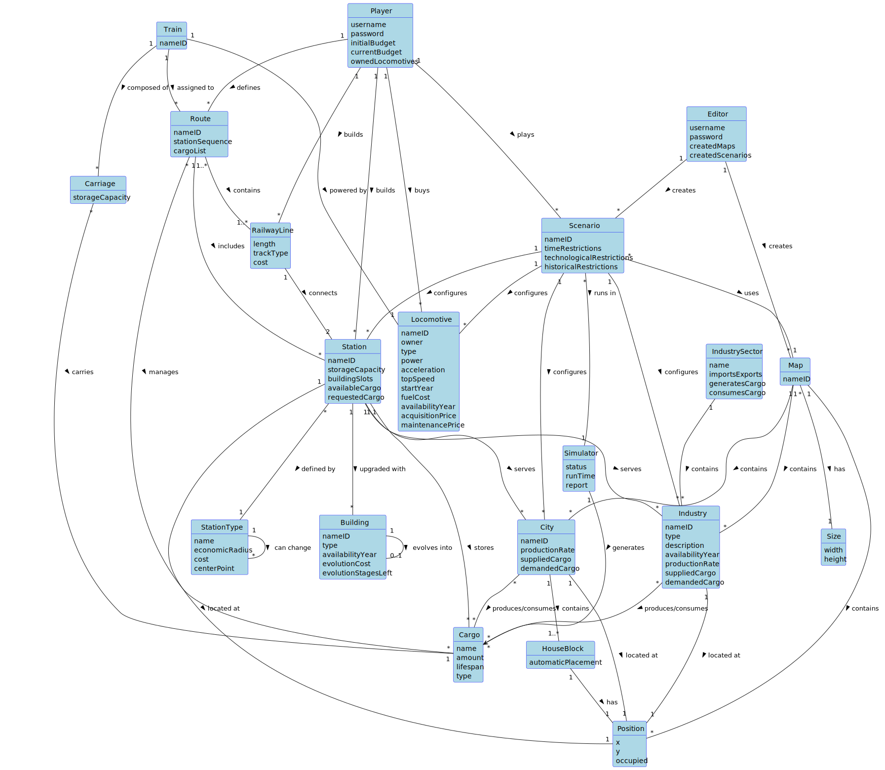

# OO Analysis

The construction process of the domain model is based on the client specifications, especially the nouns (for _concepts_) and verbs (for _relations_) used.

## Rationale to identify domain conceptual classes

To identify domain conceptual classes, start by making a list of candidate conceptual classes inspired by the list of categories suggested in the book "Applying UML and Patterns: An Introduction to Object-Oriented Analysis and Design and Iterative Development".

### _Conceptual Class Category List_

**Business Transactions**

* Scenario (game session)
* Simulator (game simulation)
* Route (transportation route)
* TrainSchedule (train arrival/departure times)

---

**Transaction Line Items**

* Cargo (goods being transported)
* RailwayLine (connection between stations)

---

**Product/Service related to a Transaction or Transaction Line Item**

* Station (service point with cost)
* Building (station upgrades)
* Locomotive (transport service with acquisition/maintenance costs)
* Carriage (transport capacity)
* StationType (classification of stations)
* IndustrySector (classification of industries)

---

**Transaction Records**

* SimulationReport (simulation results from Simulator)
* Train (transport unit record)
* CargoGenerationEvent (cargo generation records)
* TransportationEvent (transportation records)

---

**Roles of People or Organizations**

* Player (game participant with budget)
* Editor (content creator)

---

**Places**

* Map (game world)
* City (population center)
* Industry (production facility)
* Position (spatial location)
* Size (map dimensions)
* HouseBlock (city residential area)
* IndustrySector (industrial sector)

---

**Noteworthy Events**

* CargoGenerationEvent (cargo generation and management)
* TransportationEvent (train transportation events)
* Simulation run
* Route completion
* Financial transactions (purchases/constructions)

---

**Physical Objects**

* Train
* Locomotive
* Carriage
* Station
* Building
* RailwayLine
* Position
* HouseBlock

---

**Descriptions of Things**

* Scenario (game rules and restrictions)
* Map (world layout)
* Cargo (goods specifications)
* Industry (production specs)
* StationType (station classification)
* IndustrySector (industry classification)
* SimulationReport (simulation performance report)

---

**Catalogs**

* Available locomotives
* Available buildings
* Available industries
* Available scenarios
* Station types
* Industry sectors

---

**Containers**

* Station (for cargo and buildings)
* Train (with carriages)
* Map (contains cities, industries, positions)
* Route (with stations and railway lines)
* City (contains HouseBlocks)
* IndustrySector (contains industries)
* RailwayNetwork (contains railway lines and routes)

---

**Elements of Containers**

* Carriage (part of train)
* Building (part of station)
* City (part of map)
* Industry (part of map/sector)
* Station (part of map)
* Position (element of map)
* HouseBlock (part of city)
* RailwayLine (part of railway network)
* Route (part of railway network)

---

**Organizations**

* (Not explicitly modeled)

---

**Other External/Collaborating Systems**

* Simulator (external simulation engine)

---

**Records of finance, work, contracts, legal matters**

* Player budget
* Station construction costs
* RailwayLine construction costs
* Locomotive acquisition/maintenance costs
* Building evolution cost
* SimulationReport (financial performance)

---

**Financial Instruments**

* Player budget
* Station cost
* RailwayLine cost
* Locomotive acquisitionPrice
* Locomotive maintenancePrice
* Building evolutionCost

---

**Documents mentioned/used to perform some work**

* SimulationReport

---

## Rationale to identify associations between conceptual classes

An association is a relationship between instances of objects that indicates a relevant connection and that is worth remembering, or it is derivable from the List of Common Associations:

- **_A_** is physically or logically part of **_B_**
- **_A_** is physically or logically contained in/on **_B_**
- **_A_** is a description for **_B_**
- **_A_** is known/logged/recorded/reported/captured in **_B_**
- **_A_** uses or manages or owns **_B_**
- **_A_** is related to a transaction (item) of **_B_**

| Concept (A)      | Association         | Concept (B)       |
|------------------|---------------------|-------------------|
| Building         | evolves into        | Building          |
| Carriage         | carries             | Cargo             |
| CargoGenerationEvent | generates     | Cargo             |
| CargoGenerationEvent | involves      | Industry          |
| CargoGenerationEvent | involves      | Station           |
| City             | produces/consumes   | Cargo             |
| City             | located at          | Position          |
| City             | contains            | HouseBlock        |
| Editor           | creates             | Map               |
| Editor           | creates             | Scenario          |
| HouseBlock       | has                 | Position          |
| Industry         | produces/consumes   | Cargo             |
| Industry         | located at          | Position          |
| Industry         | belongs to          | IndustrySector    |
| IndustrySector   | contains            | Industry          |
| Locomotive       | configured in       | Scenario          |
| Map              | contains            | City              |
| Map              | contains            | Industry          |
| Map              | tracks              | Position          |
| Map              | has                 | Size              |
| Player           | builds              | RailwayLine       |
| Player           | builds              | Station           |
| Player           | buys                | Locomotive        |
| Player           | defines             | Route             |
| Player           | plays               | Scenario          |
| RailwayLine      | connects            | Station           |
| RailwayLine      | has                 | TrackType         |
| RailwayNetwork   | contains            | RailwayLine       |
| Route            | contains            | RailwayLine       |
| Route            | defined by          | Player            |
| Route            | includes            | Station           |
| Route            | manages             | Cargo             |
| Scenario         | configures          | Industry          |
| Scenario         | configures          | IndustrySector    |
| Scenario         | configures          | Locomotive        |
| Scenario         | configures          | Station           |
| Scenario         | configures          | City              |
| Scenario         | uses                | Map               |
| Scenario         | runs in             | Simulator         |
| Simulator        | handles             | CargoGenerationEvent |
| Simulator        | handles             | TransportationEvent |
| Simulator        | generates           | SimulationReport  |
| SimulationReport | reports a           | Scenario          |
| SimulationReport | belongs to          | Player            |
| Station          | serves              | City              |
| Station          | serves              | Industry          |
| Station          | stores              | Cargo             |
| Station          | upgraded with       | Building          |
| Station          | located at          | Position          |
| Station          | defined by          | StationType       |
| Station          | has                 | TrainSchedule     |
| StationType      | can change          | StationType       |
| Train            | assigned to         | Route             |
| Train            | composed of         | Carriage          |
| Train            | powered by          | Locomotive        |
| TrainSchedule    | contains            | Train             |
| TransportationEvent | involves        | Train             |
| TransportationEvent | involves        | Station           |
| TransportationEvent | involves        | Cargo             |
| TransportationEvent | follows          | TrainSchedule     |

## Domain Model

