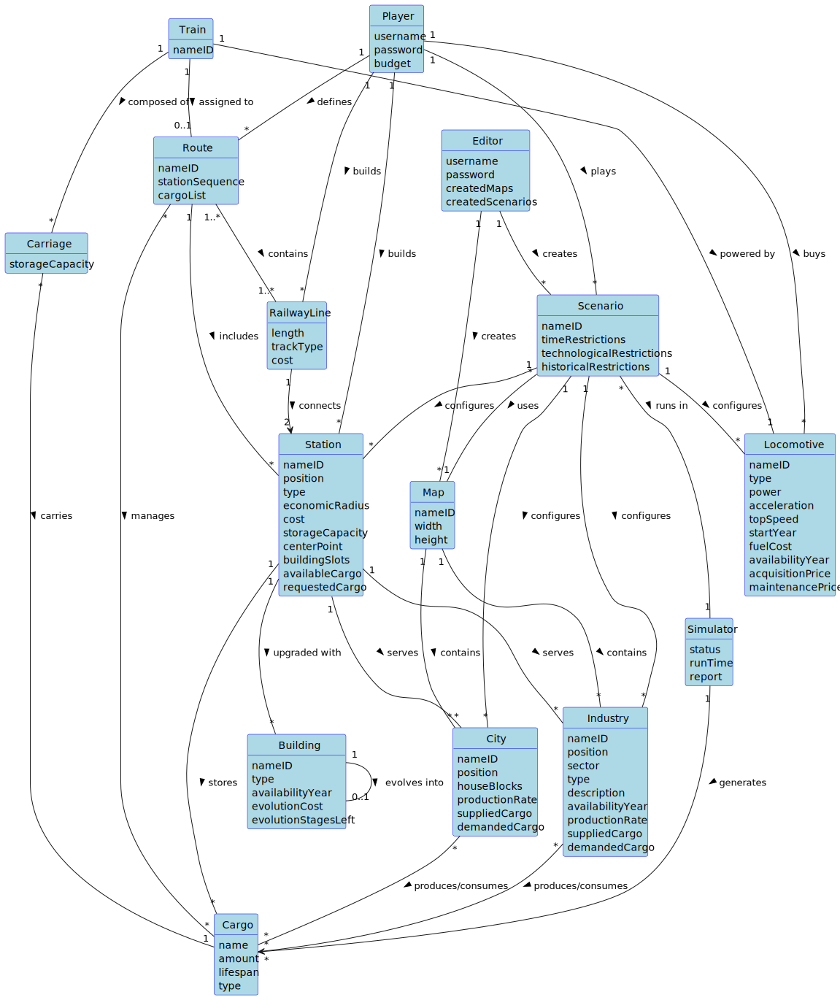

# OO Analysis

The construction process of the domain model is based on the client specifications, especially the nouns (for _concepts_) and verbs (for _relations_) used.

## Rationale to identify domain conceptual classes

To identify domain conceptual classes, start by making a list of candidate conceptual classes inspired by the list of categories suggested in the book "Applying UML and Patterns: An Introduction to Object-Oriented Analysis and Design and Iterative Development".

### _Conceptual Class Category List_

**Business Transactions**

* Scenario (game session)
* Simulator (game simulation)
* Route (transportation route)

---

**Transaction Line Items**

* Cargo (goods being transported)
* RailwayLine (connection between stations)

---

**Product/Service related to a Transaction or Transaction Line Item**

* Station (service point with cost)
* Building (station upgrades)
* Locomotive (transport service with acquisition/maintenance costs)
* Carriage (transport capacity)

---

**Transaction Records**

* Report (simulation results)
* Train (transport unit record)

---  

**Roles of People or Organizations**

* Player (game participant with budget)
* Editor (content creator)

---

**Places**

* Map (game world)
* City (population center)
* Industry (production facility)

---

**Noteworthy Events**

* Simulation run
* Route completion
* Financial transactions (purchases/constructions)

---

**Physical Objects**

* Train
* Locomotive
* Carriage
* Station
* Building
* RailwayLine

---

**Descriptions of Things**

* Scenario (game rules)
* Map (world layout)
* Cargo (goods specifications)
* Industry (production specs)

---

**Catalogs**

* Available locomotives
* Available buildings
* Available industries

---

**Containers**

* Station (for cargo)
* Train (with carriages)
* Map (contains cities/industries)

---

**Elements of Containers**

* Carriage (part of train)
* Building (part of station)
* City/Industry (part of map)

---

**Organizations**

* (Not explicitly modeled)

---

**Other External/Collaborating Systems**

* Simulator (external simulation engine)

---

**Records of finance, work, contracts, legal matters**

* Player budget
* Station construction costs
* Construction costs
* Acquisition/maintenance costs

---

**Financial Instruments**

* Player budget
* Station cost
* RailwayLine cost
* Locomotive acquisitionPrice
* Locomotive maintenancePrice
* Building cost
* Carriage storageCapacity (with implied cost)

---

**Documents mentioned/used to perform some work**

* Simulation report

---

## Rationale to identify associations between conceptual classes

An association is a relationship between instances of objects that indicates a relevant connection and that is worth remembering, or it is derivable from the List of Common Associations:

- **_A_** is physically or logically part of **_B_**
- **_A_** is physically or logically contained in/on **_B_**
- **_A_** is a description for **_B_**
- **_A_** is known/logged/recorded/reported/captured in **_B_**
- **_A_** uses or manages or owns **_B_**
- **_A_** is related to a transaction (item) of **_B_**

| Concept (A) | Association       | Concept (B) |
|-------------|-------------------|-------------|
| Building    | evolves into      | Building    |
| Carriage    | carries           | Cargo       |
| City        | produces/consumes | Cargo       |
| Editor      | creates           | Map         |
| Editor      | creates           | Scenario    |
| Industry    | produces/consumes | Cargo       |
| Map         | contains          | City        |
| Map         | contains          | Industry    |
| Player      | builds            | RailwayLine |
| Player      | builds            | Station     |
| Player      | buys              | Locomotive  |
| Player      | defines           | Route       |
| Player      | plays             | Scenario    |
| RailwayLine | connects          | Station     |
| Route       | contains          | RailwayLine |
| Route       | includes          | Station     |
| Route       | manages           | Cargo       |
| Scenario    | configures        | Industry    |
| Scenario    | configures        | Locomotive  |
| Scenario    | configures        | Station     |
| Scenario    | runs in           | Simulator   |
| Scenario    | uses              | Map         |
| Simulator   | generates         | Cargo       |
| Station     | serves            | City        |
| Station     | serves            | Industry    |
| Station     | stores            | Cargo       |
| Station     | upgraded with     | Building    |
| Train       | assigned to       | Route       |
| Train       | composed of       | Carriage    |
| Train       | powered by        | Locomotive  |

## Domain Model

