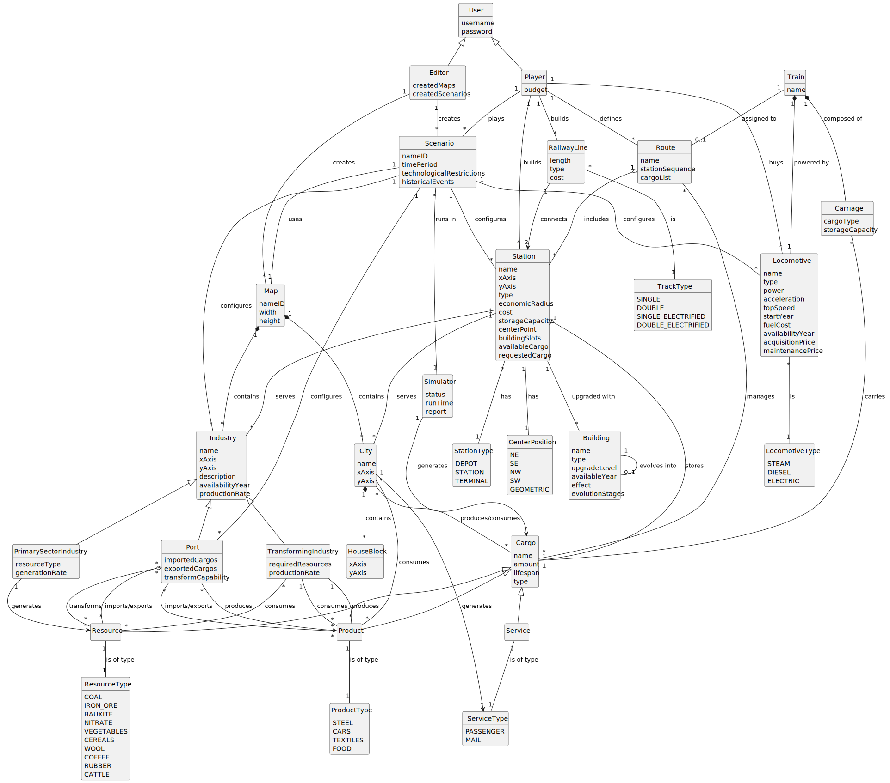

# OO Analysis

The construction process of the domain model is based on the client specifications, especially the nouns (for _concepts_) and verbs (for _relations_) used.

## Rationale to identify domain conceptual classes

To identify domain conceptual classes, start by making a list of candidate conceptual classes inspired by the list of categories suggested in the book "Applying UML and Patterns: An Introduction to Object-Oriented Analysis and Design and Iterative Development".

### _Conceptual Class Category List_

**Business Transactions**

* Purchase
* Construction
* Industry production
* Cargo transportation

---

**Transaction Line Items**

* RailwayLine purchase
* Locomotive purchase
* Station construction
* Building upgrade

---

**Product/Service related to a Transaction or Transaction Line Item**

* Cargo transport
* Passenger transport
* Mail transport
* Resource production
* Product manufacturing

---

**Transaction Records**

* Created maps
* Created scenarios
* Simulation reports

---  

**Roles of People or Organizations**

* User
* Editor
* Player

---

**Places**

* Map
* City
* Station
* Industry

---

**Noteworthy Events**

* Scenario restrictions
* Resource generation

---

**Physical Objects**

* Train
* Carriage
* Locomotive
* RailwayLine
* Building
* Industry (PrimarySector, Transforming, Port)
* Cargo (Resource, Product, Service)
* HouseBlock

---

**Descriptions of Things**

* Position (xAxis, yAxis)
* ResourceType (COAL, IRON_ORE, etc.)
* ProductType (STEEL, CARS, etc.)
* ServiceType (PASSENGER, MAIL)
* TrackType (SINGLE, DOUBLE, etc.)
* LocomotiveType (STEAM, DIESEL, ELECTRIC)
* StationType (DEPOT, STATION, TERMINAL)
* Building evolution stages

---

**Catalogs**

* List of locomotive types
* List of track types
* List of resource types
* List of product types
* List of service types
* List of building types
* List of industry types

---

**Containers**

* Map (contains industries and cities)
* Train (contains locomotive and carriages)
* Station (stores cargo and includes buildings)
* Route (includes stations and manages cargo)
* City (contains HouseBlocks)
* Industry (produces/consumes cargo)
* Port (handles imports/exports)

---

**Elements of Containers**

* Industry within a Map
* City within a Map
* Cargo within a Station
* Carriages within a Train
* Buildings within a Station
* HouseBlocks within a City
* Stations within a Route

---

**Organizations**

* Railway network management
* Industrial production chains
* City services

---

**Other External/Collaborating Systems**

* Simulator (runs scenarios)
* Economic system

---

**Records of finance, work, contracts, legal matters**

* Player budget
* Locomotive maintenance costs
* Station construction costs
* Industry production rates
* Cargo values

---

**Financial Instruments**

* Locomotive acquisition
* Railway line construction
* Station building
* Industry operation
* Cargo transportation

---

**Documents mentioned/used to perform some work**

* Scenarios
* Simulation reports

---

## Rationale to identify associations between conceptual classes

An association is a relationship between instances of objects that indicates a relevant connection and that is worth remembering, or it is derivable from the List of Common Associations:

- **_A_** is physically or logically part of **_B_**
- **_A_** is physically or logically contained in/on **_B_**
- **_A_** is a description for **_B_**
- **_A_** is known/logged/recorded/reported/captured in **_B_**
- **_A_** uses or manages or owns **_B_**
- **_A_** is related to a transaction (item) of **_B_**

| Concept (A)           | Association  | Concept (B)                          |
|-----------------------|--------------|--------------------------------------|
| User                  | generalizes  | Editor/Player                        |
| Editor                | creates      | Map                                  |
| Editor                | creates      | Scenario                             |
| Player                | plays        | Scenario                             |
| Player                | has          | Budget                               |
| Scenario              | uses         | Map                                  |
| Scenario              | runs in      | Simulator                            |
| Scenario              | configures   | Locomotive                           |
| Scenario              | configures   | Industry                             |
| Scenario              | configures   | Station                              |
| Scenario              | configures   | Port                                 |
| Map                   | contains     | Industry                             |
| Map                   | contains     | City                                 |
| City                  | contains     | HouseBlock                           |
| City                  | generates    | Service                              |
| City                  | consumes     | Product                              |
| Player                | builds       | Station                              |
| Player                | builds       | RailwayLine                          |
| Player                | buys         | Locomotive                           |
| Player                | defines      | Route                                |
| Station               | has          | Building                             |
| Station               | serves       | City                                 |
| Station               | serves       | Industry                             |
| Station               | stores       | Cargo                                |
| Station               | has          | CenterPosition                       |
| Station               | is of        | StationType                          |
| RailwayLine           | connects     | Station                              |
| RailwayLine           | is of        | TrackType                            |
| Train                 | powered by   | Locomotive                           |
| Train                 | composed of  | Carriage                             |
| Train                 | assigned to  | Route                                |
| Carriage              | carries      | Cargo                                |
| Route                 | includes     | Station                              |
| Route                 | manages      | Cargo                                |
| Building              | evolves into | Building                             |
| Industry              | located at   | Map position                         |
| PrimarySectorIndustry | generates    | Resource                             |
| TransformingIndustry  | consumes     | Resource                             |
| TransformingIndustry  | produces     | Product                              |
| TransformingIndustry  | consumes     | Product                              |
| Port                  | imports      | Resource                             |
| Port                  | exports      | Resource                             |
| Port                  | imports      | Product                              |
| Port                  | exports      | Product                              |
| Port                  | transforms   | Resource                             |
| Port                  | produces     | Product                              |
| Simulator             | generates    | Cargo                                |
| Simulator             | produces     | Report                               |
| Locomotive            | is of        | LocomotiveType                       |
| Cargo                 | is of        | ResourceType/ProductType/ServiceType |
| Resource              | is of        | ResourceType                         |
| Product               | is of        | ProductType                          |
| Service               | is of        | ServiceType                          |

## Domain Model

