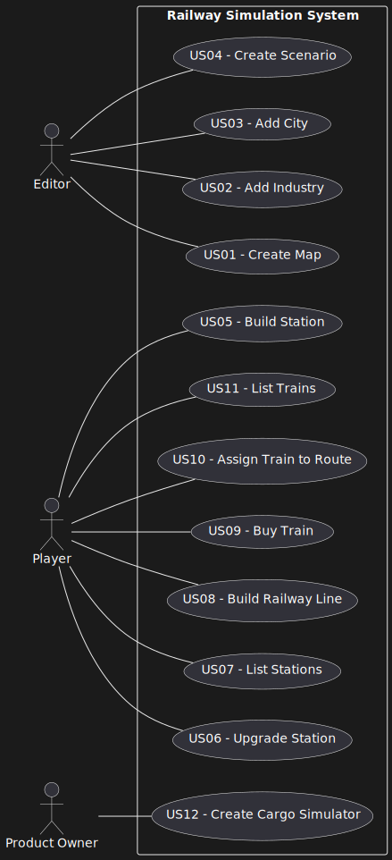

# Use Case Diagram (UCD)

# Use Cases / User Stories

| **UC/US**  | **Description**  |
|:----------|:----------------|
| **US01**  | Create a map with a size and a name. |
| **US02**  | Add an industry in a position XY of the selected map. |
| **US03**  | Add a city in a position XY of the selected map. |
| **US04**  | Create a scenario for a selected map. |
| **US05**  | Build a station. |
| **US06**  | Upgrade a selected station with a building. |
| **US07**  | List all the stations to select one and see its details. |
| **US08**  | Build a railway line between two stations. |
| **US09**  | Buy a train. |
| **US10**  | Assign a selected train to a route . |
| **US11**  | List all trains. |
| **US12**  | Create a simulator that generates cargoes at current stations. |
