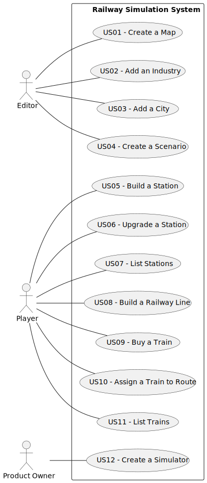

# Use Case Diagram (UCD)

# Use Cases / User Stories

| **UC/US** | **Description**                                                                |
|:----------|:-------------------------------------------------------------------------------|
| **US01**  | Create a map with a size and a name.                                           |
| **US02**  | Add an industry in a position XY of the selected map.                          |
| **US03**  | Add a city in a position XY of the selected map.                               |
| **US04**  | Create a scenario for a selected map.                                          |
| **US05**  | Build a station in a position XY of the selected map.                          |
| **US06**  | Upgrade a selected station with a building.                                    |
| **US07**  | List all the stations to select one and see its details.                       |
| **US08**  | Build a railway line between two stations.                                     |
| **US09**  | Buy a locomotive.                                                              |
| **US10**  | Assign a selected train to a route.                                            |
| **US11**  | List all trains.                                                               |
| **US12**  | Create a simulator that generates cargoes at current stations.                 |
| **US13**  | Verify if a specific train can travel between two stations in the network.     |
| **US14**  | See a maintenance route that passes once by each railway line.                 |
| **US15**  | Perform statistical analysis of average annual profit for a specified station. |
| **US16**  | Perform comparative analysis of passenger arrivals across all stations.        |
| **US17**  | Analyze cargo arrivals at each station for a specified cargo type.             |
| **US18**  | Analyze distribution of trains, passengers, and mail across stations.          |                                                            |
