# Railway Network Management System - User Manual

## Table of Contents

1. [Introduction](#1-introduction)

   1.1 [Purpose](#11-purpose)

   1.2 [System Overview](#12-system-overview)

   1.3 [Glossary](#13-glossary)

2. [Getting Started](#2-getting-started)

   2.1 [Login System](#21-login-system)

   2.2 [Role Selection](#22-role-selection)

   2.3 [Main Menu](#23-main-menu)

3. [Editor Features](#3-editor-features)

   3.1 [Map Creation](#31-map-creation)

   3.2 [Industry Management](#32-industry-management)

   3.3 [City Management](#33-city-management)

   3.4 [Scenario Creation](#34-scenario-creation)

4. [Player Features](#4-player-features)

   4.1 [Station Management](#41-station-management)

   4.2 [Station Upgrades](#42-station-upgrades)

   4.3 [Station List and Details](#43-station-list-and-details)

   4.4 [Railway Line Construction](#44-railway-line-construction)

   4.5 [Locomotive Management](#45-locomotive-management)

   4.6 [Train Route Management](#46-train-route-management)

   4.7 [Train List](#47-train-list)

5. [Simulator Features](#5-simulator-features)

   5.1 [Cargo Generation](#51-cargo-generation)

   5.2 [Network Statistics](#52-network-statistics)

## 1. Introduction

### 1.1 Purpose

Railways represent one of the most efficient, safe, and environmentally friendly methods of transporting people and goods. This railway management system is designed to address the complex challenges of railway infrastructure management while providing an engaging simulation experience.

The system serves two primary purposes:

1. **Professional Management Tool**
   - Support basic functionalities of managing a railway system
   - Enable effective resource management
   - Facilitate network planning and optimization
   - Provide statistical analysis tools

2. **Educational Simulation**
   - Inspired by the classic RailRoad Tycoon game
   - Offers hands-on experience with railway management
   - Demonstrates the complexity of railway operations
   - Provides an entertaining learning environment

### 1.2 System Overview

The system is built around two core components that work together to provide a complete railway management experience:

1. **Map and Scenario Editor**
   - Create and customize maps with specific dimensions
   - Place industries and cities strategically
   - Define scenarios with historical contexts
   - Configure economic and operational parameters
   - Set up cargo generation and transformation rules

2. **Railway Network Simulator**
   - Build and manage railway stations
   - Connect stations with railway lines
   - Manage train operations and routes
   - Handle cargo transportation
   - Monitor network performance
   - Generate real-time statistics

Key Features:
- Realistic cargo generation based on cities and industries
- Dynamic station management and upgrades
- Historical progression of technology
- Economic simulation of railway operations
- Topological network analysis tools

### 1.3 Glossary

## Software Engineering Terms

| **_Term_** (EN)                           | **_Termo_** (PT)                                     | **_Description_** (EN)                                                                                                                       |
|:------------------------------------------|:-----------------------------------------------------|:---------------------------------------------------------------------------------------------------------------------------------------------|
| **Acceptance Criteria (AC)**              | **Critérios de Aceitação**                           | Conditions that a user story must meet to be considered complete.                                                                            |
| **Agile SCRUM**                           | **Agile SCRUM**                                      | An iterative and incremental framework for managing teamwork, used in this project for sprint-based development.                             |
| **Backlog**                               | **Backlog**                                          | A prioritized list of tasks or user stories to be completed in a project.                                                                    |
| **Boxplot**                               | **Diagrama de Caixa**                                | A standardized way to display data distribution based on quartiles, highlighting outliers.                                                   |
| **Business Rules Validation**             | **Validação de Regras de Negócio**                   | Ensuring that all business rules are respected when recording and updating data.                                                             |
| **CamelCase**                             | **CamelCase**                                        | A naming convention where words are joined without spaces and capitalized, e.g., `myVariableName`.                                           |
| **GraphStream**                           | **GraphStream**                                      | Tool used to visualize graph structures (e.g. railway networks) in Java.                                                                     |
| **Graphviz**                              | **Graphviz**                                         | Tool used to visualize graph structures (e.g. railway networks) in Python.                                                                   |
| **Input/Output Operations**               | **Operações de Entrada/Saída**                       | Methods responsible for handling user input and system output, typically excluded from unit tests.                                           |
| **Iterative and Incremental Development** | **Desenvolvimento Iterativo e Incremental**          | A development process where the project is broken into small iterations, each adding functionality incrementally.                            |
| **Histogram**                             | **Histograma**                                       | A graphical representation of data distribution using bars, where each bar groups data into intervals (bins).                                |
| **JaCoCo**                                | **JaCoCo**                                           | A Java code coverage tool used to generate reports on unit test coverage.                                                                    |
| **Java**                                  | **Java**                                             | The programming language in which the application must be developed.                                                                         |
| **Javadoc**                               | **Javadoc**                                          | A tool used for generating API documentation from Java source code comments.                                                                 |
| **JUnit 5**                               | **JUnit 5**                                          | A framework for writing and executing unit tests in Java.                                                                                    |
| **Jupyter Notebook**                      | **Jupyter Notebook**                                 | An interactive development environment for Python, used for statistical analysis and documentation.                                          |
| **Key Performance Indicators (KPIs)**     | **Indicadores-Chave de Desempenho (KPIs)**           | Metrics used to evaluate the efficiency and profitability of railway operations (e.g. station profits).                                      |
| **LaTeX**                                 | **LaTeX**                                            | A document preparation system used for formatting detailed descriptions and statistical analyses in the Jupyter Notebook.                    |
| **Markdown Format**                       | **Formato Markdown**                                 | A lightweight markup language for documentation.                                                                                             |
| **Minimal Viable Product (MVP)**          | **Produto Mínimo Viável (MVP)**                      | The most basic version of a product that can be released to meet initial requirements.                                                       |
| **Non-functional Requirements**           | **Requisitos Não Funcionais**                        | Constraints and quality attributes that a system must adhere to, such as performance, security, and maintainability.                         |
| **Object-Oriented (OO) Practices**        | **Práticas de Programação Orientada a Objetos (OO)** | Design principles that promote modularity, encapsulation, and reusability in software development.                                           |
| **Object Serialization**                  | **Serialização de Objetos**                          | A process that converts objects into a format that can be stored and reconstructed later, ensuring data persistence between successive runs. |
| **Primitive Operations**                  | **Operações Primitivas**                             | Basic operations (e.g. loops) implemented without relying on external library functions.                                                     |
| **Product Owner**                         | **Product Owner**                                    | The person representing the organization developing the game, responsible for defining requirements.                                         |
| **Python**                                | **Python**                                           | A programming language used for statistical analysis.                                                                                        |
| **Scrum Board**                           | **Quadro Scrum**                                     | A visual tool used to track progress of tasks in a sprint (e.g., Backlog, ToDo, In Process, Testing, Done).                                  |
| **Scrum Master**                          | **Scrum Master**                                     | A team role responsible for ensuring the team follows Agile practices during a sprint.                                                       |
| **Software Analysis and Design**          | **Análise e Conceção de Software**                   | The process of identifying software requirements and structuring the system to meet them effectively.                                        |
| **Statistical Analysis**                  | **Análise Estatística**                              | Methods to analyze data.                                                                                                                     |
| **SVG Format**                            | **Formato SVG**                                      | A vector graphics format used for storing images and diagrams in software development.                                                       |
| **System Users**                          | **Utilizadores do Sistema**                          | Refers to different users who interact with the system, including Editors and Players.                                                       |
| **Test-Driven Development (TDD)**         | **Desenvolvimento Guiado por Testes (TDD)**          | A development approach where tests are written before the code they validate.                                                                |
| **Unit Tests**                            | **Testes Unitários**                                 | Tests that validate the functionality of individual methods in a program, typically implemented using JUnit 5.                               |
| **User Story (US)**                       | **História de Utilizador (US)**                      | A short description of a feature from the perspective of a user, often including acceptance criteria.                                        |

## Railway Simulation Terms

| **_Term_** (EN)                 | **_Termo_** (PT)                        | **_Description_** (EN)                                                                                                                                        |
|:--------------------------------|:----------------------------------------|:--------------------------------------------------------------------------------------------------------------------------------------------------------------|
| **Building**                    | **Edifício**                            | A structure at a station that provides services like communication, storage, or administration.                                                               |
| **Cargo**                       | **Carga**                               | Goods or passengers transported by trains. It includes raw materials, mail, passengers and products.                                                          |
| **Cargo Type**                  | **Tipo de Carga**                       | The classification of cargo transported by trains, such as passengers, mail, coal, iron ore, steel, etc.                                                      |
| **Carriage**                    | **Carruagem**                           | A rail vehicle used to transport cargo, such as passengers, mail, coal, or steel.                                                                             |
| **City**                        | **Cidade**                              | An urban area on the map that generates and consumes cargo like passengers, mail, and final products.                                                         |
| **Depot**                       | **Depósito**                            | A small railway station with a short economic radius, mainly used for train maintenance (50k, 3x3 radius).                                                    |
| **Diesel Locomotive**           | **Locomotiva a Diesel**                 | A type of locomotive powered by diesel fuel, more efficient than steam locomotives.                                                                           |
| **Economic Radius**             | **Raio Económico**                      | The area around a station where industries and cities contribute to its supply and demand.                                                                    |
| **Editor**                      | **Editor**                              | A person who can create maps and scenarios that can be provided in a bundle with the game or sold separately.                                                 |
| **Electric Locomotive**         | **Locomotiva Elétrica**                 | A train engine that requires electrified railway lines to operate.                                                                                            |
| **Electrified Railway Line**    | **Linha Ferroviária Electrificada**     | A railway line equipped with electrical power to support electric locomotives.                                                                                |
| **Farm**                        | **Quinta**                              | A primary sector industry that produces agricultural resources like cereals, wool, or coffee.                                                                 |
| **Final Product**               | **Produto Final**                       | A processed good, such as textiles, food, or automobiles, consumed by cities.                                                                                 |
| **Historical Restrictions**     | **Restrições Históricas**               | Simulation constraints defining which historical events will be happening during the scenario.                                                                |
| **House Blocks**                | **Blocos Habitacionais**                | Residential units in a city that generate and consume cargo (passengers, mail, goods). Their quantity affects the city's economic activity in the simulation. |
| **Industry**                    | **Indústria**                           | A facility that produces, processes, or exports cargo.                                                                                                        |
| **Locomotive**                  | **Locomotiva**                          | The engine of a train that provides traction. It can be powered by steam, diesel, or electricity.                                                             |
| **Locomotive Type**             | **Tipo de Locomotiva**                  | The classification of locomotives based on their propulsion system, such as steam, diesel, or electric.                                                       |
| **Mail**                        | **Correio**                             | A type of cargo representing postal services transported between cities.                                                                                      |
| **Map**                         | **Mapa**                                | The virtual representation of the railway world, where cities, industries, and stations are placed.                                                           |
| **Mine**                        | **Mina**                                | A primary sector industry that, depending on its type, can extract coal, iron, bauxite, etc., which can be transported to steel mills.                        |
| **Mixed Industry**              | **Indústria Mista**                     | An industry like a port that can import/export and transform cargo.                                                                                           |
| **Outlier Profits**             | **Lucros Atípicos**                     | Profits significantly higher/lower than the average.                                                                                                          |
| **Passenger Traffic**           | **Tráfego de Passageiros**              | The volume of passengers arriving at stations.                                                                                                                |
| **Passengers**                  | **Passageiros**                         | People transported by trains between cities.                                                                                                                  |
| **Player**                      | **Jogador**                             | A person who wants to play a game; in advanced versions, a scenario can be played by multiple players simultaneously.                                         |
| **Port**                        | **Porto**                               | A mixed industry that handles cargo import and export, and can transform resources.                                                                           |
| **Primary Sector Industry**     | **Indústria do Sector Primário**        | An industry that generates raw resources like coal, iron ore, or cereals.                                                                                     |
| **Railway**                     | **Caminho de Ferro**                    | A transportation system using trains on tracks to move cargo and passengers.                                                                                  |
| **Railway Connectivity**        | **Conectividade Ferroviária**           | The topological representation of stations and lines, including electrified routes.                                                                           |
| **Railway Line**                | **Linha Ferroviária**                   | A track connecting two railway stations, allowing trains to travel between them.                                                                              |
| **Resource**                    | **Recurso**                             | A type of raw material extracted or produced by primary sector industries.                                                                                    |
| **Route**                       | **Rota**                                | A predefined path for a train, including stations where cargo is loaded/unloaded.                                                                             |
| **Scenario**                    | **Cenário**                             | A predefined game configuration with a specific time period, technological constraints, and historical events.                                                |
| **Station**                     | **Estação**                             | A facility where trains stop to load and unload cargo.                                                                                                        |
| **Station Building Slot**       | **Espaço de Construção na Estação**     | A designated area within a station for constructing buildings.                                                                                                |
| **Steam Locomotive**            | **Locomotiva a Vapor**                  | A type of locomotive powered by coal and steam, commonly used in early railway history.                                                                       |
| **Technological Restrictions**  | **Restrições Tecnológicas**             | Constraints in a scenario defining which locomotives or industries are available.                                                                             |
| **Terminal**                    | **Terminal**                            | A large railway station with a wide economic radius (200k, 5x5 radius).                                                                                       |
| **Time Restrictions**           | **Restrições Temporais**                | Constraints in a scenario defining the period in which the simulation takes place.                                                                            |
| **Track Type**                  | **Tipo de Linha**                       | Classification of railway lines, including single, double, single electrified, and double electrified.                                                        |
| **Train**                       | **Comboio**                             | A vehicle composed of a locomotive and carriages, used to transport cargo and passengers.                                                                     |
| **Transforming Industry**       | **Indústria Transformadora**            | An industry that processes raw materials into final products, such as a steel mill or automobile factory.                                                     |
| **Upgrade**                     | **Melhoria**                            | An addition to a station (e.g., telegraph, hotel) that enhances its functionality or performance.                                                             |

## 2. Getting Started

### 2.1 Main Menu

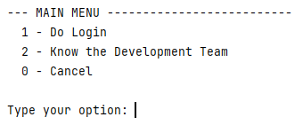

The main menu provides access to:
1. Login System
2. Development Team Information
3. Role-specific menus (after login):
    - Player Menu
    - Editor Menu

Session Management:
- Progress is saved automatically
- You can log out at any time
- Current session information is maintained while logged in

### 2.2 Login System

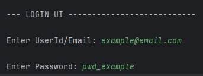

The system provides a secure authentication system with role-based access control. Users can access different features based on their assigned roles.

#### Login Process
1. From the main menu, select "Do Login"
2. Enter your credentials:
   - User ID/Email
   - Password
3. You have 3 attempts to log in successfully
4. Upon successful login, you'll be prompted to select your role if you have multiple roles assigned

#### Available Roles

1. **Player Role**
   - Access to game simulation features
   - Build and manage railway networks
   - Manage trains and cargo operations

2. **Editor Role**
   - Create and modify maps
   - Design scenarios
   - Configure game parameters

#### Session Management
- The system maintains your session while you're logged in
- You can log out at any time to end your session
- Your progress is saved automatically during the session

## 3. Editor Features

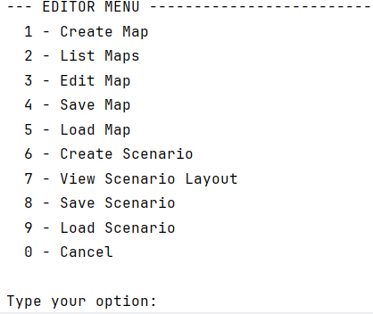

### 3.1 Map Creation
- Create new maps with custom dimensions
- Set map name following valid file name conventions
- Requirements:
  - Dimensions must be positive integers
  - Name must be valid

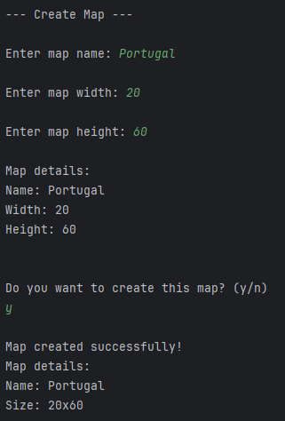

### 3.2 Edit Map

- First it will ask to choose the map to Edit:

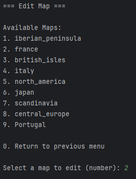

- Then it will show a preview of the map:

### 3.2.1 Industry Management
- Add industries to specific positions on the map
- Select from available industry types
- Define industry positions using X,Y coordinates

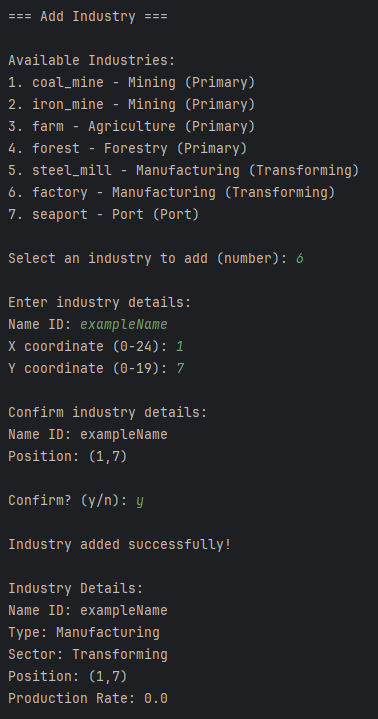

### 3.2.2 City Management
- Add cities to the map with custom names
- Configure house blocks:
  - Manual placement
  - Automatic distribution using normal distribution
- Requirements:
  - City names cannot contain special characters or digits
  - House blocks must be a positive number

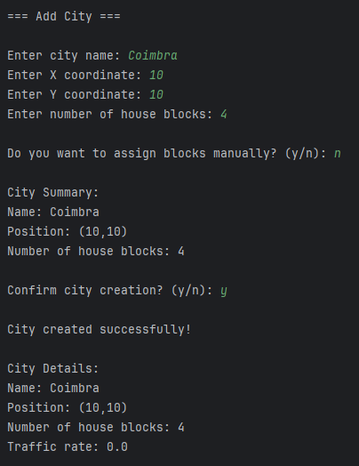

### 3.3 Scenario Creation
- Create scenarios for existing maps
- Configure port behaviors:
  - Import/export cargo settings
  - Cargo transformation rules
- Set available locomotive types:
  - Steam
  - Diesel
  - Electric
- Configure industry generation factors

- First it asks to choose a map:

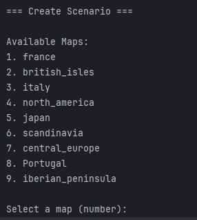

- Then ask for Name and Time Period, and Available Industries:

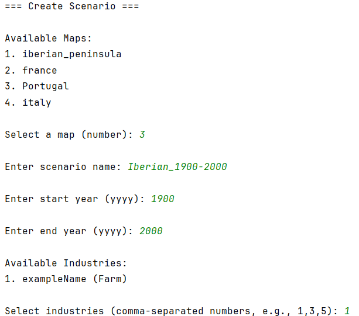

- Then configure each Port:

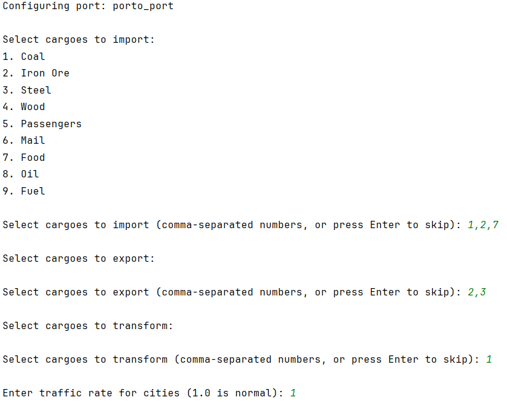

- Then ask for Available Locomotive Types:

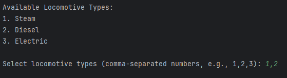

- Finally, it show the Scenario summary and asks confirmation:

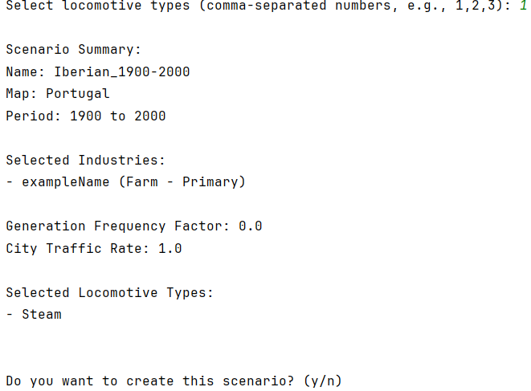

### 3.4 View Scenario Layout

- First asks for the Map and Scenario:

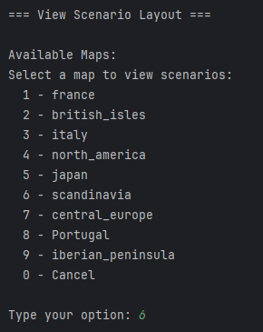

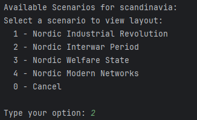

- Then the Scenario Layout will be showed:

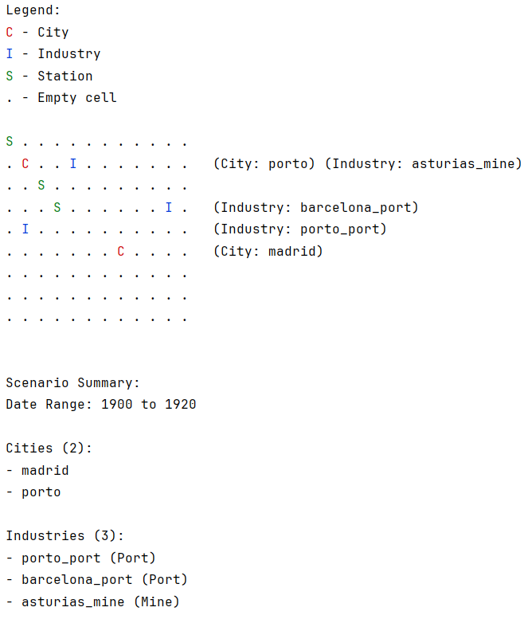

## 4. Player Features

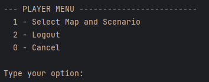

- First asks to choose map and scenario:

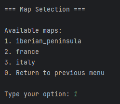

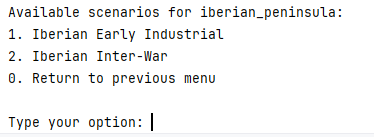

- Then the Player menu for the scenario will show:

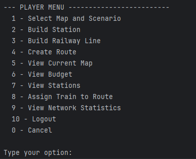

### 4.1 Station Management
- Build different station types:
  - Depot
  - Station
  - Terminal
- Automatic name generation based on closest city
- Station center configuration:
  - Depot/Terminal: Geometric center
  - Station: Player-defined (NE, SE, NW, SW)
- Prevent overbuilding

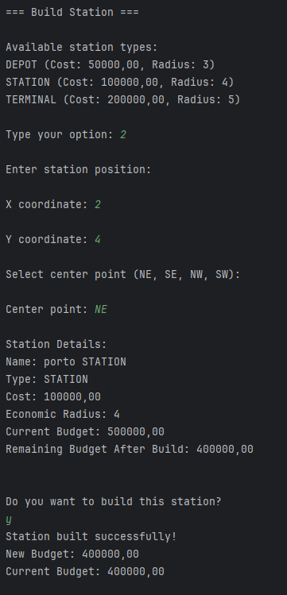

### 4.2 View Stations and Upgrades
- Add buildings and improvements to stations
- Time-based availability of upgrades
- Manage equipment compatibility:
  - Mutually exclusive options
  - Replacement of outdated technology

- View complete station list
- Access detailed station information:
    - Existing buildings
    - Cargo demand/supply
    - Current status

- First it will ask to choose station:

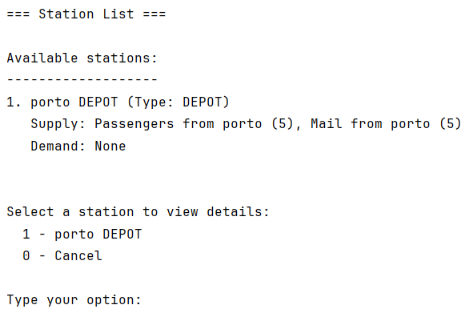

- Then it will show station detail, and ask for selection:

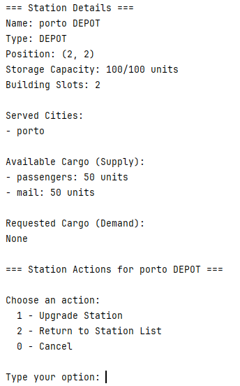

- Then iw will ask for which upgrade the player wants:

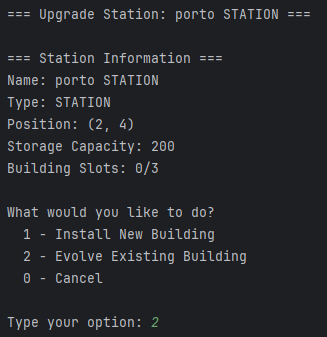

### 4.4 Railway Line Construction
- Connect stations with railway lines
- Select stations from registered station list

First aks stations to connect:

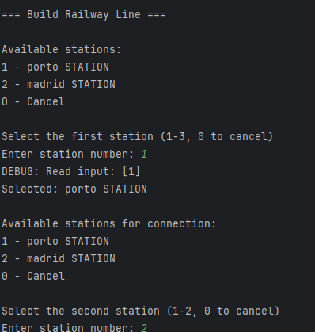

Then asks for confirmation

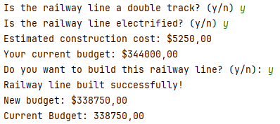

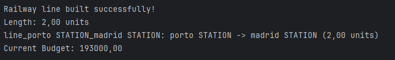

Map with RailwayLine:

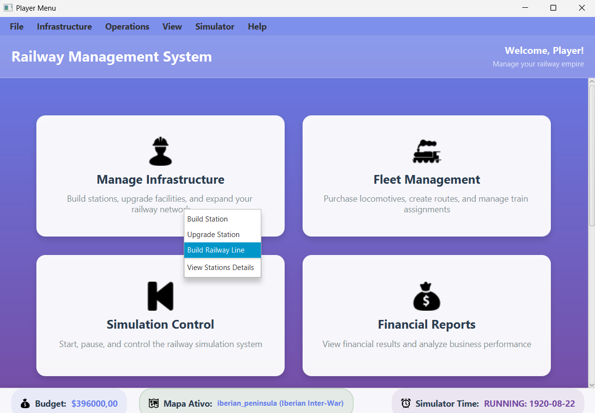

### 4.5 Locomotive Management
- Purchase new locomotives
- Select from scenario-available options
- Consider current date restrictions

### 4.6 Train Route Management
- Assign trains to routes
- Configure cargo pickup at stations
- Set station sequence

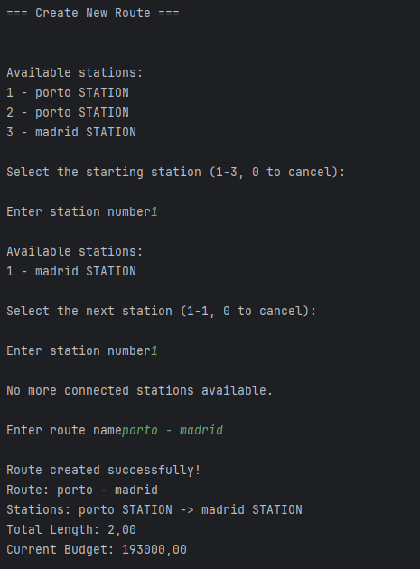

### 4.7 Train List
- View all trains grouped by locomotive type
- Sort alphabetically within groups
- Display:
  - Locomotive details
  - Current cargo status

## 5. Simulator Features (To be implemented)

### 5.1 Cargo Generation
- Automatic cargo generation at stations
- Based on:
  - Connected cities
  - Served industries
- Start/pause functionality

### 5.2 Network Statistics
- Analyze network performance
- Track cargo movement
- Monitor station efficiency

